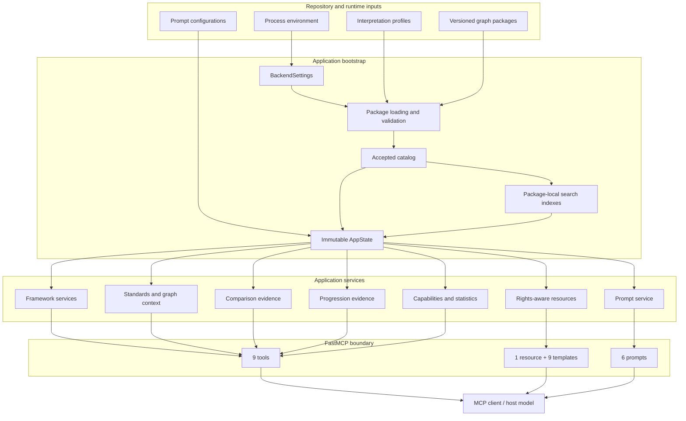
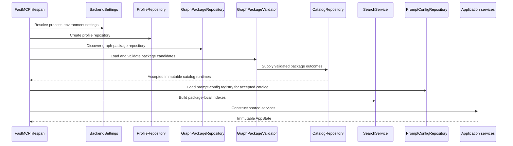

# Architecture

**KGForEdGlobalMCP** is a configuration-driven FastMCP server over independently
versioned curriculum graph packages. The runtime is intentionally read-only: it
validates accepted package inputs, builds package-local graph and search services, and
exposes a fixed MCP surface for retrieval and evidence assembly.

This page describes how the major backend components fit together and where the server
draws its trust and reasoning boundaries.

## Design goals

The implementation is organized around five goals:

1. **Preserve source identity and structure.** Frameworks, snapshots, graph packages,
   local terminology, and hierarchy are retained rather than flattened into one
   synthetic curriculum.
2. **Keep curriculum-specific semantics out of generic code.** Versioned interpretation 
   profiles define grade labels, statement types, hierarchy rules, code behavior, and 
   framework disclosures.
3. **Validate data before serving it.** Graph packages pass a package and topology
   validation gate before entering the accepted runtime catalog.
4. **Keep retrieval deterministic and bounded.** Search, traversal, comparison evidence,
   and progression evidence operate under explicit package-local limits and policies.
5. **Separate evidence retrieval from model inference.** The server does not call an
   LLM; the connected MCP host performs reasoning and generation from returned evidence
   and rendered prompt instructions.

## System overview

## FastMCP assembly boundary

The public MCP surface is registered explicitly rather than auto-discovered.

`backend/src/kgfegmcp/app.py` creates the `FastMCP` application and configures:

- a lifespan function for application-state construction;
- strict input validation;
- duplicate-component rejection; and
- masked internal error details.

`backend/src/kgfegmcp/mcp/register.py` is the single registration boundary for approved
tools, resources, and prompts. Keeping registration centralized prevents imports or
automatic discovery from accidentally expanding the public MCP surface.

The server can therefore treat the published tool, resource, and prompt inventory as an
intentional contract rather than an incidental consequence of module imports.

## Lifespan and application bootstrap

Application data is not loaded during package import. Instead, runtime construction 
begins when the FastMCP lifespan starts.

The composition root is `backend/src/kgfegmcp/bootstrap.py`. Its bootstrap sequence is:

`AppState` retains the accepted catalog, settings, search service, comparison service,
progression-evidence service, prompt service, and resource service for one server
lifespan. Its invariants require those services to share the same catalog and runtime
objects rather than mixing independently constructed state.

## The package validation gate

Graph packages are a trust boundary. The loader and validator check package identity 
and declared artifacts before the catalog exposes them. Validation includes checks such 
as:

- framework, snapshot, graph-package, and profile identity consistency;
- declared artifact existence and safe package-local paths;
- artifact SHA-256 checksums;
- interpretation-profile SHA-256 binding;
- delivery node and relationship counts;
- relationship endpoint integrity;
- hierarchy topology and cycle constraints;
- profile-governed parent cardinality and multi-parent behavior;
- code-policy consistency;
- rights and resource-policy metadata; and
- terminal package validation status.

Only accepted package runtimes are used to build the catalog and downstream services. If
no acceptable packages remain, catalog construction fails instead of starting an empty
server.

The invalid-package policy controls how certain invalid pending packages are handled:
`fail` aborts catalog construction, while `quarantine` excludes them from the accepted
runtime. Terminal failed or quarantined packages are not served.

See [Validation and lifecycle](data/validation.md) for the package-state rules.

## Package-local graph stores

Each accepted package receives an independent graph runtime. The server does not merge
all frameworks into one global source graph.

This is important because curriculum systems differ in:

- local grade labels;
- statement-type vocabulary;
- hierarchy depth;
- code conventions;
- tree versus multi-parent DAG structure; and
- unresolved source relationships.

A shared catalog routes requests to the appropriate package, while graph traversal
remains package-local. This preserves source boundaries while still allowing one MCP
server to expose multiple frameworks.

## Package-local search indexes

`SearchService` builds independent indexes from the accepted catalog. Search behavior
combines common deterministic mechanics with profile-specific policy.

The current server supports:

- lexical text search where the package declares text-search capability;
- exact code search where the interpretation profile permits it; and
- prefix code search where the profile and package both permit it.

The runtime does not provide embeddings or semantic search. Query expansion, if used by
a host model, occurs through separate bounded calls rather than hidden server-side
synonym generation.

See [Search and retrieve standards](guides/standards-search.md) for search semantics.

## Service layer

The MCP adapters are thin and ordinary Python services own the application behavior 
beneath the protocol boundary.

| Service area                | Responsibility                                                                                     |
|-----------------------------|----------------------------------------------------------------------------------------------------|
| Catalog and frameworks      | Framework-family discovery, exact snapshot routing, unique-current routing, and framework metadata |
| Standards                   | Search orchestration, exact standard retrieval, and source-grounded standard results               |
| Graph context               | Direct relationships, bounded ancestors and descendants, and bounded complete root paths           |
| Comparison                  | Deterministic, independently bounded cross-framework retrieval                                     |
| Progression evidence        | Grade-scoped, deduplicated, balanced candidate collection without asserting a progression          |
| Resources                   | Deterministic and retained artifact access under rights and size policy                            |
| Prompts                     | Generic workflows plus optional framework-specific guidance overlays                               |
| Capabilities and statistics | Truthful server/package feature reporting and framework statistics                                 |

This split allows service behavior to be tested independently of MCP transport concerns.

## Resources and rights enforcement

Resource access is not equivalent to filesystem access.

The resource layer combines accepted manifest declarations with an explicit rights and
size policy. A package may contain an artifact that the server does not expose as a
public MCP resource. Access can depend on:

- resource family;
- manifest declaration;
- source rights metadata;
- rights-review status;
- standard-resource, full-text, or bulk-resource permission; and
- configured returned-resource and source-read size limits.

Unknown or unsupported resource categories fail closed rather than being exposed
automatically.

See [Rights and provenance](data/rights-and-provenance.md)
and [Resources and URI templates](reference/resources.md).

## Prompt architecture

The six MCP prompts are deterministic instruction renderers, not server-side generation
endpoints.

Generic workflow logic is shared across frameworks. Versioned prompt configurations can
contribute framework-local terminology, warnings, context, and output guidance. The
prompt service resolves those overlays against the same accepted catalog used by search
and resources.

After a prompt is rendered, the MCP client or host model is responsible for executing
the workflow, calling tools as needed, and generating any final prose or analysis.

This separation is especially important for workflows such as:

- `teacher_guide_draft`;
- `student_handbook_section`;
- `inferred_progression_hypothesis`;
- `administrator_alignment_review`; and
- `cross_framework_comparison`.

The server can constrain the evidence and instructions without representing a
model-generated conclusion as an official source claim.

## Cross-framework evidence without graph merging

Cross-framework operations do not create edges between source graphs.

`compare_framework_evidence` performs bounded retrieval independently within each
selected framework and returns candidate evidence for downstream review.
`collect_progression_evidence` similarly assembles candidates across requested grade
scopes while preserving package-local identity and grade terminology.

The host model may reason over those results, but the server does not persist an
alignment, grade equivalence, prerequisite, or progression relationship.

## Determinism and immutability

The runtime is designed so that the same accepted inputs and request parameters produce
stable retrieval behavior.

Key properties include:

- accepted graph packages are treated as immutable inputs;
- search indexes are constructed from the accepted catalog at startup;
- source graphs are not modified by MCP calls;
- public tools and resources are read-only;
- source terminology is preserved alongside normalized retrieval facets;
- package capabilities are reported from retained runtime metadata; and
- inference remains outside the server.

This makes package identity, provenance, and validation evidence meaningful operational
boundaries rather than descriptive metadata only.

## Extension model

Adding another curriculum should normally mean adding or updating versioned data and
configuration rather than creating curriculum-specific runtime branches.

A new Academic Standards framework is represented through:

1. an accepted graph package;
2. a compatible interpretation profile; and
3. optional prompt guidance.

The generic server then applies the same validation, catalog, search, traversal,
resource, and MCP boundaries to the new package.

See [Add or update a framework](development/framework-package.md) for the maintainer
workflow.

## Key implementation locations

| Area                               | Primary location                       |
|------------------------------------|----------------------------------------|
| FastMCP application assembly       | `backend/src/kgfegmcp/app.py`          |
| Application composition root       | `backend/src/kgfegmcp/bootstrap.py`    |
| MCP component registration         | `backend/src/kgfegmcp/mcp/register.py` |
| Runtime settings                   | `backend/src/kgfegmcp/config.py`       |
| Package loading and validation     | `backend/src/kgfegmcp/packages/`       |
| Catalog construction               | `backend/src/kgfegmcp/catalog/`        |
| Graph storage and traversal        | `backend/src/kgfegmcp/graph/`          |
| Search                             | `backend/src/kgfegmcp/search/`         |
| Application services               | `backend/src/kgfegmcp/services/`       |
| Resource policy and access         | `backend/src/kgfegmcp/resources/`      |
| Prompt configuration and rendering | `backend/src/kgfegmcp/prompts/`        |
| MCP adapters                       | `backend/src/kgfegmcp/mcp/`            |
| Interpretation profiles            | `config/profiles/`                     |
| Prompt configurations              | `config/prompts/`                      |
| Graph packages                     | `data/graph_packages/`                 |

---

**Next:** [Concepts and boundaries](concepts.md)
