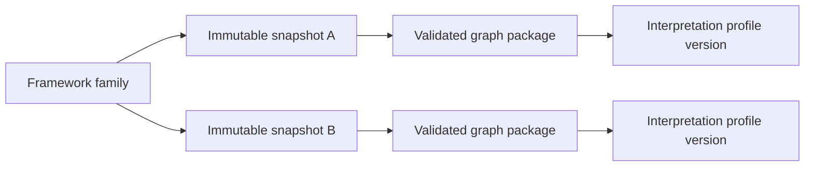

# Concepts and boundaries

**KGForEdGlobalMCP** deliberately separates **what a curriculum source says**, **what
the
server deterministically retrieves or derives**, and **what an MCP host model may infer
from that evidence**.

Understanding that separation is essential when searching standards, navigating
hierarchies, comparing frameworks, or generating curriculum-facing materials.

## Identity model

The server uses several related identifiers that should not be treated as
interchangeable.

### Framework

A **framework** is the stable curriculum family identified by `frameworkId`, for example
a particular national or state curriculum and subject scope.

The framework family can contain one or more immutable snapshots over time.

### Snapshot

A **snapshot** is one immutable version of a framework, identified by `snapshotId`.

Snapshot identity allows the server to preserve historical or revised curriculum states
rather than overwriting a prior source in place. Snapshot relationships, when declared,
are operator-supplied metadata such as `revises`, `replaces`, `supersedes`, or
`derived_from`; the server does not infer those relationships automatically.

### Graph package

A **graph package** is the validated delivery unit used by the runtime. It contains a
manifest, delivery graph files, and detailed provenance or validation artifacts.

`graphPackageId` identifies the package independently of the conceptual framework
family. The package manifest binds together:

- framework and snapshot identity;
- graph type;
- package revision;
- interpretation-profile identity and SHA-256;
- declared artifacts and checksums;
- counts and capabilities;
- rights metadata; and
- validation status.

Even when identifiers happen to share the same text in a current package, framework,
snapshot, and graph-package identity represent different concepts and should remain
distinct.

### Node and source identifiers

Individual curriculum statements may expose several identifiers depending on source
availability:

- package-local `nodeId`;
- CASE UUID;
- CASE URI; and
- source statement code.

Not every framework provides every identifier type. Code search is therefore package-
and profile-specific rather than a universal server capability.

## Interpretation profiles

An **interpretation profile** is the versioned semantic contract that tells the generic
runtime how to interpret a framework without hard-coding curriculum-specific rules.

Profiles define or constrain areas such as:

- local and normalized subjects;
- local grade labels and aliases;
- normalized grade retrieval facets;
- source statement types;
- normalized statement classification;
- hierarchy relationship type and statement-type ordering;
- root and grouping behavior;
- multi-parent policy and parent cardinality;
- code availability, normalization, and prefix-search behavior;
- local language and terminology requirements;
- rights or generated-derivative guidance;
- known source anomalies; and
- required disclosures.

The graph-package manifest binds the accepted package to an exact profile version and
profile SHA-256 so that the same package cannot silently be interpreted under materially
different semantics.

See [Interpretation profiles](data/profiles.md) for the profile contract.

## Prompt configurations

Prompt configurations provide framework-local guidance to the server's generic prompt
workflows.

They can contribute terminology, local context, warnings, and output guidance without
moving model generation into the server. Framework prompt overlays are optional at the
capability level: the generic prompt workflows remain server-defined, while local
overlays refine how a client should work with a particular framework.

See [Prompt configurations](data/prompt-configs.md).

## Local terminology vs. normalized facets

The server preserves local curriculum terminology while also exposing selected
normalized values for discovery and filtering.

For example, different frameworks may use labels such as:

- `BASIC 1`;
- `PRIMARY ONE`;
- `P1`;
- `Class-1`; or
- `Class IX`.

A profile can map those labels to normalized grade facets that make bounded retrieval
easier across packages.

!!! warning "Normalized grade is not grade equivalence"
    A normalized grade value is a retrieval and discovery facet. It does **not** establish
    that two local grades are officially equivalent, instructionally equivalent, or
    interchangeable across curriculum systems.

The same principle applies to normalized subjects and statement classifications:
normalization supports a common interface while the original local terminology remains
authoritative for source representation.

## Standards and groupings

The server uses two framework-independent normalized statement classifications:

- `Standard`
- `Standard Grouping`

A **Standard** is a curriculum statement treated as an instructional or standards item
for normalized retrieval purposes.

A **Standard Grouping** is a structural source item used to organize other statements,
such as a strand, topic, unit, curricular goal, or similar local grouping level.

The exact local statement type remains framework-specific. Profiles define how local
types map into these normalized classifications.

!!! note  "Do not infer educational meaning from the normalized label alone. A `Standard Grouping` can represent different source concepts in different frameworks; use the local statement type and hierarchy path when describing it."

## Source hierarchy

Academic Standards packages currently use the structural relationship type `hasChild`
for retained hierarchy.

Depending on the source and profile, that hierarchy can be a simple tree or a valid
multi-parent directed acyclic graph (DAG).

The current catalog demonstrates both patterns. In particular, the CBSE Science package
contains valid multi-parent targets, so client code must not assume that every node has
exactly one parent or exactly one path to the framework root.

`get_standard_context` therefore supports bounded graph navigation rather than assuming
a single parent chain.

### Hierarchy is not progression

!!! warning "A `hasChild` edge records source structure. It does not assert a prerequisite, learning progression, instructional sequence, conceptual dependency, or mastery relationship."

A source may organize two statements in adjacent grades or under the same branch without
asserting that one must be learned before the other.

## Unresolved relationships

Some accepted packages preserve source relationships that could not be resolved into the
ordinary retained hierarchy with sufficient confidence.

Those relationships are not silently discarded or converted into stronger claims. The
package can retain unresolved evidence and expose it through package metadata or the
approved unresolved-resource family.

An unresolved status means that the source-to-graph relationship remains uncertain under
the package's accepted rules; it should not be interpreted as an ordinary confirmed
hierarchy edge.

## Search semantics

Text search is **lexical**.

The server matches normalized description tokens or contiguous normalized phrases. It
does not currently provide:

- embeddings;
- semantic similarity search;
- stemming;
- lemmatization; or
- automatic synonym expansion.

Consequently, lexical variants can matter. For example, `fraction` and `fractions` are
distinct tokens unless the requested text literally contains the searched form.

!!! warning "Zero results are query-bounded"
    A zero-result lexical search means that the supplied expression did not match under the
    specified framework, snapshot, filters, match policy, and limit. It does **not**
    establish that the curriculum contains no conceptually related material.

A client may issue a small number of conservative alternate queries, but each query
remains a separate bounded retrieval operation. Once a relevant branch is found,
hierarchy context is preferable to unlimited query expansion.

See [Search and retrieve standards](guides/standards-search.md).

## Retrieval candidates vs. source claims

Search and evidence-assembly services explicitly distinguish retrieved candidates from
stronger evidentiary claims.

The shared `EpistemicStatus` vocabulary includes:

| Status                  | Intended meaning                                                        |
|-------------------------|-------------------------------------------------------------------------|
| `source_asserted`       | A claim represented as directly asserted by the source                  |
| `source_extracted`      | Source material retained through the extraction/package process         |
| `deterministic_derived` | A value or result computed deterministically from accepted runtime data |
| `accepted_derived`      | Derived material accepted through the package/operator process          |
| `human_reviewed`        | Material explicitly reviewed by a human                                 |
| `retrieval_candidate`   | A search or evidence candidate returned for further interpretation      |
| `llm_inferred`          | A conclusion or synthesis inferred by a host language model             |
| `unresolved`            | Evidence whose relationship or interpretation remains unresolved        |

Not every response uses every status, but the vocabulary provides a common way to avoid
collapsing source evidence, deterministic computation, and model inference into one
undifferentiated claim.

## Cross-framework comparison

`compare_framework_evidence` is an evidence-retrieval tool, not an alignment engine.

It applies bounded retrieval independently within each selected framework and returns
candidate standards together with package-local context. This preserves differences in
source terminology, grade systems, and hierarchy.

!!! warning "Candidate evidence is not official alignment"
    Similar wording, shared normalized facets, or co-retrieval in one comparison request
    does not establish official equivalence, alignment, grade correspondence,
    interchangeability, or endorsement between frameworks.

A host model can synthesize a comparison from the evidence, but that synthesis must
remain distinguishable from source-asserted relationships.

See [Compare framework evidence](guides/comparison.md).

## Progression evidence

`collect_progression_evidence` assembles bounded candidates across explicitly requested
grade scopes. It validates the requested scope, canonicalizes grades in package-declared
order, deduplicates candidates, balances selection across requested scopes, and reports
uncovered scopes.

The result is evidence that may support a hypothesis; it is not itself a progression
graph.

!!! warning "Ordered evidence is not a prerequisite claim"
    Earlier/later grade placement, shared terminology, or increasing complexity can support
    a carefully qualified hypothesis, but the server does not convert those observations
    into an official prerequisite or learning-progression relationship.

The `inferred_progression_hypothesis` prompt makes the client-side inference boundary
explicit: deterministic retrieval happens in the server; the hypothesis is generated by
the host model.

See [Collect progression evidence](guides/progression.md).

## Provenance, rights, and resource access

Accepted packages carry provenance, rights, and validation evidence alongside graph
data.

Resource exposure is policy-controlled. The presence of a file inside a package does not
mean that an MCP client may automatically retrieve it. The resource service evaluates
approved resource families against manifest declarations, rights-review metadata,
permissions, and configured size limits.

This distinction protects two different concerns:

1. **Provenance:** where a returned statement or artifact came from and how it is
   identified.
2. **Permission:** whether the server is allowed to expose a particular representation
   through an MCP resource.

See [Rights and provenance](data/rights-and-provenance.md).

## Current graph-domain boundary

The domain model reserves identifiers for several graph types, but the accepted runtime
currently focuses on `academic_standards` packages.

`get_capabilities` reports the features actually implemented by the loaded runtime. The
current server explicitly reports the following as unavailable:

- accepted mapping overlays;
- alignment persistence;
- official alignments;
- embeddings;
- learning-component graphs;
- learning-progression graphs;
- MCP sampling;
- semantic candidate retrieval;
- semantic search;
- server-side LLM execution;
- snapshot alignment candidate retrieval; and
- snapshot diffs.

Clients should use runtime capability reporting rather than inferring support from enum
values, planned graph domains, or package filenames.

## Interpretation rules to keep throughout the documentation

The following rules apply across the official documentation:

1. Normalized grades are discovery facets, not official grade equivalence.
2. `hasChild` is structural, not a prerequisite or progression edge.
3. Comparison evidence is not official alignment.
4. Progression evidence is not an asserted learning progression.
5. A retrieval candidate is not automatically a source claim.
6. Zero lexical matches do not prove curriculum absence.
7. Source wording and generated material should remain visibly distinguishable.
8. Local terminology and local grade labels should be preserved when presenting source
   evidence.
9. Search and resource capabilities are package-specific.
10. Accepted snapshots and graph packages are treated as immutable runtime inputs.

---

**Next:** [Quickstart](getting-started/index.md)
