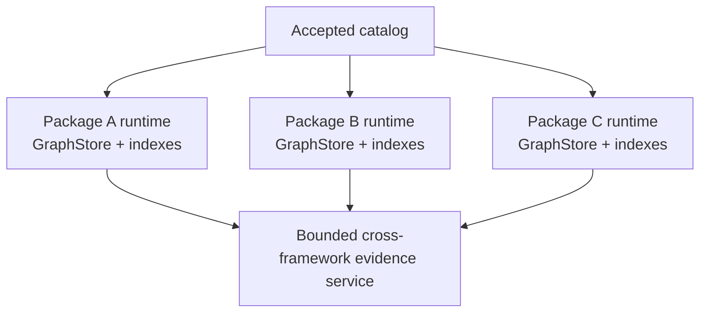

# Graph package format

A graph package is the immutable delivery unit the MCP server validates, indexes, and
serves. Each package belongs to one framework family and one exact snapshot.

The runtime consumes packages; it does not construct curriculum graphs from source PDFs
or other source documents during MCP startup.

## Directory identity

Packages are discovered under:

```text
data/graph_packages/<framework-id>/<snapshot-id>/
```

The snapshot directory must be under the matching framework directory, and both names
must satisfy the repository identifier contracts.

A supplied package has this shape:

```text
<snapshot-id>/
├── package_manifest.json
├── delivery/
│   ├── as_lc_nodes_*.jsonl
│   └── as_lc_relationships_*.jsonl
└── detailed/
    ├── as_entity_provenance.json
    ├── as_kg_bundle.json
    ├── as_lc_kg_bundle.json
    ├── as_relationships_has_child.jsonl
    ├── as_standards_framework.json
    ├── as_standards_framework_items.jsonl
    ├── as_unresolved_items.json
    ├── as_validation_report.json
    ├── lc_dedup_groups.json
    ├── lc_entity_provenance.json
    └── lc_generation_summary.json
```

Artifact basenames differ by framework, but logical roles are declared by the manifest.

## Delivery versus detailed artifacts

| Area                    | Runtime role                                                                                                                    |
|-------------------------|---------------------------------------------------------------------------------------------------------------------------------|
| `delivery/`             | Slim graph records decoded into the package-local graph store and search index                                                  |
| `detailed/`             | Provenance, audit, validation, unresolved evidence, and richer source-shaped artifacts available under manifest/resource policy |
| `package_manifest.json` | Identity, checksums, counts, capabilities, profile binding, rights, and validation state                                        |

The server's primary graph runtime is built from the manifest-declared `nodes` and
`relationships` delivery artifacts.

## Delivery JSONL envelope

Delivery schema version `1.0` uses one JSON object per physical line.

A node record has this outer shape:

```json
{
  "identifier": "b8436bd2-daea-5d82-acd6-850e6d00bcf2",
  "labels": ["StandardsFrameworkItem"],
  "properties": {
    "caseIdentifierUUID": "b8436bd2-daea-5d82-acd6-850e6d00bcf2",
    "description": "Explore using certain culturally acceptable language for communication",
    "gradeLevel": "[\"3\"]",
    "isCurrent": "true",
    "statementCode": "B3.1.6.1",
    "statementType": "Content Standard"
  },
  "type": "node"
}
```

A relationship record contains source and target outer node IDs plus source-facing
relationship properties:

```json
{
  "identifier": "28b84369-c0bc-57d9-b87a-7802f4c49b53",
  "label": "hasChild",
  "properties": {
    "relationshipType": "hasChild",
    "sourceEntityKey": "caseIdentifierUUID",
    "targetEntityKey": "caseIdentifierUUID"
  },
  "source_identifier": "3af5ee9c-2fd2-502b-beb0-8ee969d57556",
  "source_labels": ["StandardsFrameworkItem"],
  "target_identifier": "0017af07-7b1b-56ec-91cd-36916e5ee0a4",
  "target_labels": ["StandardsFrameworkItem"],
  "type": "relationship"
}
```

## String-valued wire properties

The external delivery `properties` object deliberately preserves source values as
strings. The decoder is the boundary that interprets a small set of known encodings.

For schema `1.0`:

- booleans are decoded only from the exact strings `"true"` and `"false"`;
- array-valued properties such as `gradeLevel` are JSON arrays encoded inside a string;
- unknown string properties are retained rather than discarded; and
- malformed encodings fail with typed parsing/decoding findings instead of being
  coerced loosely.

The decoder does not repair identifiers, resolve endpoints, or validate graph topology;
those are later validation stages.

## Node labels

Delivery schema `1.1` recognizes these Learning Commons-shaped labels:

```text
StandardsFramework
StandardsFrameworkItem
LearningComponent
```

Every node must carry exactly one of these labels. A record matching none of them, or
more than one, is rejected at decode.

The package must contain the expected framework root and item records required by the
manifest counts and semantic validators.

## Learning components

A learning component is model-generated content decomposed from a standards framework
item. It is kept separate from standards at every level: its own node type, its own
package collection, and its own manifest counts. Standards results, hierarchy traversal,
search indexes, and framework statistics are all built from item nodes and therefore
never include generated content.

A learning component carries no CASE identifier, no grade level, and no statement
taxonomy. Those belong to published standards and are recovered by following the
component's `supports` relationships to the standards items it was decomposed from.

Delivery artifacts carry standards and learning components together, and take the
`as_lc_` filename prefix:

```text
delivery/as_lc_nodes_<subject>.jsonl
delivery/as_lc_relationships_<subject>.jsonl
detailed/as_lc_validation_report.json
```

## Relationship representation

The current hierarchy relationship type is `hasChild`. Delivery schema `1.1` adds
`supports`, which runs from a learning component to the standards framework item it was
decomposed from, and carries a `supportConfidence` between zero and one.

Relationships retain both outer node identifiers and source-facing endpoint metadata.
The validator checks that these representations agree and that endpoints resolve
correctly.

Endpoints are referenced by different properties depending on the node they point at. A
standards framework or framework item endpoint is referenced by `caseIdentifierUUID`; a
learning component endpoint is referenced by `identifier`, because a learning component
has no CASE identity to cite. A `supports` relationship is therefore asymmetric,
referencing its source by `identifier` and its target by `caseIdentifierUUID`.

Two rules keep generated content out of source-asserted structure: a `supports`
relationship must run from a learning component to a standards framework item, and a
learning component must never appear in the `hasChild` hierarchy in either direction.
Every learning component must be reachable by at least one `supports` relationship.

A relationship can also carry a supported unresolved status such as
`unresolvedRootFallback`. Such evidence remains explicitly unresolved rather than being
silently repaired.

## Closed package tree

The package tree is exact, not an open directory of auxiliary files.

The loader computes the expected file set as:

```text
package_manifest.json
+ every artifact path declared by the manifest
```

It then rejects:

- missing declared files;
- undeclared files;
- undeclared directories;
- unsafe/symlinked entries;
- artifact paths escaping the package root; and
- case-insensitive name collisions in repository/package discovery.

This means adding a file to an accepted package without declaring it in the manifest is
a validation change, not a harmless sidecar operation.

## Package-local isolation

Each accepted package gets its own graph runtime and search indexes. Framework graphs
are not merged into a single source graph.



Cross-framework tools can retrieve evidence from multiple package-local runtimes, but
they do not create cross-framework source edges or mutate any package.

## Immutability

Terminal accepted packages are treated as immutable inputs. Catalog startup revalidates
a terminal `passed` package read-only. If its bytes, tree, profile binding, or semantics
no longer validate, catalog publication fails rather than accepting the modified
content under the old identity.

See [Validation and lifecycle](validation.md) for the complete acceptance flow.

---

**Next:** [Manifest contract](manifest.md)
