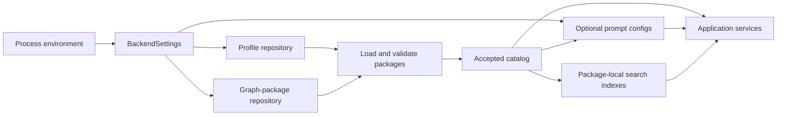

# Runtime inputs

**KGForEdGlobalMCP** builds one immutable application state from process-environment
settings, versioned interpretation profiles, versioned graph packages, and optional
framework-local prompt configuration.

This section documents those inputs as runtime contracts. It does not describe the
upstream document-extraction or knowledge-graph-construction process that produced the
accepted graph packages.

## Input model



The bootstrap order matters: package acceptance depends on the exact profile referenced
by each manifest, and prompt configuration is loaded only after the accepted catalog is
known.

## Repository layout

The default repository-relative locations are:

```text
config/
├── profiles/
│   └── <profile-id>/
│       └── <profile-version>/
│           └── profile.json
└── prompts/
    └── <profile-id>/
        └── <profile-version>/
            └── prompts.json

data/
└── graph_packages/
    └── <framework-id>/
        └── <snapshot-id>/
            ├── package_manifest.json
            ├── delivery/
            └── detailed/
```

The runtime roots can be overridden through environment variables. See
[Environment variables](../operations/configuration.md) for the operational settings.

## What each input owns

| Input                  | Owns                                                                                                                          | Does not own                                        |
|------------------------|-------------------------------------------------------------------------------------------------------------------------------|-----------------------------------------------------|
| Process environment    | Repository roots, invalid-package policy, resource-size limits, runtime settings                                              | Curriculum semantics                                |
| Interpretation profile | Local terminology, grade mappings, hierarchy, statement types, code policy, rights guidance, anomalies, disclosures           | Graph records or package checksums                  |
| Graph package          | Immutable framework/snapshot identity, graph records, provenance artifacts, capabilities, rights, checksums, validation state | Host-model reasoning                                |
| Prompt configuration   | Optional framework-local soft guidance for generic prompt workflows                                                           | MCP tool behavior, graph mutation, or LLM execution |

## Startup inputs actually used by the composition root

`bootstrap_application()` constructs the application from one `BackendSettings`
instance and directly consumes:

- `profile_root`;
- `graph_packages_root`;
- `prompt_root`;
- `invalid_package_policy`;
- `max_resource_bytes`; and
- `max_resource_source_bytes`.

The settings model also exposes other repository paths for broader project use, but the
accepted catalog is constructed from validated graph packages rather than from a
required `config/catalog.json` file.

## Versioned identity

The runtime intentionally separates several identities:

| Identity                                 | Example purpose                                                  |
|------------------------------------------|------------------------------------------------------------------|
| `frameworkId`                            | Stable framework family                                          |
| `snapshotId`                             | Immutable source/version snapshot within a framework             |
| `graphPackageId`                         | Immutable graph-package identity for the snapshot and graph type |
| `profileId` + `profileVersion`           | Versioned interpretation contract                                |
| `promptConfigId` + `promptConfigVersion` | Versioned optional prompt guidance                               |

A package manifest also records the SHA-256 of the exact interpretation-profile bytes.
The profile therefore participates in package identity and acceptance rather than being
an untracked runtime preference.

## Read-only runtime boundary

The server treats accepted package content as immutable during normal MCP operation.
Search indexes and graph stores are constructed at startup from accepted packages, and
MCP calls do not rewrite source records, repair hierarchy, accept inferred alignments,
or persist model-generated conclusions.

The package-validation CLI can perform the narrowly controlled transition of a
`pending` manifest to a terminal validation status. Catalog startup itself revalidates
packages read-only.

!!! important "Configuration is interpretation, not source replacement"
    Profiles and prompt configurations may normalize discovery facets or provide
    guidance, but they do not authorize the server to rewrite source-visible curriculum
    statements or silently synthesize missing source structure.

## Trust roots

Profiles, prompt configs, and graph packages are resolved beneath configured filesystem
roots. Their loaders reject unsafe path behavior such as symbolic-link escapes and
identity/path mismatches. Graph packages additionally require a closed package tree:
files that are undeclared by the manifest are validation failures.

## Where to go next

- [Interpretation profiles](profiles.md) — framework-specific semantic policy.
- [Prompt configurations](prompt-configs.md) — optional local prompt guidance.
- [Graph package format](graph-packages.md) — immutable package structure and delivery artifacts.
- [Manifest contract](manifest.md) — package identity, checksums, counts, capabilities, and validation state.
- [Validation and lifecycle](validation.md) — package acceptance and catalog rules.
- [Rights and provenance](rights-and-provenance.md) — content exposure and evidentiary traceability.
- [Available frameworks](framework-catalog.md) — the six packages supplied with this repository snapshot.

---

**Next:** [Interpretation profiles](profiles.md)
