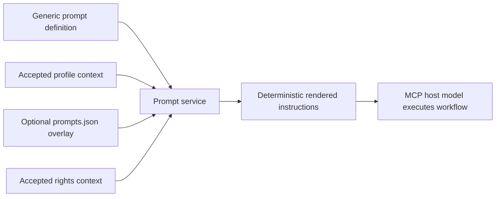

# Prompt configurations

Framework-local prompt configurations add optional soft guidance to the server's six
generic prompt workflows. They provide terminology, context, warnings, pedagogy, and
presentation guidance without changing tool behavior or executing an LLM.

## Location and selection

Prompt configs use the accepted profile identity:

```text
config/prompts/<profile-id>/<profile-version>/prompts.json
```

The prompt root is optional. If the configured root does not exist, the server starts
with an empty prompt-config registry and uses generic prompt definitions only. If a
`prompts.json` file is present for an accepted profile, it must validate successfully.

The supported `promptConfigSchemaVersion` is currently `1.0` and one prompt config is
limited to **64 KiB** of exact file bytes.

## Identity contract

A configuration declares:

| Field                       | Meaning                                                |
|-----------------------------|--------------------------------------------------------|
| `promptConfigId`            | Stable kebab-case configuration identity               |
| `promptConfigVersion`       | Configuration version token                            |
| `promptConfigSchemaVersion` | Schema version, currently `1.0`                        |
| `profileId`                 | Exact profile ID selecting the config                  |
| `profileVersion`            | Exact profile version selecting the config             |
| `frameworkIds`              | Exact framework-ID tuple owned by the selected profile |
| `shared`                    | Guidance applied across generic prompt workflows       |
| `prompts`                   | Prompt-specific overlay sections                       |

The repository rejects a present config whose profile identity or `frameworkIds` differ
from the accepted profile.

## Shared guidance

`shared` can contain these optional blocks:

- `languageGuidance`;
- `localContextGuidance`;
- `outputGuidance`;
- `terminologyGuidance`; and
- `warningGuidance`.

Each block contains one to 20 unique instructions and a `mode`.

```json
{
  "terminologyGuidance": {
    "mode": "append",
    "instructions": [
      "Use the source hierarchy terms BASIC 1, BASIC 2, BASIC 3, Strand, Sub-Strand, Content Standard, Indicator, and Exemplar rather than replacing them with generic international labels."
    ]
  }
}
```

A shared configuration may contain at most **40 instructions** in total.

## Guidance modes

A guidance block can use:

| Mode      | Behavior                                                                   |
|-----------|----------------------------------------------------------------------------|
| `append`  | Add framework-local instructions to the generic section                    |
| `replace` | Replace the generic soft-guidance section with the configured instructions |

These modes operate on prompt guidance, not on source evidence, rights gates, MCP tool
schemas, or graph records.

## Prompt-specific overlays

The schema supports optional overlays for all six generic prompt names.

| Prompt                            | Supported local guidance sections                            |
|-----------------------------------|--------------------------------------------------------------|
| `student_study_support`           | audience, example, explanation, practice                     |
| `teacher_guide_draft`             | assessment, differentiation, lesson structure, pedagogy      |
| `student_handbook_section`        | audience, example, explanation, section structure            |
| `inferred_progression_hypothesis` | counter-evidence, evidence, inference, sequence presentation |
| `administrator_alignment_review`  | evidence matrix, governance, risk framing, review questions  |
| `cross_framework_comparison`      | comparison dimensions, synthesis, terminology, uncertainty   |

Each prompt-specific overlay may contain at most **60 instructions**. A complete
framework prompt config must contain at least one guidance instruction across `shared`
and `prompts`.

## Current repository configurations

The repository snapshot contains one prompt config for each of the six accepted profile
identities. All currently declare `promptConfigVersion` `1.0.0`.

| Framework/profile                  | Prompt-config ID                                              | Current prompt-specific overlays                                     |
|------------------------------------|---------------------------------------------------------------|----------------------------------------------------------------------|
| Ghana English Basic 1–3            | `ghana-nacca-primary-english-language-basic-1-3-guidance`     | Study support, teacher guide, student handbook, inferred progression |
| Ghana Mathematics Basic 4–6        | `ghana-nacca-primary-mathematics-basic-4-6-guidance`          | Study support, teacher guide, student handbook, inferred progression |
| CBSE Science Classes IX–X          | `india-cbse-science-learning-framework-classes-9-10-guidance` | Study support, teacher guide, student handbook, inferred progression |
| Tamil Nadu Mathematics Classes 1–5 | `india-tamil-nadu-tnscert-mathematics-classes-1-5-guidance`   | Study support, teacher guide, student handbook, inferred progression |
| Nigeria Mathematics Primary 1–3    | `nigeria-nerdc-mathematics-primary-1-3-guidance`              | Study support, teacher guide, student handbook, inferred progression |
| Rwanda Mathematics P1–P3           | `rwanda-reb-mathematics-lower-primary-1-3-guidance`           | Study support, teacher guide, student handbook, inferred progression |

All six also provide the five shared-guidance sections. The current files do **not**
declare framework-local `administratorAlignmentReview` or `crossFrameworkComparison`
overlays, although the schema supports them. Those multi-framework workflows still use
the generic prompt definition and the selected frameworks' accepted profile/rights
context.

## Prompt configuration is optional; prompt registration is not

The server always registers the six generic prompts. Missing framework-local config
means there is no local overlay for that profile; it does not remove the generic prompt
from the MCP surface.



!!! important "No server-side generation"
    `prompts.json` does not contain a model endpoint or model settings. The server
    renders deterministic instructions; the connected MCP host performs any reasoning
    and content generation.

## Filesystem and validation boundary

Prompt configuration is selected only for profiles already present in the accepted
catalog. The repository:

- resolves the prompt root beneath a filesystem trust boundary;
- rejects symlinked profile/version/file components;
- checks file size before and after reading;
- validates the strict schema;
- verifies profile/framework identity; and
- computes a SHA-256 for the loaded config record.

Unlike the interpretation-profile SHA, the prompt-config SHA is not part of the graph
package manifest contract.

## When to change a prompt config

Use prompt configuration for framework-local **soft guidance**, such as:

- preserving source terminology;
- adapting explanations to local curriculum language;
- reminding the host about known caveats;
- suggesting age-appropriate generated examples; or
- structuring a generated teacher/student artifact.

Do not use it to redefine package identity, change hierarchy, enable unsupported code
search, override rights, or assert official alignment/progression.

See [Use prompt workflows](../guides/prompts.md) for user-facing prompt behavior and
[Prompts reference](../reference/prompts.md) for exact MCP prompt arguments.

---

**Next:** [Graph package format](graph-packages.md)
