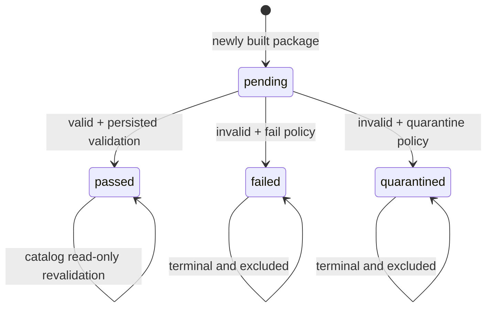
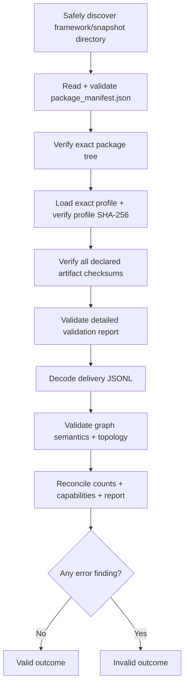

# Validation and lifecycle

Package validation is the trust boundary between files present in the repository and
packages that the MCP server is willing to catalog and serve.

A directory is not accepted merely because it contains syntactically valid JSON. The
loader and validator establish filesystem integrity, manifest/artifact integrity,
profile binding, delivery decoding, semantic consistency, topology, counts,
capabilities, rights metadata, and terminal validation state.

## Package states



Supported `validation.status` values are:

| State         | Meaning for catalog startup                                                                    |
|---------------|------------------------------------------------------------------------------------------------|
| `passed`      | Eligible only if current read-only revalidation also succeeds                                  |
| `pending`     | Not queryable; valid pending packages remain excluded until a terminal transition is persisted |
| `failed`      | Terminal and excluded                                                                          |
| `quarantined` | Terminal and excluded                                                                          |

A terminal status requires `validatedAt`; `pending` may not declare it.

## Validation pipeline



The stages are deliberately separate so the runtime never relies on one upstream
validation flag as a substitute for current integrity checks.

## Filesystem discovery and tree integrity

Before graph content is trusted, repository/package discovery checks:

- framework and snapshot directory names;
- snapshot namespace agreement with framework ID;
- directory containment beneath the configured root;
- real directories/files rather than symbolic links;
- case-insensitive name collisions; and
- safe manifest and artifact paths.

The package tree must then match `package_manifest.json` exactly. Missing declared files,
undeclared files, and undeclared directories are findings.

## Manifest and artifact integrity

The loader validates the strict manifest contract and then verifies every declared
artifact:

- safe package-local path;
- regular-file status;
- exact SHA-256 checksum;
- exact declaration/checksum closure; and
- stable integrity observations used to detect changes before persistence.

The manifest itself is parsed as one UTF-8 JSON object with duplicate-key rejection.

## Profile integrity

The loader resolves the exact `profileId` and `profileVersion` from the central profile
repository and checks the exact-byte profile SHA-256 against the manifest.

A package therefore cannot silently start using newly edited profile semantics while
retaining the old accepted manifest identity.

## Detailed validation report

When declared, `as_validation_report.json` must satisfy the supported acceptance
contract. In particular:

- `passed` must be the exact boolean `true`;
- `errors` must be an empty array;
- `validation_checks` must be a non-empty array of unique non-blank strings; and
- `object_counts` must include the required Learning Commons delivery graph counts.

Required report count names are:

```text
learning_commons_framework_nodes
learning_commons_item_nodes
learning_commons_relationships
learning_commons_unresolved_fallback_relationships
```

The server later compares report counts with independently observed delivery facts and
manifest counts.

## Delivery decoding

The decoder reads one physical JSONL line at a time and validates strict node or
relationship envelopes. It then decodes known string encodings such as exact boolean
strings and embedded JSON arrays.

Malformed UTF-8, invalid JSON, invalid envelopes, or invalid encoded properties produce
typed findings. The decoder does not perform source repair.

## Graph and semantic validation

After successful decoding, validation checks include:

- unique and consistent node identifiers/labels;
- framework and profile semantics;
- item statement types and normalized classifications;
- grade/stage mappings;
- statement-code policy;
- relationship identity and endpoint agreement;
- relationship endpoint existence;
- hierarchy acyclicity;
- root reachability;
- root-parent rules;
- ordinary parent type/cardinality policy;
- multi-parent policy;
- unresolved/fallback-parent representation; and
- consistency of counts and capabilities.

A tree-shaped profile and a multi-parent DAG are validated against different profile
rules rather than against one hard-coded hierarchy assumption.

## Count and capability reconciliation

The validator derives graph facts independently:

- coded item count;
- multi-parent target count;
- text-item count; and
- unresolved relationship count.

Those facts are reconciled with manifest `counts`, package `capabilities`, profile code
policy, and the detailed validation report. A manifest cannot declare a capability that
conflicts with the accepted graph/profile facts.

## Persisted validation transitions

The validator can persist a status transition only when all of the following are true:

1. the observed manifest state is `pending`;
2. the caller did not request read-only validation;
3. the loader retained the integrity context needed for a safe transition;
4. the package/profile state is verified unchanged after validation; and
5. no blocking condition suppresses persistence.

Before replacement, the repository checks that the manifest bytes are still the same.
The terminal update is atomic and is required to change only the validation state and
timestamp, not package-defining fields.

Terminal manifests are revalidated read-only; they are not rewritten by catalog startup.

## Invalid-package policy

`KGFEGMCP_INVALID_PACKAGE_POLICY` controls the target status for an **invalid pending**
package and catalog behavior for that invalid candidate:

| Policy       | Validation target | Catalog behavior                                            |
|--------------|-------------------|-------------------------------------------------------------|
| `fail`       | `failed`          | Invalid pending package causes catalog construction to fail |
| `quarantine` | `quarantined`     | Invalid pending package is excluded from the catalog        |

This policy never makes an invalid package queryable.

A valid `pending` package is also not queryable until it has a persisted terminal
`passed` state.

## Catalog acceptance is stricter than terminal status alone

Catalog construction validates every discovered candidate with persistence disabled.
Only a package whose **observed** status is `passed` and whose current validation outcome
is still valid becomes a `CatalogPackageRuntime`.

Important consequences:

- `failed` and `quarantined` packages are excluded;
- valid `pending` packages are excluded;
- a `passed` package that now fails revalidation is a catalog integrity error and stops
  startup;
- malformed candidates whose status cannot be trusted stop safe catalog construction;
  and
- if no terminal passed packages remain, startup fails instead of publishing an empty
  catalog.

!!! important "Passed means accepted bytes plus current revalidation"
    Do not interpret `validation.status == "passed"` as a permanent bypass of integrity
    checks. The server revalidates terminal passed packages read-only every time it
    constructs the catalog.

See [CLI commands](../operations/cli.md) for the validation command workflow.

---

**Next:** [Rights and provenance](rights-and-provenance.md)
