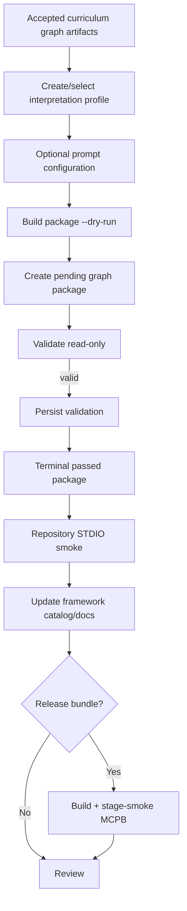

# Add or update a framework

Adding an Academic Standards framework should normally be a **data and configuration
change**, not a curriculum-specific Python change.

The backend is designed to apply the same package validation, catalog, search, graph,
resource, prompt, and MCP behavior to each accepted package.

## Before you start

This repository consumes already-created curriculum graph artifacts. It does not include
the upstream PDF/document extraction or knowledge-graph construction pipeline.

You need accepted source artifacts that satisfy the delivery and detailed artifact
contracts before the package builder can create a graph package.

Read these references first:

- [Interpretation profiles](../data/profiles.md)
- [Prompt configurations](../data/prompt-configs.md)
- [Graph package format](../data/graph-packages.md)
- [Manifest contract](../data/manifest.md)
- [Validation and lifecycle](../data/validation.md)
- [Rights and provenance](../data/rights-and-provenance.md)

## Decide what is changing

Use a **new framework ID** when the conceptual framework family is different.

Use a **new snapshot** when the source curriculum/version changes within the same
framework family. Snapshot IDs are immutable and namespaced by framework ID.

Do not edit an already passed package in place. The current package builder supports
initial package revision `1`; the current loader/validator also supports revision `1`.
An update therefore should be represented as a new immutable snapshot rather than an
invented later package revision.

## End-to-end workflow



## 1. Create or version the interpretation profile

Profiles live at:

```text
config/profiles/<profile-id>/<profile-version>/profile.json
```

The profile is the semantic contract between generic Python and the curriculum. It
should express source-local behavior such as:

- framework and jurisdiction terminology;
- local grade labels and normalized discovery facets;
- source statement types and normalized classifications;
- hierarchy levels and allowed parent relationships;
- tree versus multi-parent DAG behavior;
- root/grouping semantics;
- code format, normalization, and prefix-search policy;
- language/terminology preservation;
- rights and derivative-use policy;
- known source anomalies; and
- required disclosures.

Do not solve a profile problem by adding `if framework_id == ...` branches to generic
runtime code.

If profile semantics change for an existing immutable snapshot/package, create a new
appropriate version/snapshot relationship rather than silently changing the bytes that
a passed package checksum already binds.

## 2. Add optional prompt guidance

Prompt configuration lives at:

```text
config/prompts/<profile-id>/<profile-version>/prompts.json
```

Prompt overlays are optional. Use them for framework-local terminology, warnings,
context, or output guidance—not for retrieval logic that belongs in ordinary services or
profile semantics.

The prompt configuration must resolve against the same profile identity/version used by
the package.

## 3. Prepare delivery artifacts

The package builder requires canonical node and relationship JSONL inputs:

```text
as_nodes_*.jsonl
as_relationships_*.jsonl
```

Recognized detailed artifacts may also be supplied, including the retained standards
framework/items, provenance, KG bundle, hierarchy relationships, unresolved items, and
validation report described in [Graph package format](../data/graph-packages.md).

Treat source wording, identifiers, hierarchy, unresolved relationships, rights, and
provenance as evidence to preserve rather than values to normalize away.

## 4. Dry-run the package build

The safest operator interface is a JSON build specification:

```bash
uv --directory backend run --locked --no-dev \
  kgfegmcp-build-manifest \
  --spec ./package-build-spec.json \
  --dry-run
```

A minimal specification has this shape:

```json
{
  "jurisdictionType": "<operator-approved type>",
  "nodes": "/absolute/path/to/as_nodes_XXX.jsonl",
  "outputRoot": "/absolute/path/to/data/graph_packages",
  "profileId": "<profile-id>",
  "profileVersion": "<profile-version>",
  "relationships": "/absolute/path/to/as_relationships_XXX.jsonl",
  "versionToken": "<immutable source version token>"
}
```

Optional fields cover detailed artifacts, explicitly named additional artifacts,
snapshot relations, a source document, and authoritative source publication date.

The builder creates/proposes a **pending** package. It does not replace complete package
validation.

## 5. Create the pending package

After reviewing the dry run:

```bash
uv --directory backend run --locked --no-dev \
  kgfegmcp-build-manifest --spec ./package-build-spec.json
```

The package is written beneath:

```text
data/graph_packages/<framework-id>/<snapshot-id>/
```

The builder is deterministic: an already-existing byte-identical pending target can be
reported as `existing_identical`; it will not overwrite a different or terminal package
as though it were the same build.

## 6. Validate read-only first

Resolve the generated framework and snapshot IDs from the builder result, then run:

```bash
uv --directory backend run --locked --no-dev \
  kgfegmcp-validate-packages one \
  --framework-id <framework-id> \
  --snapshot-id <snapshot-id> \
  --read-only
```

Review every finding. Validation covers package closure and checksums, profile binding,
delivery decoding, graph semantics, topology, counts, capabilities, rights metadata, and
other acceptance invariants.

Do not weaken validation merely to admit one framework. If the source genuinely needs a
new generic capability, model that capability explicitly and test it across appropriate
packages.

## 7. Persist the terminal state

When read-only validation is clean, persist the pending-to-passed transition:

```bash
uv --directory backend run --locked --no-dev \
  kgfegmcp-validate-packages one \
  --framework-id <framework-id> \
  --snapshot-id <snapshot-id>
```

Only a terminal `passed` package that still passes catalog read-only revalidation is
eligible to be served.

A `failed` or `quarantined` package is terminal and excluded. A valid but still
`pending` package is also excluded.

## 8. Verify discovery and retrieval

Run the end-to-end smoke test:

```bash
uv --directory backend run --locked --no-dev kgfegmcp-stdio-smoke
```

Then verify the new framework through an MCP client or focused service/tool tests:

1. `list_frameworks` returns the framework/snapshot;
2. `get_framework` resolves it exactly;
3. `get_capabilities` reports package-appropriate search/resource behavior;
4. representative text search returns source-grounded hits;
5. code search behaves exactly as the profile permits;
6. hierarchy context preserves all valid parent edges; and
7. declared resource access follows rights policy.

For a multi-parent package, include a representative node whose complete root paths prove
that all valid parent edges survive loading and traversal.

## 9. Update documentation

Update the generated or maintained framework catalog and any framework-specific caveats:

- [Available frameworks](../data/framework-catalog.md)
- examples that intentionally name current framework/snapshot IDs;
- search-code support matrices;
- rights/disclosure notes; and
- totals derived from accepted manifests.

Do not hand-copy source facts into many pages when they can instead be generated from the
manifest/profile contracts.

## 10. Validate packaged distribution when applicable

If the new package is part of the MCPB release, build and retain a stage:

```bash
rm -rf ./dist/kgfegmcp-stage

uv --directory backend run --locked --no-dev kgfegmcp-build-mcpb \
  --stage-output ./dist/kgfegmcp-stage

uv --directory backend run --locked --no-dev kgfegmcp-stdio-smoke \
  --bundle-root ./dist/kgfegmcp-stage
```

The stage smoke proves that configuration, profile, data, and backend files were all
included independently of the source checkout.

## Updating only prompt guidance

If source/package semantics do not change but prompt guidance does, version the prompt
configuration according to the repository's profile/prompt policy and verify prompt
rendering without altering accepted source evidence.

Prompt changes never turn model-generated text into source assertions.

## When Python changes are justified

A new framework should trigger generic Python changes only when it exposes a genuinely
new reusable requirement—for example a new framework-independent topology capability,
resource class, or search policy that the current typed contracts cannot represent.

In that case:

1. extend the generic model/service first;
2. keep framework-specific values in profiles/manifests;
3. add positive and negative tests across representative packages;
4. update capability reporting honestly; and
5. update MCP/reference contracts only if the public surface changes.

---

**Next:** [Testing and acceptance](testing.md)
