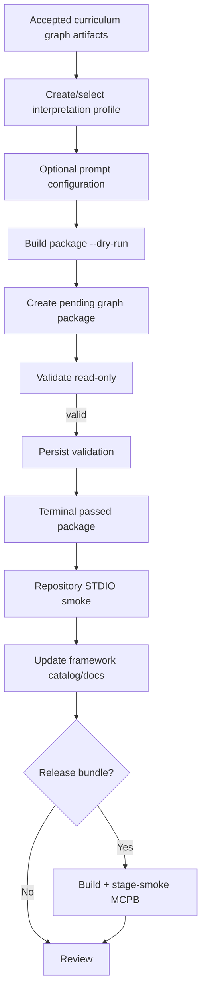

# Add or update a framework

> **Rollout prerequisite:** LP rebuild examples require the corresponding maintained input artifacts and version-2.0 profiles from the data PRs. See [the staged rollout](lp-migration.md).

Adding an Academic Standards framework should normally be a **data and configuration
change**, not a curriculum-specific Python change.

The backend is designed to apply the same package validation, catalog, search, graph,
resource, prompt, and MCP behavior to each accepted package.

## Before you start

This repository consumes already-created curriculum graph artifacts. It does not include
the upstream PDF/document extraction or knowledge-graph construction pipeline.

You need accepted source artifacts that satisfy the delivery and detailed artifact
contracts before the package builder can create a graph package.

Read these references first:

- [Interpretation profiles](../data/profiles.md)
- [Prompt configurations](../data/prompt-configs.md)
- [Graph package format](../data/graph-packages.md)
- [Manifest contract](../data/manifest.md)
- [Validation and lifecycle](../data/validation.md)
- [Rights and provenance](../data/rights-and-provenance.md)

## Decide what is changing

Use a **new framework ID** when the conceptual framework family is different.

Use a **new snapshot** when the source curriculum/version changes within the same
framework family. Snapshot IDs are immutable and namespaced by framework ID.

Do not edit an already passed package in place. The current package builder supports
initial package revision `1`; the current loader/validator also supports revision `1`.
An update therefore should be represented as a new immutable snapshot rather than an
invented later package revision.

## End-to-end workflow


```mermaid
%%{init: {"themeVariables": {"fontSize": "18px"}}}%%
flowchart TB
    SOURCE[Accepted curriculum graph artifacts] --> PROFILE[Create/select interpretation profile]
    PROFILE --> PROMPT[Optional prompt configuration]
    PROMPT --> DRY[Build package --dry-run]
    DRY --> BUILD[Create pending graph package]
    BUILD --> READONLY[Validate read-only]
    READONLY -->|valid| PERSIST[Persist validation]
    PERSIST --> PASSED[Terminal passed package]
    PASSED --> SMOKE[Repository STDIO smoke]
    SMOKE --> DOCS[Update framework catalog/docs]
    DOCS --> BUNDLE{Release bundle?}
    BUNDLE -- Yes --> MCPB[Build + stage-smoke MCPB]
    BUNDLE -- No --> DONE[Review]
    MCPB --> DONE
```

## 1. Create or version the interpretation profile

Profiles live at:

```text
config/profiles/<profile-id>/<profile-version>/profile.json
```

The profile is the semantic contract between generic Python and the curriculum. It
should express source-local behavior such as:

- framework and jurisdiction terminology;
- local grade labels and normalized discovery facets;
- source statement types and normalized classifications;
- hierarchy levels and allowed parent relationships;
- tree versus multi-parent DAG behavior;
- root/grouping semantics;
- code format, normalization, and prefix-search policy;
- language/terminology preservation;
- rights and derivative-use policy;
- known source anomalies; and
- required disclosures.

Do not solve a profile problem by adding `if framework_id == ...` branches to generic
runtime code.

If profile semantics change for an existing immutable snapshot/package, create a new
appropriate version/snapshot relationship rather than silently changing the bytes that
a passed package checksum already binds.

## 2. Add optional prompt guidance

Prompt configuration lives at:

```text
config/prompts/<profile-id>/<profile-version>/prompts.json
```

Prompt overlays are optional. Use them for framework-local terminology, warnings,
context, or output guidance—not for retrieval logic that belongs in ordinary services or
profile semantics.

The prompt configuration must resolve against the same profile identity/version used by
the package.

## 3. Prepare delivery artifacts

The package builder requires canonical node and relationship JSONL inputs:

```text
as_lc_lp_nodes_*.jsonl
as_lc_lp_relationships_*.jsonl
```

Recognized detailed artifacts may also be supplied, including the retained standards
framework/items, provenance, KG bundle, hierarchy relationships, unresolved items, and
validation report described in [Graph package format](../data/graph-packages.md).

Treat source wording, identifiers, hierarchy, unresolved relationships, rights, and
provenance as evidence to preserve rather than values to normalize away.

## Learning progression inputs and updates

The six mixed AS/LC/LP packages reuse one graph/runtime per curriculum. Nodes and the AS/LC relationship prefix remain byte-identical; normalized LP wire records are appended in `(relationship type, identifier)` order. Source/target CASE UUIDs resolve to the existing outer standard IDs. Combined upstream exports are reconciliation inputs, not interchangeable delivery files: five use a flat format; CBSE uses envelopes. Preparation normalizes the split LP records and preserves exact IDs, endpoint orientation, origin, attribution and rich original provenance. It does not rerun the producer/checker pipeline or accept final claims as edges.

### Retained input boundaries

| Maintained input set                   | Framework                                            | Original source document key                                       |
|----------------------------------------|------------------------------------------------------|--------------------------------------------------------------------|
| `data/input_artifacts/ghana_english`   | `ghana-nacca-primary-english-language-basic-1-3`     | `e49a792637011b32ed2ed906d58f9992e5208d2b7c15425ccc971f4f51de43c8` |
| `data/input_artifacts/ghana_math`      | `ghana-nacca-primary-mathematics-basic-4-6`          | `8d59d76cb439110ad9409e9c12561023df60d12f234ced7285796f7e320fd9fa` |
| `data/input_artifacts/pratham_science` | `india-cbse-science-learning-framework-classes-9-10` | `3f8c25c19ed8395bf6625b7958092b8d219cae743b9ea36fcfd56efd59b6d2fc` |
| `data/input_artifacts/madhi_math`      | `india-tamil-nadu-tnscert-mathematics-classes-1-5`   | `33c5da78839a7611308dd30f342b72f931a661235e094cc641832ec2a5548444` |
| `data/input_artifacts/nigeria_math`    | `nigeria-nerdc-mathematics-primary-1-3`              | `09d6b52b54b2f6b00d5279a58650d0ef10ab5a6a5d3da02d10b24c42edb1058a` |
| `data/input_artifacts/rwanda_math`     | `rwanda-reb-mathematics-lower-primary-1-3`           | `7b9629e6bd5ad5566e6420892908a307687543ede8cc0c676ddf5b0321ba5874` |

The original 23-file copy set for each document is:

```text
as_entity_provenance.json
as_kg_bundle.json
as_lc_kg_bundle.json
as_lc_lp_kg_bundle.json
as_lc_lp_nodes.jsonl
as_lc_lp_relationships.jsonl
as_lc_nodes.jsonl
as_lc_relationships.jsonl
as_lc_validation_report.json
as_relationships_has_child.jsonl
as_standards_framework.json
as_standards_framework_items.jsonl
as_unresolved_items.json
lc_dedup_groups.json
lc_entity_provenance.json
lc_generation_summary.json
lp_final_claims.json
lp_generation_summary.json
lp_relationship_provenance.json
lp_relationships_builds_towards.jsonl
lp_relationships_relates_to.jsonl
lp_unresolved_items.json
lp_validation_report.json
```

Raw verified copies live at `data/source_artifacts/learning_progressions/<doc-key>/kgs/`. Their `copy_receipt.json` records source paths, framework/CASE mapping, size, SHA-256 before and after copying, destination hash and old package/profile identities. The initial copy retained 138 files (933,392,640 bytes), reconciled all 8,080 LP edges, and verified the external originals were unchanged. Raw copies, receipts, scratch normalization, old retired trees and verification stages are deliberately ignored local preparation evidence. They are not in a fresh clone, runtime discovery or MCPB.

The six maintained `data/input_artifacts/<set>/` trees and `package_build.json` files are version-controlled. Nigeria's migrated input set includes normalized delivery, required AS/LC and LP detailed evidence, the original provenance map, 64 partitions, index and sanitized normalization receipt. It is sufficient to rebuild the Nigeria LP package without raw copies or the external project. The other five input sets retain their pre-LP data pending separate migrations. Active runtime consumes only `data/graph_packages` plus profiles/prompts.

### Prepare new source exports locally

For a future export, copy only the listed files from the mapped `<doc-key>/kgs/` directory into a repository-local source copy; do not edit the external source. Record exact source-before/source-after/destination SHA-256 and sizes, verify CASE/framework mapping and AS/LC equality, and reconcile per-type counts against split/combined/provenance evidence before relying on it. A source change needs a new verified receipt, not reuse of an old hash. The strict `CopyReceipt`, `CopiedFile` and `CopiedFramework` models in `packages/normalization_models.py` define the preparation input contract: `receiptVersion: 1.0`, `status: verified`, framework mappings, selected-file count and verified per-file fields. The local historical receipt can retain private source paths; package receipts expose only relative paths/logical names and hashes.

From repository root, normalize existing verified local copies into the separate default preparation root:

```bash
uv --directory backend run --locked kgfegmcp-prepare-learning-progressions
```

Optional `--framework-id` selects one mapped framework; `--receipt` selects a verified local receipt and `--output-root` a separate safe preparation directory. Run `--help` for those options. The default output is `data/source_artifacts/learning_progressions/prepared/<framework-id>/`. Identical output is reusable; conflicting output is preserved and rejected. Unsafe/symlinked paths and overlap with source/config/runtime roots are rejected. Preparation verifies local bytes and never reads external receipt source paths. It returns hashes/counts and `created` or `existing_identical`; it does not build or accept a package.

### Rebuild and accept separately

For the current maintained Nigeria inputs, first make a local specification with a fresh output root. The maintained spec's original destination may already contain terminal packages, which the builder refuses even in dry-run mode. This example preserves existing files and requires unused paths:

```bash
python3 - <<'PYTHON'
import json
from pathlib import Path

root = Path.cwd()
local = root / "data/source_artifacts/learning_progressions/operator-rebuild"
output = local / "packages"
spec_path = local / "nigeria-build.json"
if spec_path.exists() or output.exists():
    raise FileExistsError("Choose new local specification/output paths.")
spec = json.loads((root / "data/input_artifacts/nigeria_math/package_build.json").read_text())
spec["outputRoot"] = str(output)
local.mkdir(parents=True, exist_ok=True)
spec_path.write_text(json.dumps(spec, indent=2) + "\n")
PYTHON
project_root="$PWD"
uv --directory backend run --locked kgfegmcp-build-manifest \
  --spec "$project_root/data/source_artifacts/learning_progressions/operator-rebuild/nigeria-build.json" \
  --dry-run
```

Nigeria's maintained spec selects profile version `2.0`, schema-compatible delivery and every required detailed/partition artifact. The other five specs will be migrated with their corresponding input sets. Input paths in the spec resolve from the project root; `--spec` itself is an absolute path because uv changes cwd to backend. Omit `--dry-run` only to create the proposed pending package in this fresh root. For other curricula, copy the corresponding maintained specification and review its output root before each build. Never patch a sealed accepted package; changed artifacts/profile bytes require new immutable identities.

Validate the separate package root before switching active data:

```bash
project_root="$PWD"
KGFEGMCP_GRAPH_PACKAGES_ROOT="$project_root/data/source_artifacts/learning_progressions/operator-rebuild/packages" \
  uv --directory backend run --locked kgfegmcp-validate-packages one \
  --framework-id <framework-id> --snapshot-id <built-snapshot-id> --read-only
```

Inspect findings, then omit `--read-only` for an intentional pending-to-terminal acceptance; terminal revalidation never persists changes. For each framework, validate its replacement before switching its active package and matching profile/prompt configuration in the same PR. Finish with complete six-package acceptance after the last migration. Keep one unambiguous current snapshot per framework. Required runtime evidence stays in the accepted package, not only in ignored preparation folders. Local preparation/activation and distribution verification do not publish or deploy; deployment remains user-owned.

### Provenance and independent validation

The target LP package contracts are manifest `1.1`, delivery `1.2`, source `1.0`, package revision `1`, profile schema `1.1`/version `2.0`, prompt-config schema `1.1`/version `2.0.0`, public prompt library `1.4.0` (server/MCPB `0.4.0`). Adding evidence changed artifact-set snapshot hashes; source version tokens and standard/component IDs stayed intact.

CBSE's original provenance map is about 40.9 MB, above the default 32 MiB resource source-read limit. All packages retain the original and 64 deterministic maps: `SHA256(UTF8(relationship_id))[0] modulo 64`, logical names `learningProgressionProvenanceShard00` through `63`. The validated index binds their exact hashes and placement; their exhaustive unique union must equal the original entries. This lets a client open one evidence page without opening the entire binder, while maintaining rights and byte ceilings.

Dedicated logical artifacts are `learningProgressionBuildsTowards`, `learningProgressionRelatesTo`, `learningProgressionProvenance`, `learningProgressionValidation`, `learningProgressionUnresolved`, `learningProgressionSummary`, `learningProgressionFinalClaims`, `learningProgressionProvenanceIndex` and `learningProgressionNormalization`. Manifest closure covers all of them and the 64 declared partitions. Normalization receipts bind unchanged nodes, AS/LC prefix/separator, sorted normalized suffix, input/output hashes and copy-receipt identity.

Server acceptance checks IDs/types, standard endpoints, exact CASE correspondence, canonical relates ordering, duplicates/pair exclusivity, counts, evidence/hash agreement and builds cycles separately from hasChild. It reconciles final claims/provenance/report/unresolved evidence while excluding rejected, `no_relation` and `needs_review` claims from exported edges. AS/LC reports are compared with their subgraph, LP reports with LP counts. Acceptance is structural/process integrity, not semantic/pedagogical certification. Preserve source truncation, warning pairs and eligibility notices, including CBSE's one needs-review claim.

Use [local tests and acceptance commands](testing.md) for package/service/static/STDIO/loopback HTTP/MCPB stage checks, and build docs strictly. Tests must mock live-model/paid boundaries, including failures; a `costs-money` marker cannot authorize calls. Build a fresh retained stage for changed runtime inputs, verify that stage using its own roots, and leave hosted deployment/publication to the user.

## 4. Dry-run the package build

The safest operator interface is a JSON build specification:

```bash
uv --directory backend run --locked --no-dev \
  kgfegmcp-build-manifest \
  --spec ./package-build-spec.json \
  --dry-run
```

A minimal specification has this shape:

```json
{
  "jurisdictionType": "<operator-approved type>",
  "nodes": "/absolute/path/to/as_lc_lp_nodes_XXX.jsonl",
  "outputRoot": "/absolute/path/to/data/graph_packages",
  "profileId": "<profile-id>",
  "profileVersion": "<profile-version>",
  "relationships": "/absolute/path/to/as_lc_lp_relationships_XXX.jsonl",
  "versionToken": "<immutable source version token>"
}
```

Optional fields cover detailed artifacts, explicitly named additional artifacts,
snapshot relations, a source document, and authoritative source publication date.

The builder creates/proposes a **pending** package. It does not replace complete package
validation.

## 5. Create the pending package

After reviewing the dry run:

```bash
uv --directory backend run --locked --no-dev \
  kgfegmcp-build-manifest --spec ./package-build-spec.json
```

The package is written beneath:

```text
data/graph_packages/<framework-id>/<snapshot-id>/
```

The builder is deterministic: an already-existing byte-identical pending target can be
reported as `existing_identical`; it will not overwrite a different or terminal package
as though it were the same build.

## 6. Validate read-only first

Resolve the generated framework and snapshot IDs from the builder result, then run:

```bash
uv --directory backend run --locked --no-dev \
  kgfegmcp-validate-packages one \
  --framework-id <framework-id> \
  --snapshot-id <snapshot-id> \
  --read-only
```

Review every finding. Validation covers package closure and checksums, profile binding,
delivery decoding, graph semantics, topology, counts, capabilities, rights metadata, and
other acceptance invariants.

Do not weaken validation merely to admit one framework. If the source genuinely needs a
new generic capability, model that capability explicitly and test it across appropriate
packages.

## 7. Persist the terminal state

When read-only validation is clean, persist the pending-to-passed transition:

```bash
uv --directory backend run --locked --no-dev \
  kgfegmcp-validate-packages one \
  --framework-id <framework-id> \
  --snapshot-id <snapshot-id>
```

Only a terminal `passed` package that still passes catalog read-only revalidation is
eligible to be served.

A `failed` or `quarantined` package is terminal and excluded. A valid but still
`pending` package is also excluded.

## 8. Verify discovery and retrieval

Run the end-to-end smoke test:

```bash
uv --directory backend run --locked --no-dev kgfegmcp-stdio-smoke
```

Then verify the new framework through an MCP client or focused service/tool tests:

1. `list_frameworks` returns the framework/snapshot;
2. `get_framework` resolves it exactly;
3. `get_capabilities` reports package-appropriate search/resource behavior;
4. representative text search returns source-grounded hits;
5. code search behaves exactly as the profile permits;
6. hierarchy context preserves all valid parent edges; and
7. declared resource access follows rights policy.

For a multi-parent package, include a representative node whose complete root paths prove
that all valid parent edges survive loading and traversal.

## 9. Update documentation

Update the generated or maintained framework catalog and any framework-specific caveats:

- [Available frameworks](../data/framework-catalog.md)
- examples that intentionally name current framework/snapshot IDs;
- search-code support matrices;
- rights/disclosure notes; and
- totals derived from accepted manifests.

Do not hand-copy source facts into many pages when they can instead be generated from the
manifest/profile contracts.

## 10. Validate packaged distribution when applicable

If the new package is part of the MCPB release, build and retain a stage:

```bash
rm -rf ./dist/kgfegmcp-stage

uv --directory backend run --locked --no-dev kgfegmcp-build-mcpb \
  --stage-output ./dist/kgfegmcp-stage

uv --directory backend run --locked --no-dev kgfegmcp-stdio-smoke \
  --bundle-root ./dist/kgfegmcp-stage
```

The stage smoke proves that configuration, profile, data, and backend files were all
included independently of the source checkout.

## Updating only prompt guidance

If source/package semantics do not change but prompt guidance does, version the prompt
configuration according to the repository's profile/prompt policy and verify prompt
rendering without altering accepted source evidence.

Prompt changes never turn model-generated text into source assertions.

## When Python changes are justified

A new framework should trigger generic Python changes only when it exposes a genuinely
new reusable requirement—for example a new framework-independent topology capability,
resource class, or search policy that the current typed contracts cannot represent.

In that case:

1. extend the generic model/service first;
2. keep framework-specific values in profiles/manifests;
3. add positive and negative tests across representative packages;
4. update capability reporting honestly; and
5. update MCP/reference contracts only if the public surface changes.

---

**Next:** [Testing and acceptance](testing.md)
