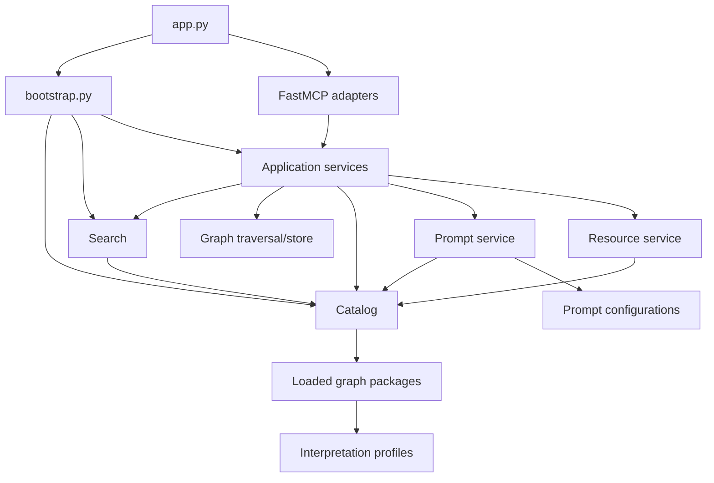
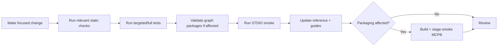

# Backend structure

This section is for maintainers changing the Python backend, adding curriculum packages,
or extending the published MCP surface.

**KGForEdGlobalMCP** deliberately separates protocol adapters from ordinary application
logic. Most changes should be implemented below the MCP boundary and then exposed through
thin, explicitly registered adapters.

## Development principles

Backend changes should preserve these project boundaries:

1. **Keep MCP adapters thin.** Request parsing, FastMCP context access, display formatting,
   and registration belong under `kgfegmcp/mcp/`; domain behavior does not.
2. **Keep curriculum-specific semantics in versioned configuration.** Grade mappings,
   statement types, hierarchy rules, code behavior, terminology, anomalies, and
   disclosures belong in interpretation profiles rather than Python conditionals.
3. **Treat accepted graph packages as immutable.** Runtime tools and resources are
   read-only, and a passed snapshot must not be edited in place.
4. **Keep retrieval deterministic and bounded.** Search, traversal, comparison, and
   progression-evidence behavior should remain explicit and reproducible.
5. **Preserve evidence boundaries.** Structural hierarchy is not progression; retrieved
   candidates are not official alignments; normalized grades are discovery facets rather
   than equivalence claims.
6. **Do not add server-side LLM reasoning.** The connected MCP host owns inference and
   generated prose.
7. **Reserve STDIO stdout for protocol traffic.** Logging and diagnostics must not corrupt
   the JSON-RPC stream.

The backend `README` additionally requires complete type annotations and accurate
Docstrings, prefers named arguments for calls with more than one argument, and keeps
named arguments alphabetically ordered.

## Source layout

```text
backend/
├── pyproject.toml
├── uv.lock
├── fastmcp.json
└── src/
    └── kgfegmcp/
        ├── app.py
        ├── bootstrap.py
        ├── config.py
        ├── mcpb_server.py
        ├── catalog/
        ├── cli/
        ├── domain/
        ├── graph/
        ├── mcp/
        ├── packages/
        ├── profiles/
        ├── prompts/
        ├── resources/
        ├── search/
        ├── services/
        └── utils/
```

Repository-level runtime inputs live outside the backend:

```text
config/
├── profiles/
└── prompts/

data/
└── graph_packages/
```

The locked workflow and MCPB builder expect `backend/uv.lock`. If a checkout does not
contain the lockfile, `uv ... --locked` commands cannot reproduce the approved runtime
until the lockfile is restored or intentionally regenerated according to project policy.

## Dependency direction



The composition root in `bootstrap.py` creates one shared immutable `AppState` for a
FastMCP lifespan. Services retained in that state are required to share the same catalog
and runtime objects.

## What belongs where

| Area                 | Primary location | Put changes here when...                                                       |
|----------------------|------------------|--------------------------------------------------------------------------------|
| FastMCP construction | `app.py`         | changing server-wide FastMCP policy or lifespan wiring                         |
| Dependency assembly  | `bootstrap.py`   | constructing or wiring an application service                                  |
| Environment settings | `config.py`      | adding an application-owned runtime setting                                    |
| Domain vocabulary    | `domain/`        | adding framework-independent identifiers, enums, or domain models              |
| Graph behavior       | `graph/`         | changing package-local storage or bounded traversal                            |
| Search               | `search/`        | changing lexical/code indexing, normalization, ranking, or cursors             |
| Application behavior | `services/`      | implementing reusable framework-independent use cases                          |
| Package lifecycle    | `packages/`      | changing build, load, validation, checksums, or wire decoding                  |
| Profile loading      | `profiles/`      | changing the interpretation-profile contract or repository                     |
| Prompt rendering     | `prompts/`       | changing generic workflows, overlays, or prompt policy                         |
| Resources            | `resources/`     | changing URI construction, rights policy, repository reads, or representations |
| MCP tools            | `mcp/tools/`     | exposing a thin tool adapter over an ordinary service                          |
| MCP prompts          | `mcp/prompts/`   | exposing a thin prompt adapter                                                 |
| MCP resources        | `mcp/resources/` | exposing a thin resource adapter                                               |
| CLI                  | `cli/`           | adding operator/developer commands                                             |

## Explicit MCP registration

`kgfegmcp/mcp/register.py` is the single public registration boundary. It calls the
approved tool, resource, and prompt registration functions explicitly.

Do not add import-time registration or automatic discovery. A public-surface change must
be deliberate and reviewable.

### When adding or removing a tool

Update all contracts that intentionally describe the tool inventory:

- the adapter and its registration function under `mcp/tools/`;
- `mcp/register.py` if a new registration group is introduced;
- `_TOOL_NAMES` in `services/capabilities.py`;
- `_EXPECTED_TOOL_NAMES` in `cli/stdio_smoke.py`;
- MCP reference and user-guide documentation; and
- any tests that assert inventory or schemas.

The fixed count will change from the current nine tools, so acceptance expectations and
public documentation must change together.

### When adding or removing a prompt

Keep these synchronized:

- `PromptName` and `PROMPT_NAMES` in `prompts/models.py`;
- generic prompt definitions/policy;
- the thin adapter under `mcp/prompts/`;
- explicit registration in `mcp/prompts/register.py`;
- `_EXPECTED_PROMPT_NAMES` in `cli/stdio_smoke.py`;
- prompt configuration support, when an overlay is applicable; and
- prompt documentation/tests.

### When adding or removing a resource template

Keep these synchronized:

- URI constants and `RESOURCE_URI_TEMPLATES` in `resources/uri.py`;
- resource-service/repository behavior and rights policy;
- the thin adapter and explicit registration under `mcp/resources/`;
- STDIO smoke resource coverage; and
- resource documentation/tests.

## Adding a new CLI

Every user-facing CLI module must have a matching `[project.scripts]` entry in
`backend/pyproject.toml`.

Keep CLI code as an operator boundary over ordinary package/service behavior. Stable,
machine-readable output and meaningful exit codes make the command usable in CI and
release workflows.

## Changes that usually should not require Python

Adding another Academic Standards curriculum should normally require data and
configuration rather than framework-specific runtime code:

1. create or select a versioned interpretation profile;
2. optionally add prompt guidance;
3. produce accepted delivery/detailed artifacts;
4. build a pending graph package;
5. validate and persist it as passed; and
6. run server acceptance checks.

See [Add or update a framework](framework-package.md) for the full workflow.

## Recommended change flow



Use the smallest set of checks that can prove the change during iteration, then run the
full applicable acceptance sequence before release.

## Related documentation

- [Local development](local-setup.md)
- [Add or update a framework](framework-package.md)
- [Testing and acceptance](testing.md)
- [Architecture](../architecture.md)
- [CLI commands](../operations/cli.md)

---

**Next:** [Local development](local-setup.md)
