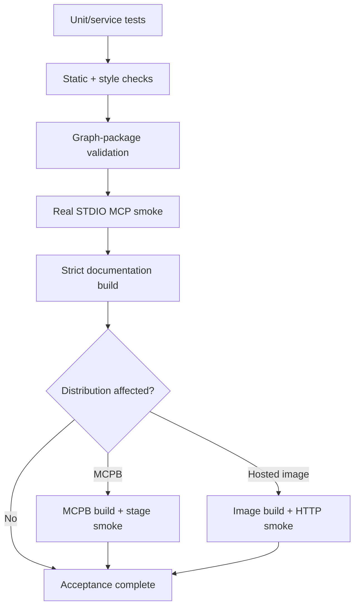

# Testing and acceptance

Testing should prove the layer being changed while preserving the server's trust,
determinism, and protocol boundaries.

The repository combines ordinary Python tests/static analysis with package validation,
real STDIO MCP smoke testing, and optional packaged-stage and hosted-image acceptance.

## Acceptance layers



Not every code edit requires every layer during iteration, but release acceptance should
cover every layer affected by the change.

## Python test configuration

`backend/pyproject.toml` configures pytest with:

- `tests/` as the test root;
- asyncio mode `auto`;
- `tests/features/` as the pytest-bdd feature base;
- a `costs-money` marker;
- branch coverage for `kgfegmcp`; and
- the package source as the coverage target.

Run the suite from the repository root:

```bash
uv --directory backend run --locked pytest
```

Run with coverage:

```bash
uv --directory backend run --locked \
  pytest --cov=kgfegmcp --cov-report=term-missing
```

Use normal pytest selectors for focused iteration, for example:

```bash
uv --directory backend run --locked pytest tests/path/to/test_module.py -q
```

The supplied snapshot used to prepare these docs does not contain `backend/tests/`, even
though the project configuration and backend README describe that directory. If a
checkout lacks the test suite, record that limitation explicitly rather than reporting
pytest as a completed acceptance layer.

## What to test by subsystem

### Domain and schemas

Test strict validation and cross-field invariants, including rejection cases. The
project relies on typed identifiers and Pydantic models to make malformed states hard to
construct.

### Profiles and prompt configurations

Test:

- exact version resolution;
- strict schema validation;
- duplicate/invalid values;
- grade and statement-type mappings;
- hierarchy/cardinality policy;
- code-search policy;
- prompt overlay mode and limits; and
- missing optional prompt configuration behavior.

### Package loader and validator

Use synthetic or temporary package trees for negative cases. Cover:

- unsafe paths and symlinks;
- missing/undeclared artifacts;
- checksum and profile-hash mismatches;
- malformed JSON/JSONL;
- identifier and endpoint failures;
- cycles and invalid parent cardinality;
- multi-parent acceptance where allowed;
- count/capability disagreements;
- rights-policy failures; and
- pending-to-terminal persistence rules.

Do not corrupt the six terminal repository packages to create failure fixtures.

### Graph traversal

Include both tree and multi-parent DAG cases. Prove:

- direct parents/children;
- bounded ancestors/descendants;
- complete root-path enumeration within limits;
- deterministic ordering; and
- truncation signaling.

### Search

Test exact documented semantics rather than fuzzy expectations:

- normalized token matching;
- contiguous exact phrases;
- `all` versus `any` token operation;
- exact and profile-governed prefix code search;
- package-specific code availability;
- filters;
- deterministic ranking;
- cursor request binding; and
- zero-result behavior.

### Services

Prefer service-level tests for framework discovery, standard retrieval, comparison, and
progression evidence. Assert that services share package-local identities and do not
invent alignment/progression relationships.

### MCP adapters

Adapter tests should focus on the protocol boundary:

- public field aliases and strict input validation;
- conversion from ordinary service results to FastMCP results;
- stable error mapping;
- resource links;
- explicit registration; and
- absence of business logic duplicated from services.

### Resources

Test rights and size policy separately from filesystem existence. Include denied cases
where an artifact exists but its access class/rights do not permit exposure.

### Prompts

Test deterministic rendering, parameter bounds, JSON-array parsing at the MCP boundary,
profile overlays, rights/disclosure instructions, and the absence of server-side model
calls.

## Static and style checks

The backend README lists:

```bash
uv --directory backend run --locked ruff check .
uv --directory backend run --locked black --check .
uv --directory backend run --locked isort --check-only .
uv --directory backend run --locked pylint src/kgfegmcp
uv --directory backend run --locked mypy src/kgfegmcp
```

The project also configures `interrogate` with a 100% threshold for documented Python
objects outside the configured exclusions:

```bash
uv --directory backend run --locked interrogate src/kgfegmcp
```

If a tool is intentionally deferred for a change, keep that deferral explicit in review
or release notes.

## Package validation acceptance

For a new or modified **pending** package, validate without persistence first:

```bash
uv --directory backend run --locked --no-dev \
  kgfegmcp-validate-packages pending --read-only
```

The `pending` subcommand does not enumerate terminal passed packages. To revalidate one
exact terminal package explicitly, use `one --read-only` with its framework and snapshot
IDs. Terminal packages are read-only revalidations even if the flag is omitted.

Normal catalog construction also revalidates every discovered terminal passed package
before accepting it. Therefore `kgfegmcp-stdio-smoke` is the simplest repository-wide
acceptance check that exercises passed-package revalidation through the actual server
bootstrap.

When creating a **new pending** package, first validate read-only and review findings;
then run without `--read-only` only when you intentionally want to persist the permitted
pending-to-terminal transition.

See [Validation and lifecycle](../data/validation.md) for state semantics.

## STDIO smoke is the protocol acceptance test

Run:

```bash
uv --directory backend run --locked --no-dev kgfegmcp-stdio-smoke
```

The smoke process:

1. starts `python -m kgfegmcp.mcpb_server` in a separate locked subprocess;
2. completes the MCP initialization handshake;
3. verifies the exact approved public inventory;
4. reads the fixed catalog plus representative resources for every template family; and
5. proves clean client/server shutdown.

The smoke checks intentionally keep their own expected tool/prompt inventory in
`cli/smoke_checks.py`. If the public surface changes, update those expectations together
with capability reporting and reference documentation.

### HTTP smoke for a running server

`kgfegmcp-http-smoke` runs the same `verify_server_surface` checks against a server that
is already running over Streamable HTTP, such as a local container or the hosted
deployment:

```bash
uv --directory backend run --locked --no-dev kgfegmcp-http-smoke \
  --url http://localhost:8000/mcp
```

Because both commands share one set of checks, the STDIO and HTTP transports cannot be
accepted against different inventories. See
[Hosted deployment](../operations/deployment.md).

A successful current server reports nine tools, one fixed resource, nine resource
templates, and six prompts.

## Public-surface change checklist

For a tool/prompt/resource change, verify all of the following:

- component implementation and explicit registration;
- capability inventory;
- smoke expected inventory in `cli/smoke_checks.py`;
- schemas/aliases and error mapping;
- user guide and MCP reference documentation;
- representative protocol test; and
- any fixed count shown on the homepage/README.

A feature is not complete if runtime registration and advertised capabilities disagree.

## Documentation acceptance

Install the documentation extra and build strictly:

```bash
uv --directory backend sync --locked --extra docs
uv --directory backend run --locked mkdocs build --strict
```

For documentation that embeds machine-derived catalog facts, also verify those facts
against current manifests/profiles rather than trusting copied totals.

Mermaid diagrams should use standard fenced blocks so the site-wide pan/zoom plugin can
attach consistently.

## MCPB release acceptance

For changes that affect runtime source, package/config inputs, launch behavior, or
packaging, build a retained stage:

```bash
rm -rf ./dist/kgfegmcp-stage

uv --directory backend run --locked --no-dev kgfegmcp-build-mcpb \
  --stage-output ./dist/kgfegmcp-stage
```

Then smoke the **staged** runtime, not the repository copy:

```bash
uv --directory backend run --locked --no-dev kgfegmcp-stdio-smoke \
  --bundle-root ./dist/kgfegmcp-stage
```

This catches missing source, configuration, data, or lock metadata that a repository
smoke cannot detect.

See [MCPB packaging](../operations/mcpb.md) for archive-level verification.

## Suggested acceptance matrix

| Change                             | Tests/static                          | Package validation            | STDIO smoke | Docs build      | Stage smoke         |
|------------------------------------|---------------------------------------|-------------------------------|-------------|-----------------|---------------------|
| Pure documentation                 | As applicable                         | —                             | —           | Required        | —                   |
| Ordinary service/search/graph code | Required                              | If package semantics affected | Required    | If docs changed | Before distribution |
| MCP tool/resource/prompt surface   | Required                              | If data semantics affected    | Required    | Required        | Before distribution |
| Profile change                     | Required where available              | Required                      | Required    | Required        | Before distribution |
| New graph package                  | Package-focused tests where available | Required                      | Required    | Required        | Before distribution |
| MCPB/launch change                 | Required where applicable             | —                             | Required    | If docs changed | Required            |
| Hosted image/HTTP entry point      | Required where applicable             | —                             | Required    | If docs changed | HTTP smoke on image |

`—` means normally not required by that change alone, not forbidden.

## Preserve deterministic fixtures

Tests should avoid hidden network calls, mutable external services, or host-model
reasoning. The server contract is local, deterministic, and source-grounded; acceptance
fixtures should make the same properties observable.

---

**Next:** [Contributing](../contributing.md)
