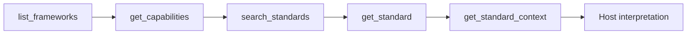

# First queries

Once the `curriculum-knowledge-graph` connector is enabled, start with discovery and
bounded retrieval before asking the host model to compare or generate educational
material.

This page uses a real accepted Ghana English standard as a concrete walkthrough. The
same sequence applies to other loaded frameworks, but local terminology and available
search modes remain package-specific.

## Recommended first-query sequence




This order matters: discover the framework first, inspect its implemented capabilities,
retrieve a bounded candidate, then expand only the source context you need.

## 1. Discover the catalog

Ask the MCP host:

```text
Use the curriculum-knowledge-graph connector to list all available frameworks. For each
framework, show the framework ID, snapshot ID, jurisdiction, subject, local grades or
stages, validation status, and available graph types. Preserve the source terminology.
```

The server's `list_frameworks` tool returns accepted immutable framework snapshots. Its
output includes exact framework and snapshot identity, source metadata, package
capabilities, and pagination state.

!!! note "Framework identity is part of the evidence"
    Keep the returned `frameworkId` and `snapshotId` when you need reproducible retrieval.
    A framework ID identifies the framework family; a snapshot ID selects an immutable
    version of that framework.

## 2. Inspect capabilities before choosing a search mode

Next ask:

```text
Use get_capabilities. Summarize the implemented search modes for the Ghana English
framework and tell me whether exact-code and code-prefix search are actually available.
Do not infer support from code coverage alone.
```

`get_capabilities` is authoritative for the currently accepted runtime. Generic tool
schemas describe possible request variants, but an individual graph package may support
only a subset of them.

For example, all current packages support lexical text search, while code-search support
varies by framework.

## 3. Run a bounded lexical search

Use the accepted Ghana English framework:

```text
ghana-nacca-primary-english-language-basic-1-3
```

Ask the host:

```text
Within the Ghana English framework, search BASIC 1 for the exact phrase
"structure of a story". Exclude grouping nodes. Return the exact source wording,
statement code, node ID, local grade label, and package identity. Do not paraphrase the
source wording in the evidence section.
```

The accepted package contains the Indicator:

```text
B1.2.7.2.6
```

with node ID:

```text
aa4cdccd-e5d9-589c-8094-e10d7ac0c754
```

and source description:

```text
Identify the structure of a story e.g. beginning part, middle and the end
```

This makes a useful first search because the expected item is specific, coded, and
anchored to an exact package-local node.

## 4. Retrieve the exact standard

Once you have a node or CASE identifier from search, retrieve the exact item rather than
continuing to rely on the search summary:

```text
Use get_standard to retrieve node aa4cdccd-e5d9-589c-8094-e10d7ac0c754 from the Ghana
English framework. Show its exact source description, statement type, statement code,
local and normalized grade evidence, language, attribution, license, and graph-package
identity.
```

`get_standard` resolves an exact standard or grouping by node ID, CASE UUID, or CASE URI
within the selected framework or snapshot.

## 5. Expand only the hierarchy context you need

Now ask for structural context:

```text
Use get_standard_context for node aa4cdccd-e5d9-589c-8094-e10d7ac0c754 in the Ghana
English framework. Show its direct parent and all complete root paths within the tool's
bounded defaults. Preserve local statement-type labels.
```

The context tool can return direct parents and children, bounded ancestors and
descendants, complete bounded root paths, and retained relationship-resolution evidence.
It is designed for tree and multi-parent DAG packages.

!!! warning "Hierarchy is structural evidence"
    A `hasChild` relationship records retained source hierarchy. It does not establish
    prerequisite knowledge, instructional sequence, conceptual dependency, or learner
    mastery.

## Understand lexical search behavior

Text search is deterministic and lexical. It matches normalized description tokens or
contiguous normalized phrases. It does not perform stemming, lemmatization, fuzzy
matching, semantic similarity, or automatic synonym expansion.

That means these expressions are not interchangeable by default:

```text
fraction
fractions
```

Likewise, an `exact_phrase` request for:

```text
story structure
```

is not equivalent to the source phrase:

```text
structure of a story
```

A zero-result query only means that the supplied lexical expression did not match 
within the requested bounds.

!!! warning "Zero matches do not prove curriculum absence"
    If the original wording returns no or visibly narrow results, a host may issue a small
    number of separate conservative lexical alternatives. Keep the same framework,
    snapshot, grade, subject, statement-type, grouping, match, and limit settings for each
    alternate call. Once a relevant branch is found, prefer bounded hierarchy context over
    open-ended synonym generation.

## Preserve local curriculum terminology

When presenting source evidence, keep local labels such as:

- `BASIC 1` for Ghana;
- `PRIMARY THREE` for Nigeria;
- `P3` for Rwanda; and
- `Class-5` for Tamil Nadu.

Normalized grade values are useful retrieval facets, but they do not establish official
grade equivalence across frameworks.

## Know when the host starts reasoning

The tool sequence above remains source-grounded and deterministic until the MCP host
interprets the returned evidence.

For example, this request adds model reasoning:

```text
Based only on the retrieved Ghana English standard and its hierarchy context, explain in
plain language what a teacher might focus on. Separate the exact source evidence from
your generated teaching suggestions.
```

That separation is intentional:

| Layer          | Responsibility                                                      |
|----------------|---------------------------------------------------------------------|
| MCP server     | Retrieve and assemble bounded source-grounded evidence              |
| MCP host/model | Explain, synthesize, compare, hypothesize, or generate new material |

Generated teaching suggestions are not official curriculum wording unless the source
evidence explicitly says so.

## Good next queries

After completing the walkthrough, try one of these bounded tasks:

```text
List the accepted mathematics frameworks and preserve each framework's local grade
labels.
```

```text
Search the Nigeria Primary 1-3 Mathematics framework for fraction-related standards in
PRIMARY THREE. Show exact source wording and identifiers, and explain the lexical search
bounds.
```

```text
For a standard returned by search, show its direct parents, direct children, and complete
root path without inferring progression.
```

Then move to the task-specific guides for more complete workflows:

- [Discover frameworks](../guides/framework-discovery.md)
- [Search and retrieve standards](../guides/standards-search.md)
- [Navigate hierarchies](../guides/hierarchy-context.md)
- [Compare framework evidence](../guides/comparison.md)
- [Collect progression evidence](../guides/progression.md)
- [Use prompt workflows](../guides/prompts.md)

---

**Next:** [Discover frameworks](../guides/framework-discovery.md)
