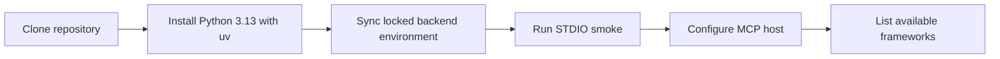

# Quickstart

This quickstart takes a new **KGForEdGlobalMCP** checkout from installation to a
working local MCP connection.

The server runs over STDIO, loads the accepted curriculum graph packages from the
repository, and exposes the fixed read-only MCP surface. The connected MCP host performs
reasoning and generation; the server itself does not call an LLM.

!!! note "What this quickstart verifies"
    By the end of this page, you will have synchronized the locked Python environment,
    exercised the real server through an MCP handshake, connected a local MCP host, and
    confirmed that the host can discover the curriculum catalog.

## Prerequisites

Install the following before you begin:

| Requirement  | Purpose                                                                            |
|--------------|------------------------------------------------------------------------------------|
| Git          | Clone and update the repository                                                    |
| `uv`         | Manage the required Python interpreter and locked environment                      |
| Python 3.13  | Runtime required by the backend (`>=3.13,<3.14`)                                   |
| An MCP host  | Connect to the local STDIO server; Claude Desktop is the default local integration |

Node.js, npm, and the MCPB CLI are needed only when building the optional `.mcpb`
distribution. They are not required for ordinary local server use.

## Setup flow




## 1. Clone the repository

```bash
git clone https://github.com/IDinsight/KGForEdGlobalMCP.git
cd KGForEdGlobalMCP
```

All commands on this page assume the repository root is your current directory.

## 2. Install the required Python version

The backend requires Python `>=3.13,<3.14`. Let `uv` manage the interpreter:

```bash
uv python install 3.13
```

You do not need to activate a virtual environment manually when running the documented
commands through `uv`.

## 3. Synchronize the locked backend environment

Install the runtime dependencies from the backend lock file:

```bash
uv --directory backend sync --locked --no-dev
```

For ordinary server use, `--no-dev` keeps the environment limited to runtime
dependencies. Maintainers who also need development tooling can instead run:

```bash
uv --directory backend sync --locked --extra dev
```

See [Local installation](local-installation.md) for the repository layout, environment
variables, and development setup.

## 4. Verify the real STDIO server

Run the repository smoke command before configuring an MCP host:

```bash
uv --directory backend run --locked --no-dev kgfegmcp-stdio-smoke
```

The smoke command starts the real module entry point in a separate process, completes an
MCP handshake, and checks the fixed public inventory:

- 9 tools;
- 1 fixed resource;
- 9 resource templates; and
- 6 prompts.

A successful run returns JSON containing:

```json
{
  "status": "passed"
}
```

!!! warning "Do not start the server by filesystem path"
    The supported local entry point is `python -m kgfegmcp.mcpb_server`. Directly
    executing `src/kgfegmcp/mcpb_server.py` can cause the internal `kgfegmcp.mcp` package
    to shadow the external MCP SDK package named `mcp`.

## 5. Connect an MCP host

The default local integration is Claude Desktop on macOS. It launches the same locked
backend through an absolute `uv` path and the module-based server entry point.

If you were given the URL of a hosted deployment instead, no local installation is
needed; see [Connect to a hosted server](mcp-clients.md#connect-to-a-hosted-server).

Follow [Connect an MCP client](mcp-clients.md) for the complete configuration, JSON
validation, restart, and connector-enablement steps.

## 6. Confirm framework discovery

After the connector is enabled in a new conversation, ask the host:

```text
Use the curriculum-knowledge-graph connector to list all available frameworks.
```

A successful response should identify accepted framework snapshots and preserve exact
framework IDs, snapshot IDs, source metadata, and package capabilities.

Do not treat a host-generated summary as the source record itself. The MCP tools return
the source-grounded evidence; the host may then summarize that evidence for you.

## Success checklist

You are ready to use the server when all of the following are true:

- `uv python install 3.13` succeeds;
- `uv --directory backend sync --locked --no-dev` succeeds;
- `kgfegmcp-stdio-smoke` reports `"status": "passed"`;
- the MCP host shows the `curriculum-knowledge-graph` connector; and
- a framework-discovery request returns the accepted catalog.

## What the quickstart does not do

The quickstart does not:

- build curriculum graph packages from source documents;
- mutate accepted graph packages;
- create official alignments or learning progressions;
- enable semantic or embedding search; or
- run a server-side language model.

Those boundaries are intentional. See [Concepts and boundaries](../concepts.md) before
interpreting retrieved evidence across grades or frameworks.

---

**Next:** [Local installation](local-installation.md)
