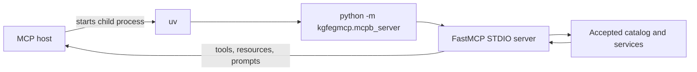

# Connect an MCP client

**KGForEdGlobalMCP** is exposed locally over STDIO. An MCP host starts the server as a
child process, communicates with it over the MCP protocol, and uses the returned tools,
resources, and prompts as context for client-side reasoning.

Claude Desktop is the default local-development integration. Other MCP hosts that 
support custom STDIO servers can use the same server launch contract, but their 
configuration files and UI steps are client-specific.

## Connection model




## Before configuring a client

Verify the repository runtime first:

```bash
uv --directory backend run --locked --no-dev kgfegmcp-stdio-smoke
```

Do not use the desktop client as the first diagnostic surface. A passing smoke test
separates server startup and package-loading problems from client configuration problems.

## Claude Desktop on macOS

The confirmed manual configuration file is:

```text
~/Library/Application Support/Claude/claude_desktop_config.json
```

### 1. Find the required absolute paths

From the repository root, run:

```bash
command -v uv
pwd
```

You need:

- the absolute path to the `uv` executable; and
- the absolute path to the repository root.

Desktop applications do not necessarily inherit the same shell `PATH` or working
directory as your terminal, so use absolute paths in the configuration.

### 2. Add the MCP server configuration

Add the following member beneath the existing top-level `mcpServers` object. Replace the
placeholder paths with the values from your machine and preserve unrelated Claude
Desktop settings.

```json
{
  "mcpServers": {
    "curriculum-knowledge-graph": {
      "command": "/absolute/path/to/uv",
      "args": [
        "--directory",
        "/absolute/path/to/repository/backend",
        "run",
        "--locked",
        "--no-dev",
        "python",
        "-m",
        "kgfegmcp.mcpb_server"
      ],
      "env": {
        "KGFEGMCP_CONFIG_ROOT": "/absolute/path/to/repository/config",
        "KGFEGMCP_DATA_ROOT": "/absolute/path/to/repository/data",
        "KGFEGMCP_ENV": "local",
        "KGFEGMCP_GRAPH_PACKAGES_ROOT": "/absolute/path/to/repository/data/graph_packages",
        "KGFEGMCP_INVALID_PACKAGE_POLICY": "fail",
        "KGFEGMCP_LOG_LEVEL": "INFO",
        "KGFEGMCP_PROFILE_ROOT": "/absolute/path/to/repository/config/profiles",
        "KGFEGMCP_PROMPT_ROOT": "/absolute/path/to/repository/config/prompts",
        "PATHS_PROJECT_DIR": "/absolute/path/to/repository"
      }
    }
  }
}
```

If the file already contains other `mcpServers`, add
`curriculum-knowledge-graph` alongside them instead of replacing the entire object.

### 3. Validate the JSON

On macOS, validate the configuration before restarting Claude Desktop:

```bash
jq empty "$HOME/Library/Application Support/Claude/claude_desktop_config.json"
```

No output means the JSON parsed successfully.

### 4. Fully restart Claude Desktop

Quit the application completely:

```bash
osascript -e 'quit app "Claude"'
```

Then reopen Claude Desktop. A window close may not be sufficient if the application 
process remains active.

### 5. Enable the connector

In a new conversation, enable **curriculum-knowledge-graph** under **Connectors**.

Use this as the first connection check:

```text
Use the curriculum-knowledge-graph connector to list all available frameworks.
```

If framework snapshots are returned, the MCP host has successfully started the server
and completed tool discovery.

## Generic STDIO launch contract

For another MCP host, the important runtime contract is the same even if the client's
configuration syntax differs.

**Executable:**

```text
/absolute/path/to/uv
```

**Arguments:**

```text
--directory
/absolute/path/to/repository/backend
run
--locked
--no-dev
python
-m
kgfegmcp.mcpb_server
```

The explicit repository environment variables shown in the Claude Desktop example are a
safe way to make runtime input locations independent of the host's working directory.

!!! warning "Do not substitute a filesystem Python entry point"
    Use `python -m kgfegmcp.mcpb_server` intact Launching `src/kgfegmcp/mcpb_server.py` 
    directly can cause Python package-name shadowing and break imports from the 
    external MCP SDK.

## What the host is responsible for

The MCP host is the reasoning and generation layer. The server is responsible for:

- accepted package loading and validation;
- framework and capability discovery;
- lexical and profile-governed code search;
- exact standards retrieval and bounded hierarchy traversal;
- rights-aware resources;
- deterministic comparison and progression evidence; and
- deterministic prompt rendering.

The host may synthesize, explain, compare, or draft from returned evidence, but those
model-generated conclusions are not automatically source-asserted curriculum claims.

## Optional MCPB connection path

The repository can also build a deterministic `.mcpb` bundle for distribution. Client
installation behavior for custom extensions can vary by Claude Desktop build, so manual
`claude_desktop_config.json` registration remains the confirmed local-development path.

See [MCPB packaging](../operations/mcpb.md) for the packaging contract and staged-runtime
smoke test.

## Troubleshooting

### The connector does not appear

Confirm all of the following:

- `command` is the absolute result of `command -v uv`;
- every repository path in the configuration is absolute;
- the JSON passes `jq empty`;
- `kgfegmcp-stdio-smoke` still passes; and
- Claude Desktop was fully quit and reopened.

### Inspect Claude MCP logs on macOS

```bash
find "$HOME/Library/Logs/Claude" \
  -maxdepth 1 \
  -type f \
  -iname '*mcp*' \
  -print
```

Use the server traceback or client log to distinguish a launch failure from a connector
UI problem before changing application code or graph packages.

### `No module named 'mcp.types'`

Check the configured argument list and confirm it launches:

```text
python -m kgfegmcp.mcpb_server
```

---

**Next:** [First queries](first-queries.md)
