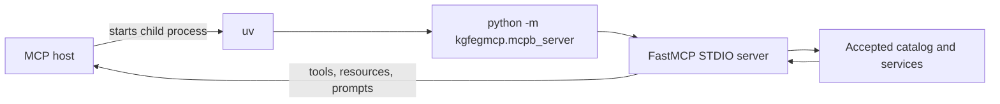

# Connect an MCP client

**KGForEdGlobalMCP** can be reached in two ways. Locally, an MCP host starts the server
as a child process over STDIO. When the server is hosted, an MCP client connects to its
Streamable HTTP endpoint by URL. In both cases the client communicates over the MCP
protocol and uses the returned tools, resources, and prompts as context for client-side
reasoning. The MCP surface is identical across the two transports.

Claude Desktop is the default local-development integration. Other MCP hosts that
support custom STDIO servers can use the same server launch contract, but their
configuration files and UI steps are client-specific.

If someone has given you a hosted URL, skip to
[Connect to a hosted server](#connect-to-a-hosted-server); no local installation is
required.

## Local connection model


```mermaid
%%{init: {"themeVariables": {"fontSize": "18px"}}}%%
flowchart LR
    A[MCP host] -->|starts child process| B[uv]
    B --> C[python -m kgfegmcp.mcpb_server]
    C --> D[FastMCP STDIO server]
    D --> E[Accepted catalog and services]
    E --> D
    D -->|tools, resources, prompts| A
```


## Before configuring a client

Verify the repository runtime first:

```bash
uv --directory backend run --locked --no-dev kgfegmcp-stdio-smoke
```

Do not use the desktop client as the first diagnostic surface. A passing smoke test
separates server startup and package-loading problems from client configuration problems.

## Claude Desktop on macOS

The paths, shell commands, restart and log instructions below are written for
macOS. The 0.4.0 checkout connection and bundle installation have not been tested
in Desktop on any OS. Earlier client observations and server smoke checks are
listed in [What has and has not been checked](claude-clients.md#what-has-and-has-not-been-checked);
their recorded evidence does not name an OS. Windows and Linux Desktop setup
steps are not documented here.

The bundle manifest declares `darwin`, `linux` and `win32`. That is a platform
declaration, not proof of Desktop availability or a successful install on those
systems. See [Claude Desktop installation](../operations/mcpb.md#claude-desktop-installation).

The manual configuration file on macOS is:

```text
~/Library/Application Support/Claude/claude_desktop_config.json
```

### 1. Find the required absolute paths

From the repository root, run:

```bash
command -v uv
pwd
```

You need:

- the absolute path to the `uv` executable; and
- the absolute path to the repository root.

Desktop applications do not necessarily inherit the same shell `PATH` or working
directory as your terminal, so use absolute paths in the configuration.

### 2. Add the MCP server configuration

Add the following member beneath the existing top-level `mcpServers` object. Replace the
placeholder paths with the values from your machine and preserve unrelated Claude
Desktop settings. There are eight path placeholders: the `uv` executable, the
`backend` directory and six environment paths. Keep all nine environment keys,
including the three fixed values, as shown.

```json
{
  "mcpServers": {
    "curriculum-knowledge-graph": {
      "command": "/absolute/path/to/uv",
      "args": [
        "--directory",
        "/absolute/path/to/repository/backend",
        "run",
        "--locked",
        "--no-dev",
        "python",
        "-m",
        "kgfegmcp.mcpb_server"
      ],
      "env": {
        "KGFEGMCP_CONFIG_ROOT": "/absolute/path/to/repository/config",
        "KGFEGMCP_DATA_ROOT": "/absolute/path/to/repository/data",
        "KGFEGMCP_ENV": "local",
        "KGFEGMCP_GRAPH_PACKAGES_ROOT": "/absolute/path/to/repository/data/graph_packages",
        "KGFEGMCP_INVALID_PACKAGE_POLICY": "fail",
        "KGFEGMCP_LOG_LEVEL": "INFO",
        "KGFEGMCP_PROFILE_ROOT": "/absolute/path/to/repository/config/profiles",
        "KGFEGMCP_PROMPT_ROOT": "/absolute/path/to/repository/config/prompts",
        "PATHS_PROJECT_DIR": "/absolute/path/to/repository"
      }
    }
  }
}
```

If the file already contains other `mcpServers`, add
`curriculum-knowledge-graph` alongside them instead of replacing the entire object.

### 3. Validate the JSON

From the repository root, after synchronizing the environment, use its Python
to validate the configuration before restarting Claude Desktop. This needs no
`jq` installation:

```bash
backend/.venv/bin/python -m json.tool \
  "$HOME/Library/Application Support/Claude/claude_desktop_config.json" > /dev/null
```

Exit status 0 with no output means the JSON parsed successfully. Invalid JSON
prints an error and exits non-zero. This checks syntax, not paths or server startup.

### 4. Fully restart Claude Desktop

Quit the application completely:

```bash
osascript -e 'quit app "Claude"'
```

Then reopen Claude Desktop. A window close may not be sufficient if the application 
process remains active.

### 5. Enable the connector

In a new conversation, enable **curriculum-knowledge-graph** under **Connectors**.

Use this as the first connection check:

```text
Use the curriculum-knowledge-graph connector to list all available frameworks.
```

If framework snapshots are returned, the MCP host has successfully started the server
and completed tool discovery.

Next, follow [Use with Claude Desktop and claude.ai](claude-clients.md) to read full
evidence, use workflows, and check the setup step by step with exact identifiers.

## Generic STDIO launch contract

For another MCP host, the important runtime contract is the same even if the client's
configuration syntax differs.

**Executable:**

```text
/absolute/path/to/uv
```

**Arguments:**

```text
--directory
/absolute/path/to/repository/backend
run
--locked
--no-dev
python
-m
kgfegmcp.mcpb_server
```

The explicit repository environment variables shown in the Claude Desktop example are a
safe way to make runtime input locations independent of the host's working directory.

!!! warning "Do not substitute a filesystem Python entry point"
    Use `python -m kgfegmcp.mcpb_server` intact. Launching
    `src/kgfegmcp/mcpb_server.py`
    directly can cause Python package-name shadowing and break imports from the 
    external MCP SDK.

## Connect to a hosted server

A hosted deployment exposes the server at a Streamable HTTP endpoint:

```text
https://<service-domain>/mcp
```

Nothing is installed or started on your machine. The endpoint is unauthenticated, so the
URL is the only value a client needs.

### Claude custom connector

In Claude, open the connector settings, add a custom connector, give it a name such as
**curriculum-knowledge-graph**, and enter the endpoint URL, including `/mcp`. Leave the
authentication fields empty. On Team and Enterprise plans an organization owner adds the
connector first; members then enable it for themselves.

Enable the connector in a new conversation and use the same first connection check as
the local path:

```text
Use the curriculum-knowledge-graph connector to list all available frameworks.
```

The claude.ai connector path has not yet been tested with the current server. After the
hosted service is updated, work through the
[remote acceptance checklist](claude-clients.md#claudeai-remote-acceptance-checklist).

### Claude Code

```bash
claude mcp add --transport http curriculum-knowledge-graph https://<service-domain>/mcp
```

### Other MCP clients

Any client that supports the Streamable HTTP transport can connect with the same URL.

### Verify a hosted endpoint

From a repository checkout, run the HTTP smoke command against the endpoint:

```bash
uv --directory backend run --locked --no-dev kgfegmcp-http-smoke \
  --url https://<service-domain>/mcp
```

See [Hosted deployment](../operations/deployment.md) for how the hosted service is built
and operated.

## What the host is responsible for

The MCP host is the reasoning and generation layer. The server is responsible for:

- accepted package loading and validation;
- framework and capability discovery;
- lexical and profile-governed code search;
- exact standards retrieval and bounded hierarchy traversal;
- rights-aware resources;
- deterministic comparison and progression evidence;
- bounded reads of full permitted evidence (`read_evidence`); and
- deterministic prompt rendering, natively or through `get_workflow_instructions`.

The host may synthesize, explain, compare, or draft from returned evidence, but those
model-generated conclusions are not automatically source-asserted curriculum claims.

## Optional MCPB connection path

The repository can also build a deterministic `.mcpb` bundle for distribution. Client
installation behavior for custom extensions can vary by Claude Desktop build, so manual
`claude_desktop_config.json` registration remains the documented macOS
local-development path; the 0.4.0 Desktop connection is untested.

See [MCPB packaging](../operations/mcpb.md) for the packaging contract and staged-runtime
smoke test.

## Troubleshooting

### The connector does not appear

Confirm all of the following:

- `command` is the absolute result of `command -v uv`;
- every repository path in the configuration is absolute;
- the JSON passes the Python check in [Validate the JSON](#3-validate-the-json);
- `kgfegmcp-stdio-smoke` still passes; and
- Claude Desktop was fully quit and reopened.

### Desktop is running an old copy

If a framework listing has one `Graph types:` line instead of separate
`Routing graph types:` and `Included graph types:` lines, Desktop is running an
older copy. For a checkout configured in JSON, verify the checkout paths, fully
quit Desktop and reopen it. For a bundle, remove the installed extension and
reinstall the current bundle; the removal and same-version replacement steps
are unverified in this project. Follow
[Claude Desktop installation](../operations/mcpb.md#claude-desktop-installation)
and check the listing again.

### Inspect Claude MCP logs on macOS

```bash
find "$HOME/Library/Logs/Claude" \
  -maxdepth 1 \
  -type f \
  -iname '*mcp*' \
  -print
```

Use the server traceback or client log to distinguish a launch failure from a connector
UI problem before changing application code or graph packages.

### `No module named 'mcp.types'`

Check the configured argument list and confirm it launches:

```text
python -m kgfegmcp.mcpb_server
```

---

**Next:** [Use with Claude Desktop and claude.ai](claude-clients.md)
