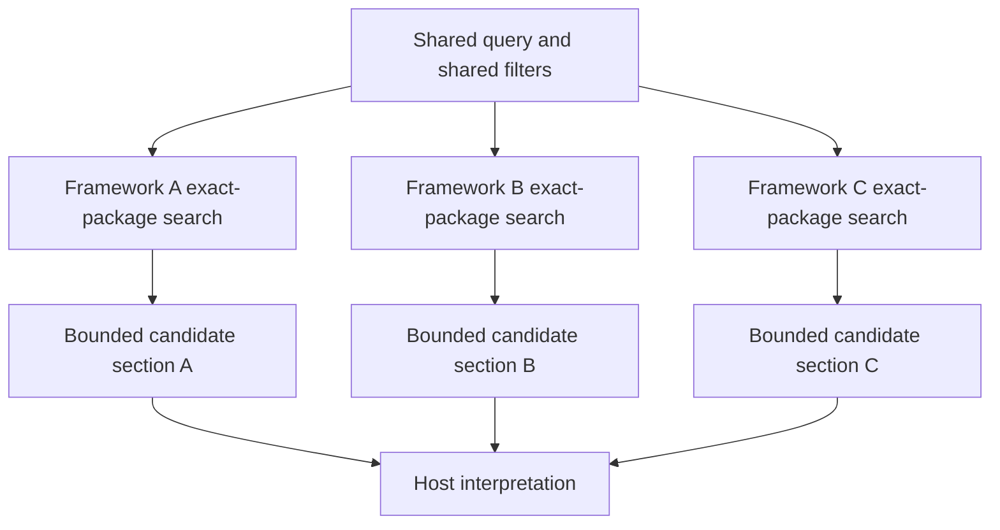

# Compare framework evidence

`compare_framework_evidence` performs independently bounded retrieval across two to
eight selected Academic Standards frameworks. Each framework keeps its own exact
snapshot, graph package, profile, source terminology, rights, warnings, ranking, and
optional hierarchy context.

The tool retrieves **comparison candidates**. It does not create an official alignment,
claim equivalence, merge the source graphs, or persist a mapping.

## Comparison model



The sections remain independent. Similar-looking results do not become source-authored
cross-framework edges.

## Before comparing

Discover the participating frameworks and call `get_capabilities`. A generic comparison
request can name `text`, `code_exact`, or `code_prefix`, but a selected package may not
implement a requested code mode.

For concept comparison, text mode is usually the safest common denominator because all
currently accepted packages implement lexical text search.

## Text comparison request

Unlike `search_standards`, the public comparison tool accepts flat fields. Do **not**
send a nested `match` object.

```json
{
  "frameworkIds": [
    "nigeria-nerdc-mathematics-primary-1-3",
    "rwanda-reb-mathematics-lower-primary-1-3"
  ],
  "includeContextPaths": true,
  "includeGroupings": false,
  "matchMode": "tokens",
  "matchOperator": "all",
  "maxMatchesPerFramework": 5,
  "mode": "text",
  "query": "length measurement"
}
```

### Flat comparison fields

| Field                    | Default  | Meaning                                                      |
|--------------------------|----------|--------------------------------------------------------------|
| `frameworkIds`           | —        | Two through eight distinct framework IDs                     |
| `snapshotIds`            | `[]`     | Optional exact snapshots; at most one per selected framework |
| `query`                  | —        | Shared topic text or code query                              |
| `mode`                   | —        | `text`, `code_exact`, or `code_prefix`                       |
| `matchMode`              | `tokens` | `tokens` or `exact_phrase` for text mode                     |
| `matchOperator`          | `all`    | `all` or `any` for token mode                                |
| `includeContextPaths`    | `true`   | Add bounded hierarchy context to each match                  |
| `includeGroupings`       | `false`  | Allow grouping nodes to match                                |
| `localGradeLabels`       | `[]`     | Shared source-facing grade filters                           |
| `normalizedGrades`       | `[]`     | Shared normalized grade filters                              |
| `maxMatchesPerFramework` | `5`      | Independent per-framework quota, 1–10                        |

`matchOperator` has no effect for exact-phrase or code modes.

## Shared filters are symmetric

The comparison service adapts the same query, mode, grouping setting, grade filters,
and candidate limit into one exact-package search per selected framework.

This symmetry is important for defensible comparisons. If a lexical variant is needed,
run a separate comparison call with that shared variant rather than changing the query
for only one framework.

!!! warning "Local grade filters may not be portable"
    `localGradeLabels` is a shared filter. Use it only when the exact requested label is
    intentionally meaningful in every selected framework. Different curricula often use
    different local labels such as `PRIMARY TWO`, `P2`, or `BASIC 2`. A cross-framework
    normalized grade filter can aid retrieval, but it still does not establish official
    grade equivalence.

When source-local grade labels differ, it is often better to leave shared grade filters
empty, retrieve the bounded candidates, and describe each section using its own local
grade evidence.

## Search modes remain package-governed

For a code comparison:

```json
{
  "frameworkIds": [
    "ghana-nacca-primary-english-language-basic-1-3",
    "ghana-nacca-primary-mathematics-basic-4-6"
  ],
  "includeContextPaths": true,
  "includeGroupings": false,
  "maxMatchesPerFramework": 5,
  "mode": "code_exact",
  "query": "B5.3.2.2"
}
```

This request is structurally valid, but meaningful use still depends on whether every
selected package implements the requested code mode and whether the same code query is
appropriate across them.

If one framework does not support the requested code mode, its section is returned
empty with `code_search_unsupported` rather than being silently switched to text mode.

## What each framework section contains

Each section keeps package-local evidence such as:

- exact framework, snapshot, graph-package, and profile identity;
- source metadata and local grades or stages;
- profile code-search policy and hierarchy policy;
- rights and required profile disclosures;
- package-local search warnings;
- bounded candidate matches in original search order;
- optional hierarchy context for each match; and
- `hasMore` plus a package-local continuation cursor.

Each candidate is explicitly marked `retrieval_candidate`.

## Context paths

With `includeContextPaths: true`, the service retrieves bounded ancestor and root-path
context for each match. This helps distinguish superficially similar descriptions that
sit in different local source structures.

If context reaches an established traversal bound, the section records a
`context_incomplete` warning. If returned context includes a non-empty unresolved
relationship status, the tool records `unresolved_evidence_present`.

Set `includeContextPaths: false` when you need a lighter first-pass comparison and do not
need hierarchy evidence.

## No-match sections

A framework section with no candidates receives a `no_matches` warning.

!!! warning "No match is query-bounded"
    A zero-match section means no retained description matched that exact query and
    filters within that framework section. It does not establish curriculum-wide
    absence of the concept.

For lexical concept discovery, the host may issue a small number of separate
conservative variants. Apply each variant symmetrically to all selected frameworks and
preserve the same filters and per-framework bound.

## Per-framework continuation

Each section has its own `hasMore` and `nextCursor`. The comparison tool does not flatten
those cursors into one global pagination stream.

When more evidence is needed from a section, use that section's cursor with the
equivalent exact-package `search_standards` request. The tool's continuation block
identifies the framework, snapshot, graph package, graph type, and cursor.

Do not treat a first page as full curriculum coverage when `hasMore` is `true`.

## Interpreting the result

A defensible client-side synthesis should keep three layers separate:

| Layer                   | Example                                                            |
|-------------------------|--------------------------------------------------------------------|
| Source evidence         | Exact standard wording and local hierarchy from each package       |
| Deterministic retrieval | Why those nodes matched the shared query and filters               |
| Model inference         | Similarities, differences, possible relationships, or review notes |

Any claim of conceptual similarity or possible correspondence is a host interpretation
unless a source package explicitly asserts it.

!!! danger "Comparison is not alignment"
    Do not describe the tool result as an official alignment, mapping, equivalence,
    grade equivalence, prerequisite relation, endorsement, or learner-mastery claim.

## Natural-language example

```text
Compare source evidence for "length measurement" across the Nigeria Primary 1-3
Mathematics and Rwanda Lower Primary Mathematics frameworks. Use the same lexical token
query for both, retrieve at most five candidates per framework, include hierarchy
context, preserve each framework's local grade and statement-type terminology, and show
all warnings and hasMore values. Keep the frameworks in separate sections. After the
evidence sections, you may summarize similarities and differences, but label that
summary as model interpretation rather than official alignment.
```

## Use the prompt workflow when synthesis is the goal

The `administrator_alignment_review` and `cross_framework_comparison` prompts render
more prescriptive client-side workflows around this tool. Use the raw comparison tool
when you want evidence assembly directly; use a prompt workflow when you want the host
to follow the server's full evidence, attribution, rights, and disclosure instructions
before generating a review.

---

**Next:** [Collect progression evidence](progression.md)
