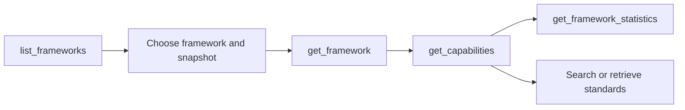

# Discover frameworks

Framework discovery is the first step for any source-grounded workflow. Before searching
standards or comparing curriculum evidence, identify the accepted framework family,
immutable snapshot, graph package, local grade labels, and package capabilities that the
request should use.

The primary tools are `list_frameworks`, `get_framework`, `get_capabilities`, and
`get_framework_statistics`.

## Recommended workflow



Use `list_frameworks` to discover candidates, then pin an exact `snapshotId` when
reproducibility matters. Use `get_capabilities` before choosing code search, because a
package's code coverage does not by itself authorize `code_exact` or `code_prefix`.

## List accepted framework snapshots

`list_frameworks` returns accepted immutable snapshots rather than raw directories or
unvalidated package candidates.

A minimal request is:

```json
{
  "request": {}
}
```

The default page limit is `25`; the maximum is `100`.

A filtered discovery request can look like:

```json
{
  "request": {
    "graphTypes": ["academic_standards"],
    "jurisdictions": ["Ghana"],
    "subjects": ["Mathematics"],
    "validationStatus": ["passed"],
    "limit": 25
  }
}
```

### Available discovery filters

| Field                | Purpose                                                    |
|----------------------|------------------------------------------------------------|
| `query`              | Free-text discovery across selected framework metadata     |
| `graphTypes`         | Require at least one requested graph type                  |
| `isCurrent`          | Restrict to current or non-current snapshots               |
| `issuingAuthorities` | Filter by source issuing authority                         |
| `jurisdictionTypes`  | Filter by source jurisdiction type                         |
| `jurisdictions`      | Filter by jurisdiction                                     |
| `languages`          | Filter by source language tags                             |
| `localGrades`        | Filter by exact source-facing grades or stages             |
| `normalizedGrades`   | Filter by normalized retrieval facets                      |
| `subjects`           | Filter by source-authored local subject                    |
| `validationStatus`   | Filter by accepted package validation status               |
| `limit`              | Maximum snapshots returned on the page, from 1 through 100 |
| `cursor`             | Opaque continuation cursor from the preceding page         |

Filter values are normalized for matching without replacing the retained source values.
Within one populated filter, any requested value may match. Across different populated
filter dimensions, every dimension must match.

For example, requesting:

```json
{
  "request": {
    "jurisdictions": ["Ghana", "Nigeria"],
    "subjects": ["Mathematics"]
  }
}
```

means **Ghana OR Nigeria**, and **Mathematics**.

### Free-text discovery

The `query` field is for framework-catalog discovery, not standards search. Every
whitespace-delimited query token must occur in the normalized concatenation of selected
framework metadata such as framework ID, snapshot ID, authority, jurisdiction, subject,
name, provider, or source version.

For standards content, use `search_standards` instead.

## Read framework identity carefully

Each returned item represents one immutable snapshot and includes source metadata plus
its accepted graph packages. Keep these identities distinct:

| Identity                       | Meaning                                      |
|--------------------------------|----------------------------------------------|
| `frameworkId`                  | Stable conceptual framework family           |
| `snapshotId`                   | Immutable version of that framework          |
| `graphPackageId`               | Validated runtime delivery unit              |
| `profileId` + `profileVersion` | Interpretation contract bound to the package |

A framework may eventually have more than one accepted snapshot. Omitting `snapshotId`
from later calls uses the catalog's unique-current routing rule; supplying it selects an
exact immutable version.

!!! tip "Pin snapshots for reproducible work"
    For audits, evaluations, stored analyses, or published examples, retain both the
    `frameworkId` and `snapshotId` returned by discovery and pass the exact snapshot to
    downstream tools.

## Retrieve one framework snapshot

Once the framework is known, use `get_framework` for the complete selected snapshot:

```json
{
  "request": {
    "frameworkId": "ghana-nacca-primary-mathematics-basic-4-6"
  }
}
```

For an exact version:

```json
{
  "request": {
    "frameworkId": "ghana-nacca-primary-mathematics-basic-4-6",
    "snapshotId": "ghana-nacca-primary-mathematics-basic-4-6@2019+43d21a2cb010"
  }
}
```

`get_framework` exposes exact source metadata, graph-package identity, counts,
validation, rights, and declared package capabilities.

## Inspect implemented capabilities

Call `get_capabilities` with no arguments before selecting a package-sensitive mode:

```json
{}
```

The result reports the fixed public MCP surface and, for every accepted graph package,
its authoritative `implementedSearchModes`.

!!! warning "Code coverage is not search authorization"
    A package may contain some coded nodes and still not implement every code-search
    mode. Use `packages[].implementedSearchModes` from `get_capabilities` before calling
    `code_exact` or `code_prefix`.

The current server intentionally reports unavailable features as well, including
capabilities such as semantic search or persisted official alignment when they are not
implemented.

## Inspect structural statistics

`get_framework_statistics` is useful when you need to understand package shape before
writing a traversal or evaluation request.

```json
{
  "request": {
    "frameworkId": "india-cbse-science-learning-framework-classes-9-10",
    "graphType": "academic_standards"
  }
}
```

It reports deterministic counts including:

- total item nodes and relationships;
- coded and uncoded items;
- local and normalized grade counts;
- local and normalized statement-type counts;
- hierarchy depth;
- multi-parent target counts; and
- unresolved relationship counts.

These are structural statistics. They do not establish difficulty, progression,
coverage quality, or curriculum equivalence.

## Pagination

`list_frameworks` uses checksum-protected opaque cursors. When `hasMore` is `true`, the
tool returns continuation data containing a complete `nextRequest`.

Submit that `nextRequest` unchanged. Only the `cursor` differs from the preceding
request. Changing the limit or any filter invalidates the cursor because pagination is
bound to both the accepted catalog state and the exact cursor-free request.

!!! warning "Do not construct or edit cursors"
    Cursors are transport tokens, not user-visible offsets. Copy them exactly or use the
    complete `nextRequest` supplied by the tool.

## Preserve local terminology

Framework discovery returns source-facing labels such as `BASIC 1`, `PRIMARY THREE`,
`P3`, `Class-5`, and `Class IX` alongside normalized retrieval facets.

Use the source label when describing the curriculum. A normalized grade is useful for
filtering but does not assert official equivalence between grade systems.

## Natural-language example

An MCP host can perform the same workflow from a bounded instruction:

```text
Use the curriculum-knowledge-graph connector to find the accepted Ghana Mathematics
framework. Preserve its exact framework ID, snapshot ID, source title, local grades,
adoption status, validation status, and graph-package identity. Then use
get_capabilities to report the search modes actually implemented for that package.
Do not infer grade equivalence or capabilities that are not explicitly reported.
```

## When discovery is complete

You have enough information to proceed when you know the exact framework or snapshot,
the source-facing grades relevant to the task, the package's implemented search modes,
and any structural caveats that could affect retrieval or traversal.

---

**Next:** [Search and retrieve standards](standards-search.md)
