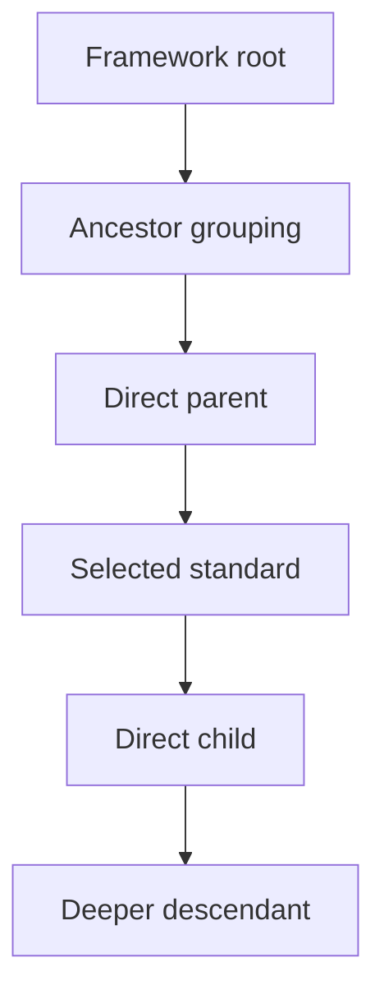
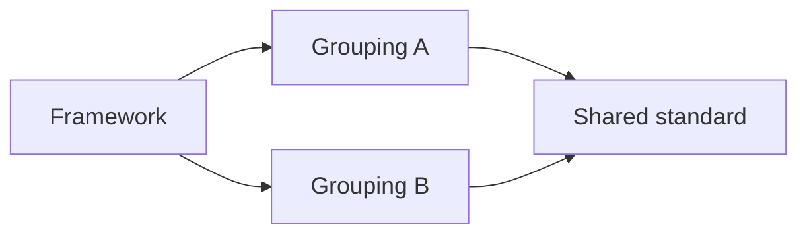

# Navigate hierarchies

`get_standard_context` expands one exact standard into its retained package-local source
hierarchy. It returns direct parents, optional direct children, bounded ancestor and
descendant traversals, optional complete root paths, and any retained non-empty
relationship-resolution statuses encountered in that context.

The tool reports **structural placement**. It does not infer prerequisites, progression,
difficulty, instructional order, or learner mastery.

## Context model



A real package may be a tree or a multi-parent directed acyclic graph. A selected node
can therefore have several direct parents and more than one complete root path.

## Start from an exact node

Context lookup is node-ID based. Usually the node comes from `search_standards` or
`get_standard`.

For the Ghana English Indicator `B1.2.7.2.6`, the retained node ID is:

```text
aa4cdccd-e5d9-589c-8094-e10d7ac0c754
```

A default context request is:

```json
{
  "request": {
    "frameworkId": "ghana-nacca-primary-english-language-basic-1-3",
    "nodeId": "aa4cdccd-e5d9-589c-8094-e10d7ac0c754"
  }
}
```

The defaults request direct parents, direct children, ancestors to depth `16`, and all
bounded root paths. Descendants beyond direct children are not included unless
`includeDescendants` is enabled.

## Request fields and bounds

| Field                    | Default              | Purpose                                                             |
|--------------------------|----------------------|---------------------------------------------------------------------|
| `frameworkId`            | —                    | Framework family selector; required unless `snapshotId` is supplied |
| `snapshotId`             | `null`               | Optional exact immutable snapshot                                   |
| `graphType`              | `academic_standards` | Selected graph domain                                               |
| `nodeId`                 | —                    | Exact package-local standard node                                   |
| `ancestorDepth`          | `16`                 | Maximum ancestor traversal depth, 0–64                              |
| `childDepth`             | `1`                  | Maximum descendant traversal depth, 0–64                            |
| `includeDirectChildren`  | `true`               | Return immediate children                                           |
| `includeDescendants`     | `false`              | Return bounded descendants                                          |
| `includeAllRootPaths`    | `true`               | Enumerate bounded complete paths to the framework root              |
| `includeUnresolved`      | `true`               | Preserve accepted unresolved relationship statuses                  |
| `maxNodes`               | `250`                | Maximum nodes in each bounded traversal, 1–2000                     |
| `maxPaths`               | `128`                | Maximum root paths, 1–1000                                          |
| `maxPathNodeOccurrences` | `8192`               | Aggregate node-occurrence bound across root paths                   |
| `relationshipTypes`      | `[]`                 | Optional explicit package hierarchy label; at most one value        |

The canonical context tool operates only on the selected package's configured hierarchy
relationship type. Supplying a different relationship label is rejected rather than
silently switching graph semantics.

`includeUnresolved` must remain `true`; the canonical tool does not permit accepted
unresolved relationship status to be hidden from returned hierarchy evidence.

## Direct parents and children

Direct relationships preserve the exact adjacent node and relationship record. This is
the best evidence for answering questions such as:

```text
What is the immediate source parent of this Indicator?
```

or:

```text
What source statements are directly grouped under this Content Standard?
```

Do not assume that `directParents.neighbors` contains exactly one item. The current
runtime supports valid multi-parent packages.

## Ancestor traversal

Ancestor traversal returns the origin at depth `0`, followed by distinct reachable
ancestors in deterministic depth-then-source order.

A focused ancestor-only request can disable children and root-path enumeration:

```json
{
  "request": {
    "frameworkId": "ghana-nacca-primary-english-language-basic-1-3",
    "nodeId": "aa4cdccd-e5d9-589c-8094-e10d7ac0c754",
    "ancestorDepth": 6,
    "includeDirectChildren": false,
    "includeAllRootPaths": false,
    "maxNodes": 100
  }
}
```

Use this when you need a compact neighborhood rather than every path to the framework
root.

## Descendant traversal

Enable descendants explicitly when you start from a grouping node and need more than
its immediate children:

```json
{
  "request": {
    "frameworkId": "ghana-nacca-primary-english-language-basic-1-3",
    "nodeId": "98490a17-1715-57eb-9375-6a3c4925c697",
    "ancestorDepth": 4,
    "childDepth": 3,
    "includeDescendants": true,
    "includeDirectChildren": true,
    "maxNodes": 250
  }
}
```

Descendant traversal remains bounded and package-local. It is not a substitute for
unbounded graph export.

## Complete root paths

When `includeAllRootPaths` is `true`, the result attempts to enumerate every requested
complete path from the framework root to the selected standard within the established
bounds.

This distinction matters in a DAG. An ancestor set tells you which nodes are reachable;
root paths preserve the actual branch combinations through which the selected node is
placed in the source structure.



For the shared standard above, a single-parent-chain assumption would lose one source
placement. `rootPaths.paths` can retain both branches when the package and traversal
bounds allow them.

## Completion and truncation evidence

Bounded traversal results explicitly report whether they are complete. Possible
truncation reasons are:

| Reason                      | Meaning                                                           |
|-----------------------------|-------------------------------------------------------------------|
| `max_nodes`                 | Traversal reached the configured node bound                       |
| `max_paths`                 | Root-path enumeration reached the path-count bound                |
| `max_path_node_occurrences` | Aggregate root-path node occurrences reached the configured bound |

If `isComplete` is `false`, describe the returned graph evidence as bounded or partial.
Do not state that all ancestors, descendants, or paths were returned.

!!! warning "A truncation bound is evidence"
    Increasing a bound can retrieve more graph context, but a client should not hide or
    reinterpret an established truncation reason. Preserve it with any conclusions
    based on the partial result.

## Relationship resolution status

`relationshipStatuses` collects non-empty resolution statuses from the relationships
included across direct, traversal, and root-path evidence.

A non-empty unresolved or special resolution status is part of the accepted source-to-
graph evidence. It should remain visible in downstream interpretation rather than being
converted into an ordinary confirmed parent-child claim.

## Hierarchy is not progression

A `hasChild` path can answer:

```text
Where is this item placed in the retained curriculum structure?
```

It cannot, by itself, answer:

```text
What must a learner master first?
```

or:

```text
Does this standard represent the next instructional step?
```

Those are stronger interpretations that require separate evidence. The server's
progression workflow therefore uses explicit grade-scoped candidate collection and
still labels any resulting progression as inferred rather than source-asserted.

## Natural-language example

```text
Retrieve the exact hierarchy context for Ghana English Indicator B1.2.7.2.6. Show its
direct parent, direct children, all complete root paths within the tool bounds, local
statement-type labels, relationship IDs, and any non-empty relationship resolution
statuses. If a traversal is truncated, say so. Describe hasChild only as source
structure and do not infer a prerequisite or learning progression.
```

## Choosing the next tool

Use `get_standard_context` after a specific search hit when hierarchy placement matters.
Use `compare_framework_evidence` instead when the question requires symmetric bounded
retrieval from several frameworks. Use `collect_progression_evidence` only when the
question explicitly asks for grade-scoped candidate evidence for a later inferred
progression review.

---

**Next:** [Compare framework evidence](comparison.md)
