# Collect progression evidence

`collect_progression_evidence` assembles a deterministic, grade-scoped, deduplicated,
and hard-bounded set of Academic Standards candidates for a later **inferred**
progression review.

The tool does not create, approve, or persist a learning progression. Every retained
item remains a `retrieval_candidate`; any progression relationship proposed later by an
MCP host is model inference.

## Evidence-collection model

```mermaid
%%{init: {"themeVariables": {"fontSize": "18px"}}}%%
flowchart LR
    A[Exact framework and grade scopes] --> B[Resolve focus]
    B --> C[Bounded discovery]
    C --> D[Expand matching groupings]
    D --> E[Deduplicate exact nodes]
    E --> F[Balance across grade scopes]
    F --> G[Apply candidate limit]
    G --> H[Retrieve compact root-path context]
    H --> I[Host may form an inferred hypothesis]
```



This workflow separates **candidate collection** from **progression inference**.

## Explicit grade scope is required

Every request must supply at least one value in `localGradeLabels` or
`normalizedGrades`.

A topic-based Nigeria example is:

```json
{
  "candidateLimit": 8,
  "focusMode": "topic",
  "frameworkId": "nigeria-nerdc-mathematics-primary-1-3",
  "localGradeLabels": [
    "PRIMARY ONE",
    "PRIMARY TWO",
    "PRIMARY THREE"
  ],
  "normalizedGrades": [],
  "topicOrStandard": "fractions"
}
```

The tool validates every requested grade against the selected exact package. Unknown
local or normalized grades are rejected with the available values rather than silently
ignored.

!!! warning "Normalized grades are retrieval facets"
    Normalized grade values can make grade-scoped retrieval easier, but they do not
    assert that similarly numbered grades in different frameworks are officially or
    instructionally equivalent.

## Request fields

| Field              | Default | Meaning                                                     |
|--------------------|---------|-------------------------------------------------------------|
| `frameworkId`      | —       | Exact conceptual framework family                           |
| `snapshotId`       | `null`  | Optional exact immutable snapshot                           |
| `focusMode`        | `topic` | How `topicOrStandard` is interpreted                        |
| `topicOrStandard`  | —       | Topic text, statement code, node ID, CASE UUID, or CASE URI |
| `localGradeLabels` | `[]`    | Exact source-facing grade or stage scopes                   |
| `normalizedGrades` | `[]`    | Normalized grade retrieval scopes                           |
| `candidateLimit`   | `8`     | Hard maximum retained standard candidates, 2–20             |

The combined grade scope cannot be empty, and duplicate scope values are rejected.

## Focus modes

`focusMode` controls the interpretation of `topicOrStandard`.

| Mode                   | Use                            |
|------------------------|--------------------------------|
| `topic`                | Lexical topic discovery        |
| `statement_code`       | Exact statement-code anchor    |
| `node_id`              | Exact package-local graph node |
| `case_identifier_uuid` | Exact CASE UUID anchor         |
| `case_identifier_uri`  | Exact CASE URI anchor          |

Use `statement_code` only when the selected package implements exact code search.

### Topic focus

Topic mode runs one bounded exact-package lexical token search with `all` semantics and
includes grouping nodes so structural matches can be expanded to eligible descendants.

```json
{
  "candidateLimit": 8,
  "focusMode": "topic",
  "frameworkId": "rwanda-reb-mathematics-lower-primary-1-3",
  "localGradeLabels": ["P1", "P2", "P3"],
  "topicOrStandard": "whole numbers"
}
```

The lexical discovery pool is capped at 100 search hits. If more matching search
results exist, `discoveryComplete` becomes false and the tool records a
`discovery_incomplete` warning.

### Exact anchor focus

An identifier or code focus first resolves an exact anchor. If the anchor is a normal
standard and falls within the requested grade scope, it can enter the candidate pool
directly. If the anchor is a grouping, the service expands eligible descendants.

For a code-backed framework:

```json
{
  "candidateLimit": 8,
  "focusMode": "statement_code",
  "frameworkId": "ghana-nacca-primary-mathematics-basic-4-6",
  "localGradeLabels": ["BASIC 4", "BASIC 5", "BASIC 6"],
  "topicOrStandard": "B4.1.1.1.1"
}
```

For node-ID focus:

```json
{
  "candidateLimit": 6,
  "focusMode": "node_id",
  "frameworkId": "ghana-nacca-primary-english-language-basic-1-3",
  "localGradeLabels": ["BASIC 1", "BASIC 2", "BASIC 3"],
  "topicOrStandard": "aa4cdccd-e5d9-589c-8094-e10d7ac0c754"
}
```

After an exact anchor is resolved, the service may derive bounded lexical terms from the
nearest useful grouping label or anchor description and search for related candidates
within the same package and grade scope.

## Grouping expansion

Grouping nodes help discovery but do not count toward the candidate limit.

When a matching grouping is found, the service can traverse eligible descendants up to
its established discovery bounds, then retain only normalized `Standard` items that
match the requested grade scope.

Grouping expansion is structural discovery. A descendant relationship does not prove
that the descendant is a later learning step.

## Deduplication and ranking

Candidates can enter the pool through several deterministic routes:

| Discovery method      | Meaning                                               |
|-----------------------|-------------------------------------------------------|
| `exact_anchor`        | The exact selected standard itself                    |
| `grouping_descendant` | Eligible standard found beneath a matching grouping   |
| `direct_search_hit`   | Direct lexical topic match                            |
| `anchor_term_search`  | Match from terms derived from an exact anchor context |

The service deduplicates by exact node identity. A node discovered by several routes is
still one candidate, while its discovery-method evidence can record the contributing
routes.

## Grade-balanced candidate selection

After discovery, the service applies the policy:

```text
balanced_scope_then_rank
```

When local grade labels are supplied, they are the balancing buckets. Otherwise,
normalized grades are used. The selector walks the requested scopes round-robin,
retaining the next highest-ranked unseen candidate from each scope until the limit is
reached or no further scoped candidates remain. Any remaining capacity is then filled
by deterministic overall rank.

This reduces the chance that a single grade dominates a small retained candidate set.
It does not score instructional progression quality.

## Candidate limit and exclusions

`candidateLimit` is a hard bound from `2` through `20`.

The result reports:

- `discoveredCandidateCount`;
- `retainedCandidateCount`;
- `excludedCandidateCount`;
- exact `excludedCandidateNodeIds`;
- whether `candidateLimitApplied` was necessary; and
- `scopeCoverage` for each requested grade scope.

An excluded candidate is not rejected as educationally irrelevant; it was simply
outside the deterministic retained quota.

## Scope coverage

For every requested local or normalized grade, `scopeCoverage` records discovered and
retained candidate counts.

The tool emits explicit warnings when:

- a requested scope has no discovered candidates; or
- a scope has discovered evidence but no candidate survives the hard retained limit.

These warnings are essential when interpreting a progression hypothesis. A model should
not describe a smooth multi-grade sequence if one of the requested scopes lacks
retained evidence.

## Compact hierarchy evidence

Each retained candidate receives bounded ancestor and complete root-path evidence. The
progression tool uses a compact context representation to preserve source placement
without repeating every raw property from the ordinary context tool.

For each candidate, inspect:

| Evidence                       | Meaning                                                    |
|--------------------------------|------------------------------------------------------------|
| `context.isComplete`           | Aggregate context completion state                         |
| `context.rootPaths`            | Bounded framework-root-to-candidate paths                  |
| `context.relationshipStatuses` | Non-empty retained resolution statuses                     |
| `matchedLocalGradeLabels`      | Requested local scopes matched by the candidate            |
| `matchedNormalizedGrades`      | Requested normalized scopes matched by the candidate       |
| `selectionRank`                | Position after the deterministic selection policy          |
| `searchHit`                    | Direct search evidence when the candidate came from search |

If context is incomplete, the tool records `context_incomplete` rather than presenting a
partial branch as complete.

## Warning codes

Progression evidence can report:

| Warning                    | Meaning                                                                 |
|----------------------------|-------------------------------------------------------------------------|
| `no_candidates`            | No eligible standard-item candidates matched focus and scope            |
| `discovery_incomplete`     | Discovery hit an established bounded search or traversal limit          |
| `context_incomplete`       | Retained candidate hierarchy context hit a bound                        |
| `scope_not_retained`       | Requested grade scope had discovered evidence but no retained candidate |
| `scope_without_candidates` | Requested grade scope had no discovered candidate                       |
| `search_warning`           | Underlying package-local search emitted a warning                       |

Keep the warnings associated with any later progression hypothesis.

## What the tool does not infer

The retained candidates do not establish:

- prerequisite relationships;
- conceptual dependency;
- intended instructional sequence;
- increasing difficulty;
- learner mastery; or
- an official source-authored learning progression.

Those claims require interpretation beyond the deterministic tool output.

!!! danger "Do not relabel candidates as a progression"
    Grade ordering plus structural context is evidence for review, not proof of a
    progression. A client-side model may formulate a hypothesis only if it labels the
    relationship as inferred, cites the supporting candidates, and preserves uncertainty
    and counter-evidence.

## Natural-language example

```text
Collect progression evidence for fractions across PRIMARY ONE, PRIMARY TWO, and PRIMARY
THREE in the Nigeria Mathematics framework. Use local grade labels, topic focus, and a
candidate limit of 8. Preserve the exact source wording, selection rank, discovery
method, scope coverage, hierarchy context, warnings, excluded count, and whether
discovery was complete. Do not infer a progression yet.
```

## Use the progression prompt for the hypothesis step

`inferred_progression_hypothesis` renders the client-side workflow that consumes this
evidence and requires any proposed relationship to remain explicitly inferred. Use the
raw tool when you want only the bounded evidence set; use the prompt when you want the
host to proceed through the controlled hypothesis workflow.

---

**Next:** [Use prompt workflows](prompts.md)
