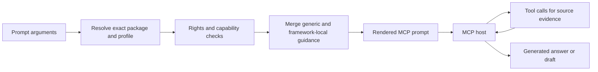

# Use prompt workflows

The server exposes six deterministic MCP prompt workflows. A prompt does not call an
LLM, retrieve evidence by itself, or generate the final educational material. It renders
versioned instructions and runtime context for the connected MCP host, which then calls
the appropriate tools and produces any final synthesis or draft.

This separation lets the server enforce framework identity, rights, attribution,
retrieval boundaries, and required disclosures without presenting model-generated text
as source-authored curriculum.

## Prompt execution model



Framework-local `prompts.json` files can append to or replace declared **soft guidance**
blocks. They cannot override correctness-critical rights, attribution, privacy,
evidence-status, package-isolation, or generated-content rules.

## Available prompts

| Prompt | Primary use |
|---|---|
| `student_study_support` | Evidence-grounded study support and practice |
| `teacher_guide_draft` | Evidence-grounded teacher lesson-guide draft |
| `student_handbook_section` | Evidence-grounded student-facing handbook section |
| `inferred_progression_hypothesis` | Review a bounded multi-grade candidate set and formulate an explicitly inferred progression hypothesis |
| `administrator_alignment_review` | Structured review between one source and one target framework |
| `cross_framework_comparison` | Exploratory evidence-grounded comparison across two to eight frameworks |

All six prompts are registered as generated-content workflows. The current prompt
version is `1.1.0`.

## Rights gate

Before a generated-content workflow is rendered, the server requires the selected
package or packages to have:

- `allowGeneratedDerivatives: allowed`; and
- a rights review status of `approved` or `provisional_operator_approved`.

If any selected package fails those requirements, prompt rendering is denied. A local
prompt configuration cannot weaken this policy.

The rendered workflow also carries the applicable attribution statement and instructs
the host to repeat it in the eventual answer.

## Focus modes

The role-oriented prompts use `focus_mode` to interpret `topic_or_standard`:

| `focus_mode` | `topic_or_standard` value |
|---|---|
| `topic` | Source-visible topic or label text |
| `statement_code` | Stable framework statement code |
| `node_id` | Exact package-local node UUID |
| `case_identifier_uuid` | Exact CASE UUID |
| `case_identifier_uri` | Exact CASE URI |

`statement_code` is rejected when the selected framework does not provide stable code
support. Use `topic` or an exact identifier instead.

## `student_study_support`

Use this workflow to generate bounded student support tied to retrieved curriculum
evidence.

| Parameter | Required | Default / bounds |
|---|---|---|
| `framework_id` | yes | Exact framework ID |
| `grade_or_stage` | yes | Local or normalized grade/stage context |
| `topic_or_standard` | yes | Interpreted by `focus_mode` |
| `focus_mode` | no | `topic` |
| `difficulty` | no | `on_level`; also `foundational`, `extension` |
| `practice_count` | no | `5`, from 1 through 10 |
| `local_context` | no | Anonymous local nuance |
| `output_language` | no | Optional BCP 47-style language tag |
| `snapshot_id` | no | Unique-current routing when omitted |

Example manual prompt inputs:

```text
difficulty: on_level
focus_mode: statement_code
framework_id: ghana-nacca-primary-english-language-basic-1-3
grade_or_stage: BASIC 1
local_context: paper, pencils, and a chalkboard
output_language: en
practice_count: 5
topic_or_standard: B1.2.7.2.6
```

The host should preserve the retrieved source wording and clearly distinguish generated
study explanations or practice items from official curriculum text.

## `teacher_guide_draft`

Use this workflow when the desired output is a teacher-facing lesson or activity guide.

| Parameter | Required | Default / bounds |
|---|---|---|
| `framework_id` | yes | Exact framework ID |
| `grade_or_stage` | yes | Local or normalized grade/stage context |
| `topic_or_standard` | yes | Interpreted by `focus_mode` |
| `focus_mode` | no | `topic` |
| `lesson_duration_minutes` | no | `45`, from 10 through 240 |
| `available_materials` | no | Untrusted material constraints |
| `learner_context` | no | Anonymous learner context; no sensitive education records |
| `local_context` | no | Untrusted local nuance |
| `output_language` | no | Optional language tag |
| `snapshot_id` | no | Unique-current routing when omitted |

Example:

```text
available_materials: pictures and chalkboard
focus_mode: node_id
framework_id: ghana-nacca-primary-english-language-basic-1-3
grade_or_stage: BASIC 1
lesson_duration_minutes: 35
output_language: en
topic_or_standard: aa4cdccd-e5d9-589c-8094-e10d7ac0c754
```

Materials, local context, and learner context are caller-supplied constraints. They are
not source curriculum evidence and should not be represented as such.

## `student_handbook_section`

This workflow generates a student-facing explanatory section grounded in bounded source
evidence.

| Parameter | Required | Default / bounds |
|---|---|---|
| `framework_id` | yes | Exact framework ID |
| `grade_or_stage` | yes | Local or normalized grade/stage context |
| `topic_or_standard` | yes | Interpreted by `focus_mode` |
| `focus_mode` | no | `topic` |
| `target_word_count` | no | `500`, from 150 through 1500 |
| `local_context` | no | Anonymous local nuance |
| `output_language` | no | Optional language tag |
| `snapshot_id` | no | Unique-current routing when omitted |

Example:

```text
focus_mode: statement_code
framework_id: ghana-nacca-primary-mathematics-basic-4-6
grade_or_stage: BASIC 6
output_language: en
target_word_count: 500
topic_or_standard: B6.1.4.1
```

## `inferred_progression_hypothesis`

This workflow is intentionally different from ordinary generation prompts. It directs
the host to call `collect_progression_evidence` once, using the server-enforced grade
scope and hard candidate limit, before formulating any hypothesis.

| Parameter | Required | Default / bounds |
|---|---|---|
| `framework_id` | yes | Exact framework ID |
| `topic_or_standard` | yes | Interpreted by `focus_mode` |
| `focus_mode` | no | `topic` |
| `local_grade_labels` | conditional | JSON array of exact source-facing scopes |
| `normalized_grades` | conditional | JSON array of normalized retrieval scopes |
| `candidate_limit` | no | `8`, from 2 through 20 |
| `direction` | no | `both`; also `earlier_to_later`, `later_to_earlier` |
| `local_context` | no | Untrusted local nuance |
| `output_language` | no | Optional language tag |
| `snapshot_id` | no | Unique-current routing when omitted |

At least one of the two grade arrays must be populated by the evidence tool.

Complex MCP prompt arguments must be entered as JSON arrays, not comma-separated prose:

```text
candidate_limit: 8
direction: both
focus_mode: topic
framework_id: nigeria-nerdc-mathematics-primary-1-3
local_grade_labels: ["PRIMARY ONE", "PRIMARY TWO", "PRIMARY THREE"]
normalized_grades: []
output_language: en
topic_or_standard: fractions
```

!!! warning "The output remains a hypothesis"
    The prompt may ask the host to propose a relationship after reviewing the evidence,
    but that relationship must remain explicitly `llm_inferred`. Grade order, source
    hierarchy, or similarity does not turn it into an official progression.

See [Collect progression evidence](progression.md) for the deterministic tool step.

## `administrator_alignment_review`

This prompt renders a controlled comparison workflow for one source framework and one
target framework. The prompt itself does not retrieve standards; it instructs the host
to use `compare_framework_evidence` and preserve both packages' evidence boundaries.

| Parameter | Required | Default / bounds |
|---|---|---|
| `source_framework_id` | yes | Exact source framework ID |
| `target_framework_id` | yes | Exact target framework ID |
| `topic_or_query` | yes | Shared text or code query |
| `search_mode` | no | `text`; also `code_exact`, `code_prefix` |
| `source_grade_or_stage` | no | Framework-local review scope |
| `target_grade_or_stage` | no | Framework-local review scope |
| `source_snapshot_id` | no | Exact source snapshot |
| `target_snapshot_id` | no | Exact target snapshot |
| `matches_per_framework` | no | `5`, from 1 through 10 |
| `include_context_paths` | no | `true` |
| `local_context` | no | Untrusted administrative context |
| `output_language` | no | Optional language tag |

Example:

```text
include_context_paths: true
matches_per_framework: 5
output_language: en
search_mode: text
source_framework_id: nigeria-nerdc-mathematics-primary-1-3
source_grade_or_stage: PRIMARY TWO
target_framework_id: rwanda-reb-mathematics-lower-primary-1-3
target_grade_or_stage: P2
topic_or_query: length measurement
```

The source and target grade values are framework-local review scopes. Their presence in
one workflow does not assert grade equivalence.

The eventual review should end with human-review questions before any governance,
adoption, or alignment decision is made.

## `cross_framework_comparison`

Use this prompt for exploratory synthesis across two to eight frameworks.

| Parameter | Required | Default / bounds |
|---|---|---|
| `framework_ids` | yes | JSON array of 2–8 distinct framework IDs |
| `topic_or_query` | yes | Shared text or code query |
| `search_mode` | no | `text`; also `code_exact`, `code_prefix` |
| `snapshot_ids` | no | JSON array, at most one snapshot per framework |
| `local_grade_labels` | no | Shared JSON-array local-grade filter |
| `normalized_grades` | no | Shared JSON-array normalized-grade filter |
| `matches_per_framework` | no | `5`, from 1 through 10 |
| `include_context_paths` | no | `true` |
| `local_context` | no | Untrusted local nuance |
| `output_language` | no | Optional language tag |

Example:

```text
framework_ids: ["nigeria-nerdc-mathematics-primary-1-3", "rwanda-reb-mathematics-lower-primary-1-3"]
include_context_paths: true
local_grade_labels: []
matches_per_framework: 5
normalized_grades: []
output_language: en
search_mode: text
snapshot_ids: []
topic_or_query: length measurement
```

Because `local_grade_labels` is shared across all selected frameworks, leave it empty
when the frameworks use different local labels unless the exact shared filter is
intentional.

See [Compare framework evidence](comparison.md) for the underlying deterministic tool.

## Framework-local prompt guidance

Each accepted framework can have a versioned prompt configuration associated with its
profile. A configuration can contribute bounded guidance such as local terminology,
classroom context, warnings, and output conventions.

The rendered prompt records whether an overlay was configured and retains its prompt
configuration ID, version, and SHA-256 when present. This makes the instructions used by
a generated workflow auditable alongside the package and profile identity.

!!! note "Soft guidance cannot redefine the source"
    A framework-local overlay may refine how the host works with the curriculum, but it
    cannot change package identity, source wording, rights, evidence status, or the
    server's non-overridable claim boundaries.

## Prompt arguments are not source evidence

Caller-supplied values such as `local_context`, `available_materials`, and
`learner_context` are treated as untrusted contextual input. Keep them separate from
source-authored curriculum evidence in the final answer.

Avoid placing personally identifiable learner data, sensitive education records, or
other unnecessary personal information into prompt arguments.

## Client behavior

Prompt-selection UX is client-specific. Some hosts expose server prompts directly in a
prompt picker, while others may require explicit selection or manual parameter entry.
The server contract remains the same: the prompt is deterministic instructions, and the
host is responsible for executing the requested tool workflow.

A useful verification pattern is to inspect the rendered workflow before trusting the
final generated answer. The workflow should identify the exact framework/snapshot
context, source rights and attribution, required disclosures, and which retrieval tool
the host must use.

## Evidence and generated content

When a prompt workflow produces educational prose, keep these categories visibly
separate:

| Category | Treatment |
|---|---|
| Exact source wording | Quote or reproduce only within applicable rights and attribution requirements |
| Retrieved source evidence | Preserve exact identifiers, package identity, and warnings |
| Deterministic server guidance | Describe as server-generated workflow instructions |
| Model explanation or draft | Label as generated content, not official curriculum wording |
| Comparison/progression interpretation | Label as inferred unless the source explicitly asserts it |

---

**Next:** [Read resources and provenance](resources.md)
