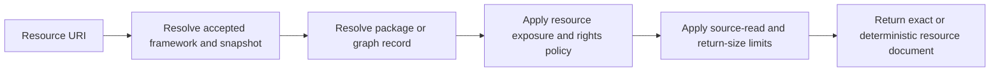

# Read resources and provenance

The MCP resource surface provides read-only access to accepted catalog metadata,
framework/package records, exact standards, relationship evidence, provenance, and a
closed set of manifest-declared artifacts.

Resources are not unrestricted filesystem access. Every read is routed through the
accepted catalog, exact package identity, rights policy, exposure policy, and configured
size limits.

## Resource model



The server exposes **one fixed resource** and **nine resource templates**.

## Fixed catalog resource

```text
kgfegmcp://catalog
```

The catalog resource returns the complete accepted public catalog as deterministic JSON.
Use it when a client supports MCP resource reads and you need the server-wide catalog as
one document rather than a paginated `list_frameworks` tool result.

## Resource URI templates

| Resource                   | URI                                                                                         |
|----------------------------|---------------------------------------------------------------------------------------------|
| Framework family           | `kgfegmcp://framework/{framework_id}`                                                       |
| Package manifest           | `kgfegmcp://framework/{framework_id}/snapshot/{snapshot_id}/manifest`                       |
| Validation report          | `kgfegmcp://framework/{framework_id}/snapshot/{snapshot_id}/validation`                     |
| Unresolved-items report    | `kgfegmcp://framework/{framework_id}/snapshot/{snapshot_id}/unresolved`                     |
| Interpretation profile     | `kgfegmcp://framework/{framework_id}/snapshot/{snapshot_id}/interpretation-profile`         |
| Manifest-declared artifact | `kgfegmcp://framework/{framework_id}/snapshot/{snapshot_id}/artifact/{artifact_name}`       |
| Standard                   | `kgfegmcp://framework/{framework_id}/snapshot/{snapshot_id}/standard/{node_id}`             |
| Standard provenance        | `kgfegmcp://framework/{framework_id}/snapshot/{snapshot_id}/standard/{node_id}/provenance`  |
| Relationship               | `kgfegmcp://framework/{framework_id}/snapshot/{snapshot_id}/relationship/{relationship_id}` |

Identifier values are percent-encoded as individual URI path segments when links are
constructed by the server.

## Framework resource

A framework URI addresses the framework family and its accepted snapshots:

```text
kgfegmcp://framework/ghana-nacca-primary-english-language-basic-1-3
```

This is useful for package identity, source metadata, and snapshot inventory. For
interactive filtered discovery, `list_frameworks` remains more convenient.

## Manifest and validation resources

For an exact snapshot, the manifest resource returns the retained accepted package
manifest bytes:

```text
kgfegmcp://framework/ghana-nacca-primary-english-language-basic-1-3/snapshot/ghana-nacca-primary-english-language-basic-1-3%402019%2B5ea90021b08d/manifest
```

The validation resource returns the accepted detailed validation report when declared:

```text
kgfegmcp://framework/{framework_id}/snapshot/{snapshot_id}/validation
```

These resources support audit questions such as:

- which profile version and SHA-256 is bound to the package;
- which artifacts and checksums are declared;
- what counts and capabilities were accepted; and
- what validation state and evidence accompany the snapshot.

The manifest and validation resources are public-metadata resource classes and do not
require the same full-text rights as source-content resources.

## Interpretation profile

The interpretation-profile resource returns the exact retained profile bytes bound to
an accepted snapshot:

```text
kgfegmcp://framework/{framework_id}/snapshot/{snapshot_id}/interpretation-profile
```

Use it when you need to audit framework-specific semantics such as local grade mappings,
statement-type normalization, hierarchy policy, code-search behavior, language policy,
known source anomalies, or required disclosures.

The profile is part of the interpretation contract, not curriculum source prose.

## Standard resource

A standard URI addresses one exact package-local node:

```text
kgfegmcp://framework/ghana-nacca-primary-english-language-basic-1-3/snapshot/ghana-nacca-primary-english-language-basic-1-3%402019%2B5ea90021b08d/standard/aa4cdccd-e5d9-589c-8094-e10d7ac0c754
```

This resource uses the outer `nodeId` namespace. It is not a generic CASE-identifier URI
resolver. Use `get_standard` when you want exact lookup by node ID, CASE UUID, or CASE
URI through an explicit identifier namespace.

Standard-resource exposure requires approved package rights and
`allowStandardResources` permission.

## Standard provenance

The provenance resource returns the selected detailed provenance entry for one exact
standard:

```text
kgfegmcp://framework/{framework_id}/snapshot/{snapshot_id}/standard/{node_id}/provenance
```

Use provenance to trace an accepted node back to retained source-extraction evidence
without conflating that evidence with later model interpretation.

The resource is rights-gated as full-text/single-standard content. Availability is
therefore package-specific even when detailed provenance exists in the accepted graph
package.

## Relationship resource

An exact package-local relationship can be read at:

```text
kgfegmcp://framework/{framework_id}/snapshot/{snapshot_id}/relationship/{relationship_id}
```

Relationship resources preserve source and target node IDs, source-facing relationship
metadata, resolution status, attribution, license, and immutable package identity.

A returned `hasChild` relationship is structural source-graph evidence. It does not
assert prerequisite or progression semantics.

## Unresolved-items resource

Packages that retain unresolved evidence can expose the accepted unresolved-items
report at:

```text
kgfegmcp://framework/{framework_id}/snapshot/{snapshot_id}/unresolved
```

This resource requires an approved rights-review state plus full-text permission.
Unresolved evidence should remain unresolved in downstream analysis; the resource exists
to preserve uncertainty, not to invite a client to guess a missing relationship.

## Generic manifest artifacts

The generic artifact template can address only logical artifact names declared by the
accepted package manifest:

```text
kgfegmcp://framework/{framework_id}/snapshot/{snapshot_id}/artifact/{artifact_name}
```

Declaration in the manifest is necessary but not sufficient for exposure. The resource
policy has a closed allowlist that assigns each built-in artifact a MIME type and access
class.

### Current built-in artifact exposure classes

| Logical artifact          | MIME type              | Access class    |
|---------------------------|------------------------|-----------------|
| `validationReport`        | `application/json`     | Public metadata |
| `unresolvedItems`         | `application/json`     | Full text       |
| `academicStandardsBundle` | `application/json`     | Bulk content    |
| `entityProvenance`        | `application/json`     | Bulk content    |
| `nodes`                   | `application/x-ndjson` | Bulk content    |
| `relationships`           | `application/x-ndjson` | Bulk content    |
| `relationshipsHasChild`   | `application/x-ndjson` | Bulk content    |
| `standardsFramework`      | `application/json`     | Bulk content    |
| `standardsFrameworkItems` | `application/x-ndjson` | Bulk content    |

An additional artifact can exist in a manifest and still fail closed if no explicit
resource exposure contract exists for its logical name.

!!! warning "Package presence does not imply public resource access"
    A file can be part of an accepted graph package while remaining inaccessible through
    MCP resources because its rights class, review status, permissions, or exposure
    contract do not allow it.

## Rights policy

Resource authorization depends on the requested family.

| Resource class                                                   | Main requirements                                                                                         |
|------------------------------------------------------------------|-----------------------------------------------------------------------------------------------------------|
| Catalog, framework, manifest, validation, interpretation profile | Available as public metadata                                                                              |
| Unresolved report                                                | Approved/provisionally approved review + `allowFullText`                                                  |
| Standard, standard provenance, relationship                      | Approved/provisionally approved review + `allowFullText` + `allowStandardResources`                       |
| Bulk artifact                                                    | Approved/provisionally approved review + `allowFullText` + `allowStandardResources` + `allowBulkResource` |

The resource layer evaluates these permissions independently from prompt derivative-
generation policy.

## Size limits

The runtime enforces separate limits for source reads and returned resource content.
Defaults are:

| Setting                              | Default |
|--------------------------------------|---------|
| `KGFEGMCP_MAX_RESOURCE_BYTES`        | 8 MiB   |
| `KGFEGMCP_MAX_RESOURCE_SOURCE_BYTES` | 32 MiB  |

The source-read limit must be greater than or equal to the returned-resource limit.
Requests that exceed the applicable bound fail instead of silently truncating source
bytes.

## Resource representation and evidence

Returned resource metadata distinguishes exact retained bytes from deterministic server-
derived documents. Resource representations are:

| Representation          | Meaning                                                                       |
|-------------------------|-------------------------------------------------------------------------------|
| `raw_source`            | Exact retained source bytes for the addressed package artifact                |
| `deterministic_derived` | Canonical server-generated representation derived from accepted runtime state |

Resource metadata also includes canonical URI, content SHA-256, byte length, MIME type,
and relevant framework, snapshot, package, or source-evidence identity.

These fields make resource consumption auditable without relying on filenames or client
presentation alone.

## Tool resource links

Several tools return optional MCP resource links alongside their structured evidence.
For example, framework tools can link to catalog/framework/package resources and
standard tools can link to standard or provenance resources when policy permits.

Those links are supplementary. A failure to construct an optional link does not change
the correctness of the tool's domain result.

## Client support varies

Whether a resource can be browsed or opened directly also depends on the connected MCP
host's resource support. If a host exposes tools but not resource reads, use the tool
surface for framework discovery, standards retrieval, context, comparison, and
progression evidence. The server-side resource contracts still exist even when a
particular client does not expose them in its UI.

## Choosing tools versus resources

Use tools when the task requires filtering, search, routing, traversal, comparison,
progression candidate collection, or structured continuation behavior. Use resources
when you already know the exact identity and need an auditable retained or deterministic
document such as a manifest, profile, validation report, standard, provenance entry, or
relationship.

For source-grounded generation, retrieve the required evidence through tools first and
use resource documents as supporting provenance or audit material rather than as a
replacement for bounded search logic.

---

**Next:** [MCP surface overview](../reference/index.md)
