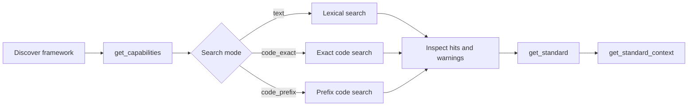

# Search and retrieve standards

`search_standards` is the main discovery tool for curriculum statements. It searches
accepted package-local indexes using deterministic lexical text matching or
profile-governed code matching, then returns exact source nodes with package identity,
facet evidence, matched fields, scores, warnings, and pagination state.

Use `get_standard` after discovery when you need the complete exact record for one
identified node.

## Search workflow



The generic tool schema exposes all three search variants, but package capability is
authoritative. Check `get_capabilities` before using either code mode.

## Text search

A text request has `mode: "text"` and a required `match` policy.

### Token matching

Use token mode when the exact source word order is unknown:

```json
{
  "request": {
    "mode": "text",
    "query": "structure story",
    "match": {
      "matchMode": "tokens",
      "operator": "all"
    },
    "frameworkIds": [
      "ghana-nacca-primary-english-language-basic-1-3"
    ],
    "localGradeLabels": ["BASIC 1"],
    "includeGroupings": false,
    "limit": 25
  }
}
```

`operator: "all"` requires every distinct query token. `operator: "any"` allows any
query token and usually broadens recall substantially.

### Exact phrase matching

Use exact phrase mode when the source wording is known closely enough to require
contiguous normalized text:

```json
{
  "request": {
    "mode": "text",
    "query": "structure of a story",
    "match": {
      "matchMode": "exact_phrase"
    },
    "frameworkIds": [
      "ghana-nacca-primary-english-language-basic-1-3"
    ],
    "localGradeLabels": ["BASIC 1"],
    "includeGroupings": false,
    "limit": 25
  }
}
```

Exact phrase matching is contiguous within a source description field. It is not
semantic phrase matching.

## Lexical search is intentionally conservative

The server normalizes lexical text deterministically, but it does not perform:

- stemming;
- lemmatization;
- fuzzy matching;
- embeddings or semantic similarity; or
- automatic synonym expansion.

Consequently, `fraction` and `fractions` are different lexical forms, and `story
structure` is not the same exact phrase as `structure of a story`.

!!! warning "Zero matches do not establish curriculum absence"
    A zero-result page means that the supplied expression did not match under the
    selected package, filters, mode, match policy, and bounds. It does not prove that no
    conceptually related source material exists.

For concept discovery, begin with the caller's original wording. If recall is visibly
narrow, issue a small number of separate conservative alternatives, such as a clear
singular/plural variant or terminology learned from retrieved source context. Preserve
all other filters and bounds so the calls remain comparable.

Once a relevant branch is found, prefer `get_standard_context` over open-ended query
expansion.

## Exact code search

Use `code_exact` only when the selected package reports the mode in
`implementedSearchModes`:

```json
{
  "request": {
    "mode": "code_exact",
    "query": "B1.2.7.2.6",
    "frameworkIds": [
      "ghana-nacca-primary-english-language-basic-1-3"
    ],
    "includeGroupings": false,
    "limit": 25
  }
}
```

Exact code matching is governed by the framework's interpretation profile. The result
can include code-specific evidence such as the authored code, normalized code key,
configured code scope, and parent-code derivation evidence.

A code can legitimately map to multiple retained records. When that happens, preserve
the `multiple_code_matches` warning and do not silently choose a preferred node unless a
separate source rule justifies that choice.

## Prefix code search

Use `code_prefix` only when the package supports prefix search:

```json
{
  "request": {
    "mode": "code_prefix",
    "query": "C-2",
    "frameworkIds": [
      "india-tamil-nadu-tnscert-mathematics-classes-1-5"
    ],
    "includeGroupings": true,
    "limit": 25
  }
}
```

Prefix behavior is profile-governed rather than a universal string `startswith`
contract. The selected profile controls code normalization and valid prefix boundaries.

## Search scope

`search_standards` can operate over one exact framework or a deterministic federated
set of accepted snapshots.

Framework and snapshot selectors include:

| Field           | Meaning                              |
|-----------------|--------------------------------------|
| `frameworkIds`  | Exact framework families to include  |
| `snapshotIds`   | Exact immutable snapshots to include |
| `jurisdictions` | Source-jurisdiction filter           |
| `languages`     | Source-language filter               |
| `subjects`      | Source-authored subject filter       |

When no framework or snapshot identifiers are supplied, search resolves the unique
current snapshot from each eligible framework family before applying catalog-level
filters.

For reproducible or evaluative work, select exact framework and snapshot identities
rather than relying on broad federation.

## Package-local filters

The same request can filter source and normalized facets:

| Field                      | Meaning                                              |
|----------------------------|------------------------------------------------------|
| `includeGroupings`         | Allow normalized `Standard Grouping` nodes to appear |
| `localGradeLabels`         | Source-facing grade or stage labels                  |
| `normalizedGrades`         | Normalized grade retrieval facets                    |
| `normalizedStatementTypes` | `Standard` or `Standard Grouping`                    |
| `normalizedSubjects`       | Normalized subject facets                            |
| `statementTypes`           | Framework-local statement-type labels                |

Within one filter dimension, values use OR semantics. Across populated dimensions,
filters use AND semantics.

Local grade matching is profile-aware: the runtime resolves configured local labels and
grade aliases to the package's normalized grade evidence while preserving exact source
labels in the result.

!!! warning "Grouping filters must agree"
    If `normalizedStatementTypes` includes `Standard Grouping`, set
    `includeGroupings` to `true`.

## Understand search evidence

Every returned hit is a `retrieval_candidate`, not a new curriculum claim. A hit
contains:

| Evidence          | Why it matters                                      |
|-------------------|-----------------------------------------------------|
| `node`            | Exact retained source item                          |
| `packageIdentity` | Framework, snapshot, package, profile, and revision |
| `facets`          | Local and normalized grade/subject/type evidence    |
| `matchedFields`   | Exact field values that matched                     |
| `matchedTerms`    | Normalized terms responsible for the hit            |
| `score`           | Deterministic algorithm and integer score           |
| `retrievalMethod` | `text`, `code_exact`, or `code_prefix`              |
| `warnings`        | Capability or source-data caveats                   |
| `codeMatch`       | Code evidence for code modes only                   |

Search ranking is deterministic. It is not an LLM relevance score.

## Search warnings

Warnings should remain attached to the package or node they describe. Current warning
codes include:

| Warning                         | Meaning                                               |
|---------------------------------|-------------------------------------------------------|
| `text_search_unavailable`       | Selected package does not implement text search       |
| `code_search_unavailable`       | Requested code mode is unavailable                    |
| `code_prefix_unavailable`       | Prefix mode is unavailable                            |
| `partial_code_coverage`         | Only part of the package is coded                     |
| `multiple_code_matches`         | Exact code maps to more than one record               |
| `derived_parent_code_not_found` | Configured derived parent code has no retained match  |
| `derived_parent_code_multiple`  | Configured derived parent code maps to multiple nodes |

Warnings are evidence, not errors to hide. In particular, partial code coverage should
remain visible when interpreting a code-search result set.

## Retrieve an exact standard

After search, use `get_standard` with an explicit identifier namespace.

### By node ID

```json
{
  "request": {
    "frameworkId": "ghana-nacca-primary-english-language-basic-1-3",
    "identifier": {
      "identifierType": "node_id",
      "nodeId": "aa4cdccd-e5d9-589c-8094-e10d7ac0c754"
    }
  }
}
```

### By CASE UUID

```json
{
  "request": {
    "frameworkId": "ghana-nacca-primary-english-language-basic-1-3",
    "identifier": {
      "identifierType": "case_identifier_uuid",
      "caseIdentifierUuid": "aa4cdccd-e5d9-589c-8094-e10d7ac0c754"
    }
  }
}
```

### By CASE URI

```json
{
  "request": {
    "frameworkId": "ghana-nacca-primary-english-language-basic-1-3",
    "identifier": {
      "identifierType": "case_identifier_uri",
      "caseIdentifierUri": "urn:uuid:aa4cdccd-e5d9-589c-8094-e10d7ac0c754"
    }
  }
}
```

Use only identifier types actually retained for the selected item. Do not convert a
node ID into a CASE identifier merely because both may use UUID-shaped text.

The exact result includes the source node, local and normalized facets, source metadata,
rights, and immutable graph-package identity.

## Pagination

The search page returns `hasMore` and an opaque `nextCursor`. The tool also emits a
complete `nextRequest` when another page exists.

Submit that request unchanged. Search cursors are bound to the exact mode, query, match
settings, filters, scope, limit, and accepted index/catalog state. Reusing a cursor with
any modified field is invalid.

!!! tip "Preserve page evidence"
    If you continue a search, keep the page-local warnings, ranking, `hasMore`, and
    cursor associated with the page that produced them. Do not concatenate pages and
    then describe the merged order as if it were one unbounded search.

## Natural-language example

```text
Within the Nigeria Primary 1-3 Mathematics framework, search PRIMARY THREE for
fraction-related standards using lexical token matching. Preserve exact source wording,
local statement type, node ID, local grade evidence, package identity, search warnings,
and whether more results are available. Do not claim that zero matches for any one
lexical form prove absence, and do not infer a learning progression from the result
order.
```

## Next step after a hit

Use [Navigate hierarchies](hierarchy-context.md) when you need to understand where a
retrieved item sits in its source structure. Use [Compare framework evidence](comparison.md)
when the task explicitly requires independently bounded retrieval across frameworks.

---

**Next:** [Navigate hierarchies](hierarchy-context.md)
