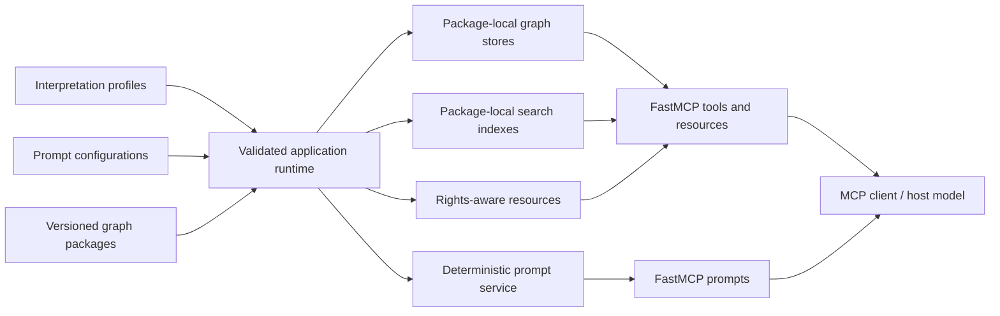

# Knowledge Graph for Education Global MCP

**KGForEdGlobalMCP** is a curriculum-agnostic, read-only FastMCP server for exploring
versioned curriculum knowledge graphs from countries, states, and educational
organizations.

It provides one MCP interface for discovering curriculum frameworks, searching and
retrieving academic standards, navigating source hierarchies, accessing provenance-aware
resources, and assembling bounded evidence for cross-framework comparison and
progression analysis.

!!! note "Deterministic server, client-side reasoning"
    The server loads, validates, indexes, and retrieves source-grounded curriculum evidence.
    It does **not** call a server-side LLM. Reasoning and generated outputs are performed by
    the connected MCP client or host model, such as Claude Desktop.

- :material-magnify:{ .lg .middle } **Search curriculum standards**

    ---

    Discover frameworks and search package-local curriculum content using lexical text
    search or profile-governed code search.

    [Search and retrieve standards](guides/standards-search.md)

- :material-file-tree:{ .lg .middle } **Navigate source hierarchies**

    ---

    Retrieve direct relationships, bounded ancestors and descendants, and complete bounded
    paths to framework roots.

    [Navigate hierarchies](guides/hierarchy-context.md)

- :material-compare-horizontal:{ .lg .middle } **Compare bounded evidence**

    ---

    Retrieve independently scoped evidence across frameworks without treating retrieval
    results as official alignment or equivalence.

    [Compare framework evidence](guides/comparison.md)

- :material-school:{ .lg .middle } **Use role-oriented workflows**

    ---

    Use deterministic prompt workflows for student support, teacher materials, progression
    hypotheses, and administrator review.

    [Use prompt workflows](guides/prompts.md)

## What the server exposes

The current MCP surface contains the following:

| Surface            | Count | Purpose                                                                                                                         |
|--------------------|-------|---------------------------------------------------------------------------------------------------------------------------------|
| Tools              | 9     | Framework discovery, standards retrieval, graph context, statistics, capability reporting, comparison, and progression evidence |
| Fixed resources    | 1     | Server catalog                                                                                                                  |
| Resource templates | 9     | Framework, package, validation, profile, standards, provenance, relationship, unresolved, and declared-artifact access          |
| Prompts            | 6     | Role-oriented and cross-framework client-side workflows                                                                         |

### Tools

- `list_frameworks`
- `get_framework`
- `search_standards`
- `get_standard`
- `get_standard_context`
- `get_framework_statistics`
- `get_capabilities`
- `compare_framework_evidence`
- `collect_progression_evidence`

### Prompts

- `student_study_support`
- `teacher_guide_draft`
- `student_handbook_section`
- `inferred_progression_hypothesis`
- `administrator_alignment_review`
- `cross_framework_comparison`

See the [MCP reference](reference/index.md) for the complete public surface.

## Current curriculum catalog

The repository snapshot currently contains six accepted Academic Standards graph
packages:

| Framework                                                       | Jurisdiction      | Subject          | Local grades or stages            | Code search |
|-----------------------------------------------------------------|-------------------|------------------|-----------------------------------|-------------|
| English Language Curriculum for Primary Schools (Basic 1 - 3)   | Ghana             | English Language | BASIC 1, BASIC 2, BASIC 3         | Partial     |
| Mathematics Curriculum for Primary Schools (Basic 4 - 6)        | Ghana             | Mathematics      | BASIC 4, BASIC 5, BASIC 6         | Partial     |
| Learning Framework - Science                                    | India             | Science          | Class IX, Class X                 | Partial     |
| Tamil Nadu Curriculum Framework 2025: Mathematics - Classes 1-5 | Tamil Nadu, India | Mathematics      | Class-1 through Class-5           | Partial     |
| 9-Year Basic Education Mathematics Curriculum for Primary 1-3   | Nigeria           | Mathematics      | PRIMARY ONE through PRIMARY THREE | None        |
| Mathematics Syllabus for Lower Primary \| Primary 1 - 3         | Rwanda            | Mathematics      | P1, P2, P3                        | None        |

All six packages support lexical text search and include detailed provenance. Search and
traversal capabilities remain package-specific; use `get_capabilities` to inspect the
runtime for supported modes for each framework.

For package-level details, see [Available frameworks](data/framework-catalog.md).

## How it works

Each curriculum is retained as an independent, immutable graph package. Shared services
make those packages discoverable through one server without merging their source
structures into a single curriculum graph.

This architecture preserves:

- exact framework, snapshot, and graph-package identity;
- source terminology and local grade labels;
- provenance, rights, and validation evidence;
- package-local tree or multi-parent DAG topology; and
- unresolved relationship statuses where the source package retains them.

Check out [Architecture](architecture.md) for the runtime design
and [Concepts and boundaries](concepts.md) for the interpretation rules behind these
guarantees.

## Important boundaries

**KGForEdGlobalMCP** is designed to return faithful, bounded evidence rather than
silently infer educational claims.

!!! warning "Graph hierarchy is not learning progression"
    A structural `hasChild` relationship records retained source hierarchy. It does not, by
    itself, assert prerequisite knowledge, instructional sequence, conceptual dependency, or
    learner mastery.

!!! warning "Framework comparison is not curriculum alignment"
    Cross-framework retrieval returns candidate evidence from independently bounded
    searches. It does not establish official alignment, equivalence, grade equivalence, or
    endorsement between frameworks.

!!! warning "Text search is lexical"
    Text search uses normalized tokens or contiguous normalized phrases. It does not perform
    semantic search, stemming, lemmatization, or automatic synonym expansion. A zero-result
    query means the supplied lexical expression did not match under the requested bounds; it
    does not necessarily mean that the curriculum lacks the concept.

The current server also does not provide persisted alignments, accepted mapping
overlays, embeddings, semantic retrieval, snapshot diffs, server-side LLM calls, or
first-class learning-component or learning-progression graphs.

## Where to start

- **New to the repository?**

    Start with [Architecture](architecture.md),
    then [Concepts and boundaries](concepts.md).

- **Ready to run the server?**

    Follow the [Quickstart](getting-started/index.md)
    and [Local installation](getting-started/local-installation.md).

- **Building an MCP client integration?**

    Read [Connect an MCP client](getting-started/mcp-clients.md) and
    the [MCP reference](reference/index.md).

- **Adding or reviewing curriculum data?**

    Read [Runtime inputs](data/index.md), [Interpretation profiles](data/profiles.md),
    and [Graph package format](data/graph-packages.md).

---

**Next:** [Architecture](architecture.md)
