# CLI commands

The backend installs four operator-facing command-line applications. Run them through
the repository's locked `uv` environment so the executable code and dependency graph
match the checked-in project metadata.

```bash
uv --directory backend run --locked --no-dev <command> [options]
```

## Command overview

| Command                      | Purpose                                                                                      | Mutates package state?                                              |
|------------------------------|----------------------------------------------------------------------------------------------|---------------------------------------------------------------------|
| `kgfegmcp-stdio-smoke`       | Start the real server in a separate STDIO subprocess and verify its public surface/resources | No                                                                  |
| `kgfegmcp-validate-packages` | Validate one package or every pending package                                                | Only when validating a pending package without `--read-only`        |
| `kgfegmcp-build-manifest`    | Construct or dry-run one deterministic **pending** graph package                             | Yes unless `--dry-run`; existing identical output is left unchanged |
| `kgfegmcp-build-mcpb`        | Assemble, validate, pack, and independently verify the MCP Bundle                            | Writes staging/output files only; does not mutate graph packages    |

Inspect the installed interfaces directly:

```bash
uv --directory backend run --locked --no-dev kgfegmcp-stdio-smoke --help
uv --directory backend run --locked --no-dev kgfegmcp-validate-packages --help
uv --directory backend run --locked --no-dev kgfegmcp-build-manifest --help
uv --directory backend run --locked --no-dev kgfegmcp-build-mcpb --help
```

## Recommended operator flow

```mermaid
%%{init: {"themeVariables": {"fontSize": "18px"}}}%%
flowchart LR
    INPUT[Accepted delivery + detailed artifacts] --> BUILD[build-manifest]
    BUILD --> PENDING[Pending graph package]
    PENDING --> CHECK[validate-packages --read-only]
    CHECK -->|valid| PERSIST[validate-packages]
    PERSIST --> PASSED[Passed package]
    PASSED --> SMOKE[stdio-smoke]
    SMOKE --> BUNDLE[build-mcpb]
    BUNDLE --> STAGE[Retained stage]
    STAGE --> STAGE_SMOKE[stdio-smoke --bundle-root]
```



## `kgfegmcp-stdio-smoke`

Use this as the primary local acceptance test:

```bash
uv --directory backend run --locked --no-dev kgfegmcp-stdio-smoke
```

The command starts:

```text
uv run --directory <runtime-root> --locked --no-dev \
  python -m kgfegmcp.mcpb_server
```

in a separate STDIO process. It then:

1. completes the MCP handshake;
2. lists and requires the exact approved inventory;
3. verifies 9 tools, 1 fixed resource, 9 resource templates, and 6 prompts;
4. reads one known-good JSON resource from the fixed catalog and every resource-template
   family; and
5. closes the client and proves the subprocess exits cleanly.

A successful result is deterministic JSON containing:

```json
{
  "fixedResourceCount": 1,
  "promptCount": 6,
  "resourceReadCount": 10,
  "resourceTemplateCount": 9,
  "status": "passed",
  "toolCount": 9
}
```

The actual result also includes per-resource read summaries and `bundleRoot`.

### Smoke a retained MCPB stage

```bash
uv --directory backend run --locked --no-dev kgfegmcp-stdio-smoke \
  --bundle-root ./dist/kgfegmcp-stage
```

The stage must contain the runtime files required by the bundle contract, including
`pyproject.toml`, `uv.lock`, `src/kgfegmcp/mcpb_server.py`, `config/`, and `data/`.

**Exit status:** `0` on success; `1` on startup, handshake, inventory, resource-read, or
shutdown failure.

## `kgfegmcp-validate-packages`

This command has two subcommands.

### Validate one exact package

```bash
uv --directory backend run --locked --no-dev \
  kgfegmcp-validate-packages one \
  --framework-id <framework-id> \
  --snapshot-id <snapshot-id> \
  --read-only
```

Options:

| Option                            | Required | Meaning                                                 |
|-----------------------------------|----------|---------------------------------------------------------|
| `--framework-id FRAMEWORK_ID`     | Yes      | Stable framework identifier                             |
| `--snapshot-id SNAPSHOT_ID`       | Yes      | Immutable snapshot identifier                           |
| `--read-only`                     | No       | Prohibit validation-status persistence                  |
| `--invalid-package-policy POLICY` | No       | Override invalid pending target: `fail` or `quarantine` |

A terminal package selected through `one` is revalidated read-only even if `--read-only`
is omitted; terminal state is never rewritten.

### Validate all pending packages

```bash
uv --directory backend run --locked --no-dev \
  kgfegmcp-validate-packages pending --read-only
```

To persist allowed pending-to-terminal transitions:

```bash
uv --directory backend run --locked --no-dev \
  kgfegmcp-validate-packages pending
```

To quarantine invalid pending packages instead of marking them failed:

```bash
uv --directory backend run --locked --no-dev \
  kgfegmcp-validate-packages pending \
  --invalid-package-policy quarantine
```

The JSON result records public findings plus fields such as `isValid`, `observedStatus`,
`targetStatus`, `effectiveStatus`, `persisted`, `readOnly`, and
`terminalRevalidation`.

### Validation exit codes

| Exit | Meaning                                                                                                 |
|------|---------------------------------------------------------------------------------------------------------|
| `0`  | Selected package(s) are valid                                                                           |
| `1`  | Validation completed but at least one package is invalid                                                |
| `2`  | Invocation, settings, identifier, repository, or other typed domain failure prevented normal validation |

This distinction is useful in CI: exit `1` means the validator produced a negative data
result, while exit `2` means the validation operation itself could not be performed as
requested.

See [Validation and lifecycle](../data/validation.md) for persistence rules.

## `kgfegmcp-build-manifest`

This command builds one deterministic pending graph package from operator-approved
inputs. Supply either a JSON build specification or explicit CLI options, never both.

### Build from a specification

```bash
uv --directory backend run --locked --no-dev \
  kgfegmcp-build-manifest --spec ./package-build-spec.json
```

Preview without writing:

```bash
uv --directory backend run --locked --no-dev \
  kgfegmcp-build-manifest --spec ./package-build-spec.json --dry-run
```

The build specification is strict and maps to `PackageBuildSpec`. The principal fields
are:

```json
{
  "jurisdictionType": "<operator-approved type>",
  "nodes": "/absolute/path/to/as_nodes_XXX.jsonl",
  "outputRoot": "/absolute/path/to/data/graph_packages",
  "profileId": "<profile-id>",
  "profileVersion": "<profile-version>",
  "relationships": "/absolute/path/to/as_relationships_XXX.jsonl",
  "versionToken": "<immutable source version token>"
}
```

Optional fields cover recognized detailed artifacts, explicitly named additional
artifacts, snapshot relations, an exact source document, and authoritative source
publication date. See [Manifest contract](../data/manifest.md) and
[Graph package format](../data/graph-packages.md) before constructing package inputs.

### Build from explicit options

The following options are required when `--spec` is not used:

```text
--jurisdiction-type
--nodes
--output-root
--profile-id
--profile-version
--relationships
--version-token
```

Example shape:

```bash
uv --directory backend run --locked --no-dev \
  kgfegmcp-build-manifest \
  --jurisdiction-type "<type>" \
  --nodes /path/to/as_nodes_XXX.jsonl \
  --relationships /path/to/as_relationships_XXX.jsonl \
  --profile-id <profile-id> \
  --profile-version <profile-version> \
  --version-token <version-token> \
  --output-root /path/to/data/graph_packages \
  --dry-run
```

Useful optional inputs include:

| Option                                 | Behavior                                                         |
|----------------------------------------|------------------------------------------------------------------|
| `--detailed-root PATH`                 | Discover recognized detailed `as_*` artifacts from one directory |
| `--detailed-artifact PATH`             | Add one recognized detailed artifact; repeat as needed           |
| `--additional-artifact NAME=PATH`      | Explicitly declare a nonstandard artifact; repeat as needed      |
| `--snapshot-relation JSON`             | Add an approved snapshot relation; repeat as needed              |
| `--source-document PATH`               | Record the exact source-document checksum                        |
| `--source-publication-date YYYY-MM-DD` | Record an authoritative source publication date                  |
| `--dry-run`                            | Render the proposed result without writing package files         |

`--detailed-root` and repeated `--detailed-artifact` inputs are mutually exclusive.

The result reports an `outcome` of `created`, `dry_run`, or `existing_identical`, along
with the proposed/created manifest and package paths and any warnings.

**Exit status:** `0` on a successful create/dry-run/identical outcome; `1` for build or
input-validation failure. Typer may reject malformed invocation syntax before the build
logic runs.

## `kgfegmcp-build-mcpb`

Build the default bundle:

```bash
uv --directory backend run --locked --no-dev kgfegmcp-build-mcpb
```

Options:

| Option                   | Default                        | Meaning                                                 |
|--------------------------|--------------------------------|---------------------------------------------------------|
| `--output PATH`          | `dist/kgfegmcp-<version>.mcpb` | Destination archive                                     |
| `--stage-output PATH`    | temporary directory            | Retain the exact assembled bundle in an empty directory |
| `--mcpb-command COMMAND` | `mcpb`                         | Official MCPB CLI executable name or absolute path      |

The command delegates validation and packing to the official MCPB CLI, then independently
reopens the archive and verifies its members and bytes against the stage.

See [MCPB packaging](mcpb.md) for the full acceptance workflow.

## Suggested CI/operator sequence

For an already-populated repository with accepted packages:

```bash
# 1. Confirm current package integrity without mutation.
uv --directory backend run --locked --no-dev \
  kgfegmcp-validate-packages pending --read-only

# 2. Exercise the repository runtime over real STDIO.
uv --directory backend run --locked --no-dev kgfegmcp-stdio-smoke

# 3. Build and retain a reviewable package stage.
rm -rf ./dist/kgfegmcp-stage
uv --directory backend run --locked --no-dev \
  kgfegmcp-build-mcpb --stage-output ./dist/kgfegmcp-stage

# 4. Exercise the staged runtime independently of repository layout.
uv --directory backend run --locked --no-dev \
  kgfegmcp-stdio-smoke --bundle-root ./dist/kgfegmcp-stage

# 5. Confirm ZIP-level integrity.
unzip -t ./dist/kgfegmcp-0.1.0.mcpb
```

The exact archive name follows the version in `packaging/mcpb/manifest.json`.

---

**Next:** [MCPB packaging](mcpb.md)
