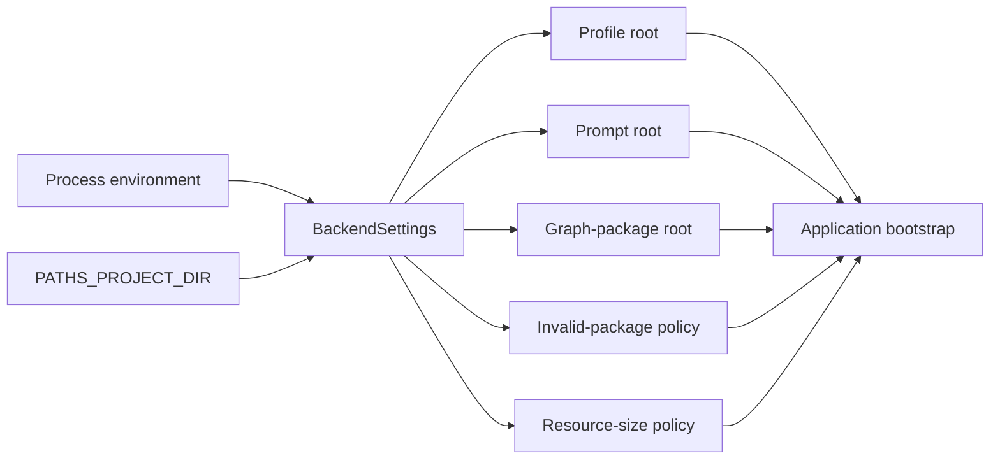

# Environment variables

**KGForEdGlobalMCP** uses an immutable `BackendSettings` object to resolve repository
paths and runtime policy from the process environment. Ordinary repository-local runs
work from the standard checkout layout, while desktop MCP hosts and retained MCPB stages
usually supply explicit absolute paths.

This page distinguishes settings that affect the current runtime from settings that are
present in the settings model but are not currently consumed by application bootstrap.

## Settings source and precedence

`BackendSettings` accepts settings from two sources, in this order:

1. explicit constructor values supplied by Python code; and
2. the existing process environment.

The application intentionally excludes Pydantic dotenv and file-secret sources.

!!! important "No implicit `.env` loading"
    A shell tool such as `direnv` may populate environment variables before the process
    starts, but the server itself does not discover or parse a repository `.env` file.
    Empty environment values are ignored.

## Path resolution

Most path overrides follow the same rules:

- `~` is expanded;
- absolute values remain absolute;
- relative values are resolved against `PATHS_PROJECT_DIR`; and
- resolved paths do not need to exist at settings-construction time.

`PATHS_PROJECT_DIR` is the exception: when explicitly supplied, it must already be an
absolute path. Without an override, the repository root is inferred from the installed
source layout.



## Active runtime settings

The following settings affect the current application bootstrap or the runtime services
it constructs.

| Environment variable                 | Default                                     | Current role                                                              |
|--------------------------------------|---------------------------------------------|---------------------------------------------------------------------------|
| `PATHS_PROJECT_DIR`                  | repository root inferred from source layout | Base path for project-relative settings; must be absolute when supplied   |
| `KGFEGMCP_DATA_ROOT`                 | `<project>/data`                            | Base data path; used by the default graph-package path                    |
| `KGFEGMCP_GRAPH_PACKAGES_ROOT`       | `<data-root>/graph_packages`                | Immutable graph-package repository loaded and revalidated at startup      |
| `KGFEGMCP_PROFILE_ROOT`              | `<project>/config/profiles`                 | Versioned interpretation-profile repository                               |
| `KGFEGMCP_PROMPT_ROOT`               | `<project>/config/prompts`                  | Optional framework prompt-configuration repository                        |
| `KGFEGMCP_INVALID_PACKAGE_POLICY`    | `fail`                                      | Controls handling of invalid pending packages: `fail` or `quarantine`     |
| `KGFEGMCP_MAX_RESOURCE_BYTES`        | `8388608` (8 MiB)                           | Maximum bytes returned by an exposed resource                             |
| `KGFEGMCP_MAX_RESOURCE_SOURCE_BYTES` | `33554432` (32 MiB)                         | Maximum bytes the resource layer may read from a retained source artifact |

`KGFEGMCP_MAX_RESOURCE_SOURCE_BYTES` must be greater than or equal to
`KGFEGMCP_MAX_RESOURCE_BYTES`. Both values must be positive integers.

See [Rights and provenance](../data/rights-and-provenance.md) for the independent rights
checks that apply in addition to these byte limits.

## Common explicit local configuration

A desktop MCP host does not necessarily inherit your interactive shell's working
directory or exported variables. A fully explicit repository-local configuration is:

```bash
export PATHS_PROJECT_DIR="/absolute/path/to/KGForEdGlobalMCP"
export KGFEGMCP_CONFIG_ROOT="$PATHS_PROJECT_DIR/config"
export KGFEGMCP_DATA_ROOT="$PATHS_PROJECT_DIR/data"
export KGFEGMCP_GRAPH_PACKAGES_ROOT="$PATHS_PROJECT_DIR/data/graph_packages"
export KGFEGMCP_PROFILE_ROOT="$PATHS_PROJECT_DIR/config/profiles"
export KGFEGMCP_PROMPT_ROOT="$PATHS_PROJECT_DIR/config/prompts"
export KGFEGMCP_INVALID_PACKAGE_POLICY="fail"
export KGFEGMCP_LOG_LEVEL="INFO"
```

This is also the shape used by the repository STDIO smoke command and the MCPB runtime
manifest.

!!! note "`KGFEGMCP_CONFIG_ROOT` does not redirect profile and prompt defaults"
    `KGFEGMCP_CONFIG_ROOT` is present in `BackendSettings`, but the current
    `profile_root` and `prompt_root` defaults are independently resolved from
    `<project>/config/profiles` and `<project>/config/prompts`. If you relocate those
    repositories, set `KGFEGMCP_PROFILE_ROOT` and `KGFEGMCP_PROMPT_ROOT` explicitly.

## Invalid-package policy

`KGFEGMCP_INVALID_PACKAGE_POLICY` accepts:

| Value        | Invalid pending package                                            | Catalog behavior                                                   |
|--------------|--------------------------------------------------------------------|--------------------------------------------------------------------|
| `fail`       | Target terminal state is `failed` when persistence is allowed      | Invalid pending candidates cause safe catalog construction to fail |
| `quarantine` | Target terminal state is `quarantined` when persistence is allowed | Invalid pending candidates are excluded rather than accepted       |

Neither policy makes an invalid package queryable. A valid package must have persisted
terminal status `passed` and must still pass read-only revalidation before entering the
catalog.

See [Validation and lifecycle](../data/validation.md) for the full package-state model.

## Resource-size settings

Resource access uses two independent byte ceilings:

```text
retained source artifact
        │
        │ must be <= KGFEGMCP_MAX_RESOURCE_SOURCE_BYTES
        ▼
resource repository read
        │
        │ returned representation must be <= KGFEGMCP_MAX_RESOURCE_BYTES
        ▼
MCP resource response
```

These limits are safety bounds, not rights grants. A resource can remain unavailable
because of manifest exposure or rights policy even when its size is below both limits.

## Settings present but not currently applied by bootstrap

`BackendSettings` also defines the following environment variables:

| Environment variable    | Resolved/default value          | Current status in the reviewed runtime                                               |
|-------------------------|---------------------------------|--------------------------------------------------------------------------------------|
| `KGFEGMCP_CACHE_ROOT`   | `<project>/caches`              | Parsed path; not consumed by application bootstrap                                   |
| `KGFEGMCP_CATALOG`      | `<project>/config/catalog.json` | Parsed path; the active catalog is constructed from validated graph packages instead |
| `KGFEGMCP_CONFIG_ROOT`  | `<project>/config`              | Parsed path; not directly consumed by bootstrap                                      |
| `KGFEGMCP_ENV`          | `local`                         | Parsed enum (`dev`, `local`, `prod`, `testing`); not currently used by bootstrap     |
| `KGFEGMCP_LOG_LEVEL`    | `INFO`                          | Parsed enum; not currently passed to the available explicit logger initializer       |
| `KGFEGMCP_LOG_ROOT`     | `<project>/logs`                | Parsed path; not consumed by bootstrap                                               |
| `KGFEGMCP_RESULTS_ROOT` | `<project>/results`             | Parsed path; not consumed by bootstrap                                               |
| `KGFEGMCP_CONFIG`       | `<project>/config/server.json`  | Parsed path; not consumed by bootstrap                                               |

These names are part of the settings model and may appear in launch configuration, but
operators should not assume they alter current application behavior unless the bootstrap
or a command actually reads the corresponding property.

!!! warning "Do not rely on `KGFEGMCP_LOG_LEVEL` as a live debugging switch"
    The repository contains an explicit Loguru initialization helper, but the reviewed
    server bootstrap does not call it. Current startup diagnostics flow through Python /
    FastMCP logging. Use the MCP host's stderr/log capture when diagnosing startup rather
    than assuming `KGFEGMCP_LOG_LEVEL=DEBUG` will reconfigure the process.

## Repository-local versus MCPB paths

Repository execution normally resolves paths beneath the checkout:

```text
<repository>/
├── backend/
├── config/
└── data/
```

A retained MCPB stage makes the stage itself the application project root:

```text
<bundle-stage>/
├── pyproject.toml
├── uv.lock
├── src/
├── config/
└── data/
```

The MCPB manifest sets `PATHS_PROJECT_DIR` and all active content roots to
`${__dirname}`-relative paths so the packaged runtime does not depend on the original
checkout.

## Validate a configuration

The most useful end-to-end configuration check is:

```bash
uv --directory backend run --locked --no-dev kgfegmcp-stdio-smoke
```

It starts a fresh subprocess with explicit repository paths, completes an MCP handshake,
checks the exact public inventory, and reads a representative resource from every
approved resource family.

For graph-package policy alone, use:

```bash
uv --directory backend run --locked --no-dev \
  kgfegmcp-validate-packages pending --read-only
```

---

**Next:** [CLI commands](cli.md)
