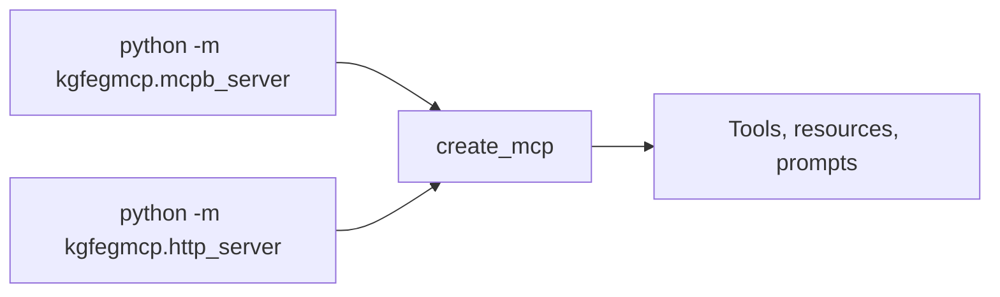

# Hosted deployment

The repository can run the same generic server as a hosted Streamable HTTP service, so
MCP clients connect to a URL instead of starting a local child process. Hosting adds a
second entry point and a container image; it does not introduce a second server
implementation, change the MCP surface, or alter curriculum data.

## Two entry points, one server



| Entry point              | Transport       | Used by                                     |
|--------------------------|-----------------|---------------------------------------------|
| `kgfegmcp.mcpb_server`   | STDIO           | Local MCP hosts, the MCPB bundle            |
| `kgfegmcp.http_server`   | Streamable HTTP | The container image and hosted deployments  |

Both call the same `create_mcp` factory, so registration, bootstrap, configuration, and
error handling are identical. The HTTP entry point additionally:

- serves MCP at `/mcp`;
- binds every interface on the port supplied through `PORT` (default `8000`);
- runs stateless, so any replica can answer any request; and
- exposes `GET /health`, which returns `{"status": "ok"}` once the server is serving.

The application state is constructed once at startup, before the first request is
served. If graph-package validation or catalog construction fails, the process exits
with a nonzero status instead of serving a partial catalog.

## What the image contains

The root `Dockerfile` builds from the repository root and bakes in only the runtime
inputs:

```text
/app/
├── backend/          locked runtime environment and src/kgfegmcp
├── config/           profiles and prompt configurations
└── data/
    └── graph_packages/
```

The `.dockerignore` file is an allowlist: everything is excluded from the build context
unless it is explicitly admitted. `data/input_artifacts/`, documentation, packaging
output, and local working files never enter the image.

Because graph packages are baked in, code and data are versioned together. Changing a
graph package means committing it and deploying a new image, and rolling back an image
rolls back the data with it. The image runs as a non-root user and the server does not
write to disk while serving, so a read-only filesystem is supported.

## Build and run locally

From the repository root:

```bash
docker build -t kgfegmcp-http:local .
docker run --rm --read-only -e PORT=8000 -p 8000:8000 kgfegmcp-http:local
```

Confirm the process is serving:

```bash
curl http://localhost:8000/health
```

Then verify the full MCP surface over HTTP:

```bash
uv --directory backend run --locked --no-dev kgfegmcp-http-smoke \
  --url http://localhost:8000/mcp
```

The HTTP smoke runs the same approved-inventory and representative resource-read checks
as the STDIO smoke. See [CLI commands](cli.md).

To run the HTTP entry point without a container:

```bash
PORT=8000 uv --directory backend run --locked --no-dev python -m kgfegmcp.http_server
```

## Hosting the image

Any platform that builds a `Dockerfile`, injects `PORT`, and routes HTTPS to the
container can host the server. The service needs no database, volume, secret, or
outbound network access. Configure the service with:

| Setting           | Value                                        |
|-------------------|----------------------------------------------|
| Source            | This repository, deployed from `main`        |
| Build             | The root `Dockerfile`                        |
| Health check path | `/health`                                    |
| Replicas          | `1` is sufficient; more can be added freely  |
| Public domain     | One stable HTTPS domain                      |

No `KGFEGMCP_*` variables need to be set on the platform. The image sets
`PATHS_PROJECT_DIR=/app` and `KGFEGMCP_ENV=prod`, and every content root resolves from
its default beneath `/app`. See [Environment variables](configuration.md).

Clients connect to:

```text
https://<service-domain>/mcp
```

!!! important "Treat the public domain as permanent"
    Every connected client stores the endpoint URL. Changing the domain later means
    every user must reconfigure their connector, so choose a stable name before sharing
    it.

After each deployment, verify the live service:

```bash
uv --directory backend run --locked --no-dev kgfegmcp-http-smoke \
  --url https://<service-domain>/mcp
```

## Access and rights posture

The hosted endpoint is unauthenticated: any MCP client that has the URL can connect. The
server remains read-only, and the manifest rights gates described in
[Rights and provenance](../data/rights-and-provenance.md) apply to hosted requests
exactly as they do locally. In particular, bulk artifact exposure stays disabled unless a
package's rights explicitly allow it.

Review the rights posture of every accepted package before adding it to an image that
will be publicly reachable.

## Roll back

Redeploy the previous image or the previous commit. Because configuration and graph
packages are part of the image, a rollback restores code, configuration, and data
together. Run `kgfegmcp-http-smoke` against the endpoint afterwards.

## Troubleshooting

### The deployment never becomes healthy

The health check only passes after application bootstrap succeeds. Read the container
logs for the bootstrap error, then reproduce it locally with the `docker run` command
above. A graph package that fails read-only revalidation stops startup under the default
`fail` policy; validate packages with
`kgfegmcp-validate-packages pending --read-only` before building.

### The smoke command cannot connect

Confirm the URL includes the `/mcp` path and that `GET /health` on the same domain
returns `{"status": "ok"}`.

---

**Next:** [MCPB packaging](mcpb.md)
