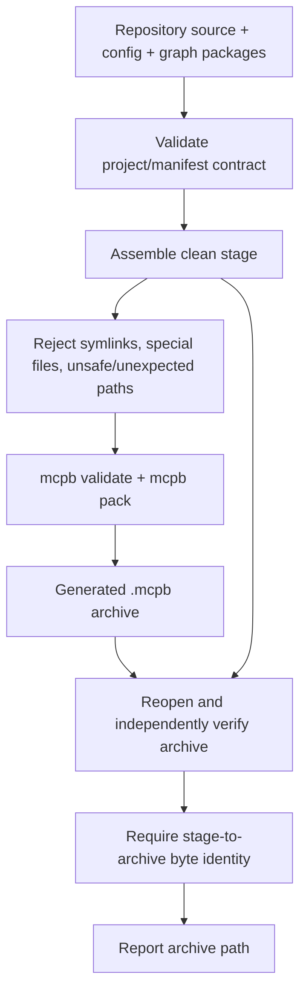

# MCPB packaging

The repository can produce a deterministic MCP Bundle (`.mcpb`) for local desktop MCP
hosts. Packaging copies the existing generic server, versioned configuration, and
accepted graph-package repository into a clean stage; it does not introduce a second
runtime implementation or alter curriculum data.

## What the bundle contains

A retained stage has this shape:

```text
kgfegmcp-stage/
├── .mcpbignore
├── README.md
├── fastmcp.json
├── manifest.json
├── pyproject.toml
├── uv.lock
├── config/
│   ├── profiles/
│   └── prompts/
├── data/
│   └── graph_packages/
└── src/
    └── kgfegmcp/
```

The `.mcpbignore` file controls the packer but is excluded from the independently
verified archive-member set.

The build deliberately does **not** package:

- `.venv` or another virtual environment;
- caches and `__pycache__` directories;
- `.pyc` or `.pyo` bytecode;
- local logs or build output;
- Git metadata;
- arbitrary files outside the approved staging contract.

## Prerequisites

Install:

- `uv`;
- Node.js and npm; and
- the official MCPB CLI.

```bash
npm install -g @anthropic-ai/mcpb
```

Confirm the executables:

```bash
command -v uv
command -v mcpb
```

The repository must also contain the locked backend project metadata, including
`backend/uv.lock`.

!!! important "The lock file is part of the distribution contract"
    Both `uv --locked` execution and MCPB staging require `uv.lock`. Do not silently
    generate or replace the lock file during a packaging review unless you intend to
    change the dependency lock as a separate repository update.

## Runtime contract

The template manifest declares MCPB manifest version `0.4` and a UV server runtime.
The packaged MCP configuration starts:

```text
uv run --directory ${__dirname} --locked --no-dev \
  python -m kgfegmcp.mcpb_server
```

It also sets the bundle root as `PATHS_PROJECT_DIR` and supplies explicit bundle-local
profile, prompt, data, and graph-package paths.

!!! warning "Keep the Python module launcher"
    The manifest contains `src/kgfegmcp/mcpb_server.py` as its declared entry-point
    artifact, but the actual MCP command must execute
    `python -m kgfegmcp.mcpb_server`. Direct filesystem execution can cause the internal
    `kgfegmcp.mcp` package to shadow the external MCP SDK package named `mcp`.

## Build flow



## Build the default archive

From the repository root:

```bash
uv --directory backend run --locked --no-dev kgfegmcp-build-mcpb
```

For version `0.1.0`, the default output is:

```text
dist/kgfegmcp-0.1.0.mcpb
```

The command removes an existing file at the selected output path before packing a new
archive.

## Retain the exact stage

The default stage is temporary. Retain it for review and independent runtime acceptance:

```bash
rm -rf ./dist/kgfegmcp-stage

uv --directory backend run --locked --no-dev \
  kgfegmcp-build-mcpb \
  --stage-output ./dist/kgfegmcp-stage
```

The requested stage location must either not exist or be a completely empty directory.
The output archive may not be placed inside the stage.

## Choose another archive path

```bash
uv --directory backend run --locked --no-dev \
  kgfegmcp-build-mcpb \
  --output ./dist/review-build.mcpb
```

You can combine `--output`, `--stage-output`, and `--mcpb-command`.

## Use a specific MCPB executable

If `mcpb` is not on `PATH`, or you need to test a specific installation:

```bash
uv --directory backend run --locked --no-dev \
  kgfegmcp-build-mcpb \
  --mcpb-command /absolute/path/to/mcpb
```

## Manifest/project cross-checks

Before packing, the builder requires the MCPB manifest to agree with the packaged Python
project. The reviewed contract fixes, among other things:

- package name and version agreement;
- MCPB manifest version `0.4`;
- server type `uv`;
- declared entry-point artifact `src/kgfegmcp/mcpb_server.py`;
- the exact module-launch MCP arguments;
- the expected bundle-local environment; and
- the project Python/dependency metadata needed by the UV runtime.

Changing the packaging manifest independently of the backend project can therefore make
the build fail before an archive is produced.

## Filesystem safety checks

The staging step requires regular source files and directory trees. It rejects:

- missing required files or directories;
- symbolic links;
- special filesystem entries;
- a stage located inside a source tree that is being copied;
- a non-empty retained stage; and
- ignored local-development/build artifacts.

Archive verification then rejects:

- absolute paths;
- parent traversal (`..`);
- backslash-based unsafe names;
- duplicate archive members;
- archive symlinks;
- missing required paths;
- unexpected members; and
- any file whose bytes differ from the retained stage.

This means successful `mcpb pack` execution is necessary but not sufficient: the
repository performs its own post-pack verification before reporting success.

## Smoke-test before packaging

First exercise the ordinary checkout:

```bash
uv --directory backend run --locked --no-dev kgfegmcp-stdio-smoke
```

A passing repository smoke demonstrates that the accepted graph packages, profiles,
prompt configurations, MCP registration, and representative resource reads work before
packaging is introduced.

## Smoke-test the retained stage

After building with `--stage-output`:

```bash
uv --directory backend run --locked --no-dev \
  kgfegmcp-stdio-smoke \
  --bundle-root ./dist/kgfegmcp-stage
```

This changes both the `uv` runtime root and the application project root to the retained
stage, providing a useful test that the package no longer depends on repository-local
paths.

## Inspect the archive manually

List members:

```bash
unzip -l ./dist/kgfegmcp-0.1.0.mcpb
```

Inspect the packaged manifest:

```bash
unzip -p ./dist/kgfegmcp-0.1.0.mcpb manifest.json | jq .
```

Inspect the server declaration:

```bash
unzip -p ./dist/kgfegmcp-0.1.0.mcpb manifest.json | jq '.server'
```

Test ZIP integrity:

```bash
unzip -t ./dist/kgfegmcp-0.1.0.mcpb
```

## Recommended acceptance sequence

```bash
# Repository runtime
uv --directory backend run --locked --no-dev kgfegmcp-stdio-smoke

# Clean, retained stage + archive
rm -rf ./dist/kgfegmcp-stage
uv --directory backend run --locked --no-dev \
  kgfegmcp-build-mcpb --stage-output ./dist/kgfegmcp-stage

# Packaged runtime
uv --directory backend run --locked --no-dev \
  kgfegmcp-stdio-smoke --bundle-root ./dist/kgfegmcp-stage

# Archive-level sanity check
unzip -t ./dist/kgfegmcp-0.1.0.mcpb
```

A strong release baseline requires all four steps to pass.

## Claude Desktop installation

The bundle is intended for a custom-extension installation flow, but installation
behavior can vary by Claude Desktop build. A client may recognize a valid bundle while
still preventing installation because of client-side prerequisite checks.

Treat bundle installation as a client surface separate from server acceptance. If both
repository and retained-stage STDIO smoke tests pass, do not change the server runtime
merely to work around an installation UI issue.

The confirmed development connection remains manual STDIO registration through Claude
Desktop's MCP configuration. See [Connect an MCP client](../getting-started/mcp-clients.md).

## Packaging is behavior-preserving

The builder copies the accepted runtime inputs. It does not modify:

- graph packages or package validation state;
- interpretation profiles;
- prompt configurations;
- search or traversal behavior;
- comparison or progression evidence behavior;
- resource policy; or
- the public MCP inventory.

A staged-runtime smoke test exists specifically to verify this distribution boundary.

---

**Next:** [Troubleshooting](troubleshooting.md)
