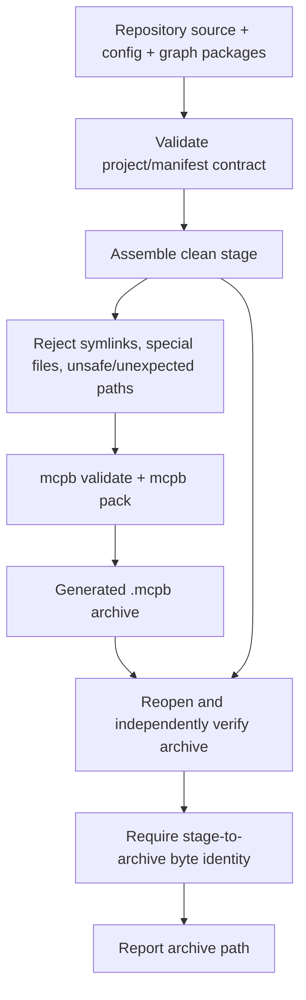

# MCPB packaging

The repository can produce a deterministic MCP Bundle (`.mcpb`) for local desktop MCP
hosts. Packaging copies the existing generic server, versioned configuration, and
accepted graph-package repository into a clean stage; it does not introduce a second
runtime implementation or alter curriculum data.

## What the bundle contains

A retained stage has this shape:

```text
kgfegmcp-stage/
├── .mcpbignore
├── README.md
├── fastmcp.json
├── manifest.json
├── pyproject.toml
├── uv.lock
├── config/
│   ├── profiles/
│   └── prompts/
├── data/
│   └── graph_packages/
└── src/
    └── kgfegmcp/
```

The `.mcpbignore` file controls the packer but is excluded from the independently
verified archive-member set.

The build deliberately does **not** package:

- `.venv` or another virtual environment;
- caches and `__pycache__` directories;
- `.pyc` or `.pyo` bytecode;
- local logs or build output;
- Git metadata;
- arbitrary files outside the approved staging contract.

## Prerequisites

Install these tools to **build** a bundle:

- `uv`;
- Node.js and npm; and
- the official MCPB CLI.

The optional archive-inspection commands also require `unzip` and `jq`.

```bash
npm install -g @anthropic-ai/mcpb
```

Confirm the executables:

```bash
command -v uv
command -v mcpb
```

The repository must also contain the locked backend project metadata, including
`backend/uv.lock`.

!!! important "The lock file is part of the distribution contract"
    Both `uv --locked` execution and MCPB staging require `uv.lock`. Do not silently
    generate or replace the lock file during a packaging review unless you intend to
    change the dependency lock as a separate repository update.

## Runtime contract

The template manifest declares MCPB manifest version `0.4` and a UV server runtime.
The packaged MCP configuration starts:

```text
uv run --directory ${__dirname} --locked --no-dev \
  python -m kgfegmcp.mcpb_server
```

It also sets the bundle root as `PATHS_PROJECT_DIR` and supplies explicit bundle-local
profile, prompt, data, and graph-package paths.

!!! warning "Keep the Python module launcher"
    The manifest contains `src/kgfegmcp/mcpb_server.py` as its declared entry-point
    artifact, but the actual MCP command must execute
    `python -m kgfegmcp.mcpb_server`. Direct filesystem execution can cause the internal
    `kgfegmcp.mcp` package to shadow the external MCP SDK package named `mcp`.

### Where does the bundle get `uv`?

This bundle declares `server.type: uv` and launches a bare `uv` command. It ships
no `uv` executable or virtual environment. The
[MCPB UV runtime specification](https://github.com/modelcontextprotocol/mcpb/blob/main/MANIFEST.md#uv-runtime-v04)
says the host manages Python and dependencies. It does not establish how this
Desktop build finds or supplies the `uv` executable for our explicit launch
configuration.

**Known unknown:** whether Desktop provides `uv` for this bundle or needs a
user-installed executable on its `PATH`. We have not installed the 0.4.0 bundle
in Desktop. A terminal's `command -v uv` result alone does not show that Desktop
can find it. For the checkout route, install `uv` yourself and use its absolute
path as documented in [Connect an MCP client](../getting-started/mcp-clients.md).

## Build flow


```mermaid
%%{init: {"themeVariables": {"fontSize": "18px"}}}%%
flowchart TB
    SRC[Repository source + config + graph packages] --> PREFLIGHT[Validate project/manifest contract]
    PREFLIGHT --> STAGE[Assemble clean stage]
    STAGE --> SAFETY[Reject symlinks, special files, unsafe/unexpected paths]
    SAFETY --> OFFICIAL[mcpb validate + mcpb pack]
    OFFICIAL --> ARCHIVE[Generated .mcpb archive]
    ARCHIVE --> VERIFY[Reopen and independently verify archive]
    STAGE --> VERIFY
    VERIFY --> BYTE[Require stage-to-archive byte identity]
    BYTE --> DONE[Report archive path]
```

## Build the default archive

From the repository root:

```bash
uv --directory backend run --locked --no-dev kgfegmcp-build-mcpb
```

For version `0.4.0`, the default output is:

```text
dist/kgfegmcp-0.4.0.mcpb
```

The command removes an existing file at the selected output path before packing a new
archive.

## Retain the exact stage

The default stage is temporary. Retain it for review and independent runtime acceptance:

```bash
rm -rf ./dist/kgfegmcp-stage

uv --directory backend run --locked --no-dev \
  kgfegmcp-build-mcpb \
  --stage-output ./dist/kgfegmcp-stage
```

The requested stage location must either not exist or be a completely empty directory.
The output archive may not be placed inside the stage.

## Choose another archive path

```bash
uv --directory backend run --locked --no-dev \
  kgfegmcp-build-mcpb \
  --output ./dist/review-build.mcpb
```

You can combine `--output`, `--stage-output`, and `--mcpb-command`.

## Use a specific MCPB executable

If `mcpb` is not on `PATH`, or you need to test a specific installation:

```bash
uv --directory backend run --locked --no-dev \
  kgfegmcp-build-mcpb \
  --mcpb-command /absolute/path/to/mcpb
```

## Manifest/project cross-checks

Before packing, the builder requires the MCPB manifest to agree with the packaged Python
project. The reviewed contract fixes, among other things:

- package name and version agreement;
- MCPB manifest version `0.4`;
- server type `uv`;
- declared entry-point artifact `src/kgfegmcp/mcpb_server.py`;
- the exact module-launch MCP arguments;
- the expected bundle-local environment; and
- the project Python/dependency metadata needed by the UV runtime.

Changing the packaging manifest independently of the backend project can therefore make
the build fail before an archive is produced.

## Filesystem safety checks

The staging step requires regular source files and directory trees. It rejects:

- missing required files or directories;
- symbolic links;
- special filesystem entries;
- a stage located inside a source tree that is being copied;
- a non-empty retained stage; and
- ignored local-development/build artifacts.

Archive verification then rejects:

- absolute paths;
- parent traversal (`..`);
- backslash-based unsafe names;
- duplicate archive members;
- archive symlinks;
- missing required paths;
- unexpected members; and
- any file whose bytes differ from the retained stage.

This means successful `mcpb pack` execution is necessary but not sufficient: the
repository performs its own post-pack verification before reporting success.

## Smoke-test before packaging

First exercise the ordinary checkout:

```bash
uv --directory backend run --locked --no-dev kgfegmcp-stdio-smoke
```

A passing repository smoke demonstrates that the accepted graph packages, profiles,
prompt configurations, MCP registration, and representative resource reads work before
packaging is introduced.

## Smoke-test the retained stage

After building with `--stage-output`:

```bash
uv --directory backend run --locked --no-dev \
  kgfegmcp-stdio-smoke \
  --bundle-root ./dist/kgfegmcp-stage
```

This changes both the `uv` runtime root and the application project root to the retained
stage, providing a useful test that the package no longer depends on repository-local
paths.

## Inspect the archive manually

List members:

```bash
unzip -l ./dist/kgfegmcp-0.4.0.mcpb
```

Inspect the packaged manifest:

```bash
unzip -p ./dist/kgfegmcp-0.4.0.mcpb manifest.json | jq .
```

Inspect the server declaration:

```bash
unzip -p ./dist/kgfegmcp-0.4.0.mcpb manifest.json | jq '.server'
```

Test ZIP integrity:

```bash
unzip -t ./dist/kgfegmcp-0.4.0.mcpb
```

## Recommended acceptance sequence

```bash
# Repository runtime
uv --directory backend run --locked --no-dev kgfegmcp-stdio-smoke

# Clean, retained stage + archive
rm -rf ./dist/kgfegmcp-stage
uv --directory backend run --locked --no-dev \
  kgfegmcp-build-mcpb --stage-output ./dist/kgfegmcp-stage

# Packaged runtime
uv --directory backend run --locked --no-dev \
  kgfegmcp-stdio-smoke --bundle-root ./dist/kgfegmcp-stage

# Archive-level sanity check
unzip -t ./dist/kgfegmcp-0.4.0.mcpb
```

A strong release baseline requires all four steps to pass.

## Claude Desktop installation

These steps are for a built `dist/kgfegmcp-0.4.0.mcpb`, rather than a repository
checkout. Installation and a 0.4.0 run in Desktop have not been checked on any OS.
The checkout guide documents macOS only. The manifest declares macOS (`darwin`),
Linux (`linux`) and Windows (`win32`); that declaration is not installation or
testing evidence. No Windows or Linux setup steps are supplied here.

### Install and enable the bundle

1. Open Claude Desktop's **Settings > Extensions**, then **Advanced settings**.
   In **Extension Developer**, choose **Install Extension…** and select the built
   `.mcpb`. This is Anthropic's documented
   [custom-extension installation route](https://support.claude.com/en/articles/10949351-getting-started-with-local-mcp-servers-on-claude-desktop).
2. Review the installation dialog and choose **Install**, completing any setup
   prompts. Anthropic also documents double-clicking the `.mcpb` to open this
   dialog in its [Desktop Extensions introduction](https://www.anthropic.com/engineering/desktop-extensions).
   This project's manifest has no `user_config` fields; it does not ask you to
   enter API keys or repository paths.
3. In a new conversation, open **+ > Connectors** and check for the connected
   server and its tools. Anthropic documents this inspection route in its
   [local MCP guide](https://support.claude.com/en/articles/10949351-getting-started-with-local-mcp-servers-on-claude-desktop).
   **Unverified UI detail:** the exact label and enable control for this bundle.
   Look for **Curriculum Knowledge Graph MCP** or **curriculum-knowledge-graph**.
   If your build offers a disabled extension/connector switch, turn it on;
   we have not confirmed a separate switch is required.
4. Follow the [Claude Desktop walkthrough](../getting-started/claude-clients.md#claude-desktop-walkthrough)
   to check the connected server. None of these steps has been tried with this
   project's 0.4.0 bundle. A passing repository or unpacked-stage smoke does not
   establish a successful Desktop installation.

If tools are absent after installation, Anthropic recommends restarting Desktop
and checking the extension's settings for incomplete configuration in the
[local MCP guide](https://support.claude.com/en/articles/10949351-getting-started-with-local-mcp-servers-on-claude-desktop).

For a Team or Enterprise account with an extension allowlist, direct file
installation can be blocked. An owner instead uploads the bundle under
**Organization settings > Connectors > Desktop > Add custom extension** and
uses **Add to team**. This is a separate
[organization-managed installation route](https://support.claude.com/en/articles/12592343-enabling-and-using-the-desktop-extension-allowlist).

### Remove an older copy before reinstalling

Removal is not a blanket prerequisite for every update. For organization-managed
custom extensions, Anthropic documents **Upload new version** from the custom
upload menu, keeping the manifest `name` and increasing `version`, without first
removing the extension. See its
[versioned-update instructions](https://support.claude.com/en/articles/12592343-enabling-and-using-the-desktop-extension-allowlist).
This does not establish what a local same-version reinstall does.

**Unverified procedure for a same-version rebuild:** open **Settings >
Extensions**, select the installed **Curriculum Knowledge Graph MCP** extension,
find its removal control (which may be labelled **Remove** or **Uninstall**) and
confirm removal. Check that it no longer appears in the installed list, then
repeat the installation steps above. The Anthropic and MCPB sources checked on
2026-10-08 did not establish the local removal control or same-version replacement
behavior. The claim that a same-version reinstall can retain the old copy remains
unverified and needs confirmation on the user's Desktop build.

Check the server after reinstalling: a framework listing should show separate
`Routing graph types:` and `Included graph types:` lines. A single `Graph types:`
line means an older copy is running. If you registered a checkout in
`claude_desktop_config.json` instead, verify its paths, fully quit Desktop and
reopen it after updating the code. See
[Connect an MCP client](../getting-started/mcp-clients.md#desktop-is-running-an-old-copy).

If installation is blocked, consult Anthropic's guide and your organization's
extension settings. Keep that client issue separate from server acceptance;
do not change the server runtime just to work around an installation UI check.
The [evidence table](../getting-started/claude-clients.md#what-has-and-has-not-been-checked)
records what remains untested. `uv` provisioning is still the
[known unknown above](#where-does-the-bundle-get-uv).

## Packaging is behavior-preserving

The builder copies the accepted runtime inputs. It does not modify:

- graph packages or package validation state;
- interpretation profiles;
- prompt configurations;
- search or traversal behavior;
- comparison or progression evidence behavior;
- resource policy; or
- the public MCP inventory.

A staged-runtime smoke test exists specifically to verify this distribution boundary.

---

**Next:** [Troubleshooting](troubleshooting.md)
