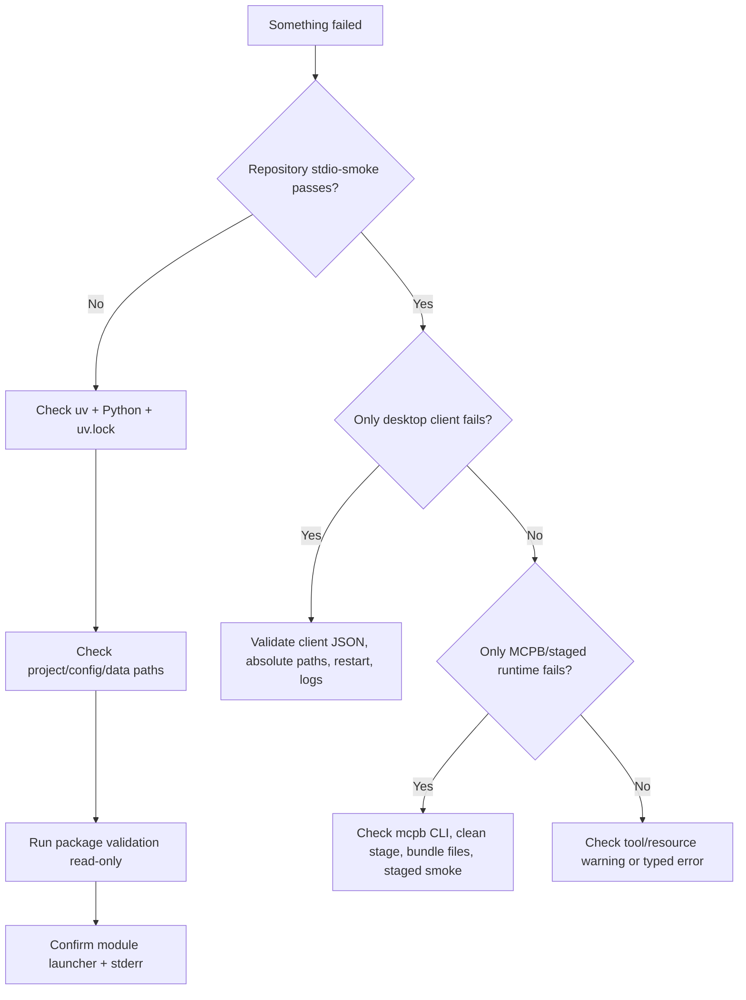

# Troubleshooting

Use this page to diagnose local startup, package validation, desktop MCP connection, and
MCPB packaging failures. Prefer checks that preserve the repository's read-only runtime
and immutable-package assumptions.

## Fast triage



## Establish a known-good baseline

From the repository root, start with:

```bash
uv --directory backend sync --locked --no-dev
uv --directory backend run --locked --no-dev kgfegmcp-stdio-smoke
```

If the smoke passes, the checked-out runtime can:

- resolve its environment;
- load and revalidate the accepted catalog;
- start the actual STDIO server;
- complete an MCP handshake;
- expose the exact approved MCP inventory; and
- read representative resources.

That sharply narrows later failures to the desktop-client or packaging layer.

## `uv --locked` fails

Confirm:

```bash
command -v uv
uv --version
ls -l backend/pyproject.toml backend/uv.lock
```

The project requires Python `>=3.13,<3.14`. Install the expected interpreter with:

```bash
uv python install 3.13
```

`backend/uv.lock` is part of the local and MCPB runtime contract. If it is missing,
`--locked` commands cannot reproduce the intended environment.

!!! caution "Do not casually regenerate the lock"
    Creating a new lock file can change resolved dependencies. If the repository should
    already contain a reviewed `uv.lock`, restore that file rather than treating lock
    regeneration as a troubleshooting shortcut.

## The server starts and appears to hang

This is expected for:

```bash
uv --directory backend run --locked --no-dev \
  python -m kgfegmcp.mcpb_server
```

The server is waiting for MCP JSON-RPC messages on STDIO. It is not an interactive shell
and does not expose an HTTP page in this launch mode.

Use `kgfegmcp-stdio-smoke` when you want a self-contained startup test.

## `No module named 'mcp.types'`

Launch the server as a module:

```text
python -m kgfegmcp.mcpb_server
```

Do **not** execute:

```text
python src/kgfegmcp/mcpb_server.py
```

Direct file execution can place `src/kgfegmcp` at the front of `sys.path`, allowing the
internal `kgfegmcp.mcp` package to shadow the external MCP SDK package named `mcp`.

## `kgfegmcp-stdio-smoke` reports `Connection closed`

Run these checks in order:

```bash
uv --directory backend sync --locked --no-dev

uv --directory backend run --locked --no-dev \
  kgfegmcp-validate-packages pending --read-only

uv --directory backend run --locked --no-dev kgfegmcp-stdio-smoke
```

Common causes include:

- incorrect/missing `uv.lock` or unsynchronized dependencies;
- invalid path overrides;
- missing or invalid graph packages/profiles;
- a catalog that cannot retain any passed package;
- direct-file rather than module launch; or
- stdout contamination that breaks protocol framing.

The smoke command reports its failure on stderr as:

```text
STDIO smoke failed: <reason>
```

## Catalog startup fails

Package files are not trusted just because they are present. Catalog construction
revalidates candidates read-only and only serves currently valid packages whose observed
terminal state is `passed`.

Inspect pending candidates without mutation:

```bash
uv --directory backend run --locked --no-dev \
  kgfegmcp-validate-packages pending --read-only
```

Inspect one exact package:

```bash
uv --directory backend run --locked --no-dev \
  kgfegmcp-validate-packages one \
  --framework-id <framework-id> \
  --snapshot-id <snapshot-id> \
  --read-only
```

See [Validation and lifecycle](../data/validation.md) for checksum, artifact-closure,
profile, topology, count, rights, and state checks.

## A valid pending package is not queryable

This is expected. `pending` is not an accepted runtime state.

After reviewing a read-only validation result, persist the allowed transition with an
operator-approved validation run:

```bash
uv --directory backend run --locked --no-dev \
  kgfegmcp-validate-packages one \
  --framework-id <framework-id> \
  --snapshot-id <snapshot-id>
```

A valid pending package can become `passed`. An invalid pending package becomes
`failed` or `quarantined` according to the selected invalid-package policy.

Do not hand-edit validation state in the manifest.

## Validation command exits `1`

For `kgfegmcp-validate-packages`, exit `1` means validation ran successfully but at
least one selected package is invalid. Read the emitted JSON `findings` and fix the
underlying package/profile/artifact issue.

Exit `2` instead means the command could not perform the requested validation normally,
for example because of an invalid identifier, settings failure, repository error, or
other typed domain failure.

This distinction is intentional and should be preserved in CI automation.

## Path overrides point to the wrong repository

Print the values visible to the process:

```bash
printf 'PATHS_PROJECT_DIR=%s\n' "$PATHS_PROJECT_DIR"
printf 'KGFEGMCP_GRAPH_PACKAGES_ROOT=%s\n' "$KGFEGMCP_GRAPH_PACKAGES_ROOT"
printf 'KGFEGMCP_PROFILE_ROOT=%s\n' "$KGFEGMCP_PROFILE_ROOT"
printf 'KGFEGMCP_PROMPT_ROOT=%s\n' "$KGFEGMCP_PROMPT_ROOT"
```

When supplied, `PATHS_PROJECT_DIR` must be absolute. Relative path overrides are resolved
against it.

If you relocate only `KGFEGMCP_CONFIG_ROOT`, remember that current profile/prompt
defaults are not derived from that variable. Set `KGFEGMCP_PROFILE_ROOT` and
`KGFEGMCP_PROMPT_ROOT` explicitly.

See [Environment variables](configuration.md).

## Desktop connector does not appear

For the confirmed Claude Desktop local setup, check that:

- `command` is the absolute result of `command -v uv`;
- the repository/backend paths are absolute;
- `claude_desktop_config.json` is valid JSON;
- the MCP server entry uses `python -m kgfegmcp.mcpb_server`;
- the repository STDIO smoke passes; and
- Claude Desktop was fully quit and reopened after the configuration change.

Validate the client JSON on macOS:

```bash
jq empty "$HOME/Library/Application Support/Claude/claude_desktop_config.json"
```

Inspect likely Claude MCP logs:

```bash
find "$HOME/Library/Logs/Claude" \
  -maxdepth 1 \
  -type f \
  -iname '*mcp*' \
  -print
```

See [Connect an MCP client](../getting-started/mcp-clients.md) for the full configuration.

## Logs or text appear on protocol stdout

STDIO stdout is reserved for MCP protocol traffic. Uncontrolled `print()` calls or
logging directed to stdout can corrupt JSON-RPC framing and cause disconnects.

Application diagnostics should go to stderr.

`KGFEGMCP_LOG_LEVEL` exists in the settings model, but the reviewed bootstrap does not
currently wire that value into the available explicit Loguru initializer. When debugging
the current implementation, inspect stderr and MCP-host logs rather than assuming that
changing this variable will reconfigure logging.

## A resource is denied or too large

Resource exposure has multiple independent gates:

1. the resource family must be approved;
2. the artifact must be manifest-declared when applicable;
3. rights/review policy must permit the requested access class; and
4. source-read and returned-resource byte limits must be satisfied.

Do not raise byte limits to work around a rights denial. Inspect the typed resource error
and the package's rights metadata first.

See [Resources and URI templates](../reference/resources.md) and
[Rights and provenance](../data/rights-and-provenance.md).

## Search returns no matches

A zero-match result is not usually an operations failure. Search is deterministic
lexical retrieval, not semantic search, stemming, or automatic synonym expansion.

Before changing server configuration, confirm query semantics in
[Search and retrieve standards](../guides/standards-search.md). In particular,
`fraction` and `fractions` are distinct normalized lexical queries.

## MCPB command not found

Confirm installation:

```bash
command -v mcpb
npm prefix -g
```

If the executable exists outside `PATH`, pass it explicitly:

```bash
uv --directory backend run --locked --no-dev \
  kgfegmcp-build-mcpb \
  --mcpb-command /absolute/path/to/mcpb
```

## MCPB staging directory is rejected

A retained stage must be absent or completely empty. The builder intentionally refuses
to merge with a prior stage.

```bash
rm -rf ./dist/kgfegmcp-stage

uv --directory backend run --locked --no-dev \
  kgfegmcp-build-mcpb --stage-output ./dist/kgfegmcp-stage
```

Also ensure the stage is not inside `backend/src`, `config/profiles`, `config/prompts`, or
`data/graph_packages`, because those trees are copied into the stage.

## MCPB output cannot be written

The output archive may not be inside the retained staging root. Choose sibling paths,
for example:

```text
dist/
├── kgfegmcp-stage/
└── kgfegmcp-0.1.0.mcpb
```

If a previous output file exists, the builder removes it before packing; ordinary parent
directory permission errors still cause the build to fail.

## MCPB build reports a missing source file

The stage requires at least:

```text
backend/README.md
backend/fastmcp.json
backend/pyproject.toml
backend/uv.lock
backend/src/
config/profiles/
config/prompts/
data/graph_packages/
packaging/mcpb/.mcpbignore
packaging/mcpb/manifest.json
```

Restore the missing reviewed repository file instead of weakening the packaging contract.

## MCPB archive builds but staged smoke fails

Run:

```bash
uv --directory backend run --locked --no-dev \
  kgfegmcp-stdio-smoke --bundle-root ./dist/kgfegmcp-stage
```

The smoke command requires the retained stage to be self-contained. A failure here often
indicates a bundle-root path/layout or locked-environment issue that would not be visible
from ZIP integrity alone.

Inspect:

```bash
find ./dist/kgfegmcp-stage -maxdepth 2 -type f -print
unzip -t ./dist/kgfegmcp-0.1.0.mcpb
```

## Claude Desktop recognizes the `.mcpb` but will not install it

Client-side custom-extension behavior can vary by Claude Desktop build. If all of the
following pass:

```bash
uv --directory backend run --locked --no-dev kgfegmcp-stdio-smoke
uv --directory backend run --locked --no-dev \
  kgfegmcp-stdio-smoke --bundle-root ./dist/kgfegmcp-stage
unzip -t ./dist/kgfegmcp-0.1.0.mcpb
```

then treat the disabled/failed install control as a client installation-path issue before
changing the server or package data. Manual STDIO registration is the confirmed local
development connection method.

## When to start a new investigation

If a failure remains after the relevant checks above, preserve:

- the exact command;
- exit status;
- stderr output;
- public JSON error/finding payloads;
- whether repository STDIO smoke passes;
- whether retained-stage STDIO smoke passes; and
- the relevant framework/snapshot/package identity.

Do not attach source documents or restricted package artifacts unless their rights and
handling policy permit sharing. Prefer manifest identities, validation findings, and
checksums when reporting integrity failures.

---

**Next:** [Backend structure](../development/index.md)
