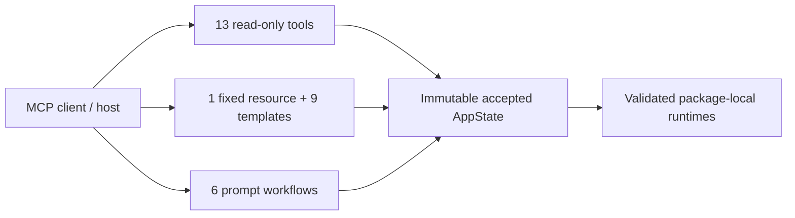

# MCP reference

This section is the protocol-facing reference for the public **KGForEdGlobalMCP**
surface. It documents the exact tool families, resource URI families, prompt workflows,
common input conventions, output conventions, and bounded behaviors exposed through
FastMCP.

Use the [Using the server](../guides/framework-discovery.md) guides when you want a
workflow. Use these pages when you need the concrete MCP contract.

## Public surface

The server registers its components explicitly and exposes a fixed read-only surface:

| Component type     | Count | Purpose                                                                                                  |
|--------------------|-------|----------------------------------------------------------------------------------------------------------|
| Tools              | 13    | Deterministic discovery, retrieval, traversal, statistics, learning-component retrieval, comparison evidence, and progression evidence |
| Fixed resources    | 1     | Complete accepted package catalog                                                                        |
| Resource templates | 9     | Framework, package, standard, relationship, provenance, and approved artifact reads                      |
| Prompts            | 6     | Deterministic client-side reasoning and generation workflows                                             |



## Tool inventory

| Tool                           | Reference                                            | Primary result                                 |
|--------------------------------|------------------------------------------------------|------------------------------------------------|
| `get_capabilities`             | [Framework and capability tools](framework-tools.md) | Server-wide and per-package capabilities       |
| `list_frameworks`              | [Framework and capability tools](framework-tools.md) | Paginated accepted framework snapshots         |
| `get_framework`                | [Framework and capability tools](framework-tools.md) | One exact or unique-current snapshot           |
| `get_framework_statistics`     | [Framework and capability tools](framework-tools.md) | Structural package statistics                  |
| `search_standards`             | [Standards tools](standards-tools.md)                | Paginated deterministic search hits            |
| `get_standard`                 | [Standards tools](standards-tools.md)                | One exact standard or grouping                 |
| `get_standard_context`         | [Standards tools](standards-tools.md)                | Bounded hierarchy context                      |
| `search_learning_components`   | [Learning component tools](learning-component-tools.md) | Paginated learning-component search hits    |
| `get_learning_component`       | [Learning component tools](learning-component-tools.md) | One exact component with placements         |
| `get_learning_component_context` | [Learning component tools](learning-component-tools.md) | Component with supported standards        |
| `get_learning_components_for_standard` | [Learning component tools](learning-component-tools.md) | Components supporting one standard  |
| `compare_framework_evidence`   | [Comparison tool](comparison-tool.md)                | Independently bounded cross-framework evidence |
| `collect_progression_evidence` | [Progression tool](progression-tool.md)              | Bounded grade-scoped progression candidates    |

All thirteen tools carry read-only, idempotent annotations.

## Input naming

Tool request/result Pydantic fields are serialized with lower-camel-case aliases. For
example:

```text
framework_id        -> frameworkId
snapshot_id         -> snapshotId
include_groupings   -> includeGroupings
local_grade_labels  -> localGradeLabels
```

The eight tools that accept a typed request model expose that model as the `request`
argument. For example:

```json
{
  "request": {
    "frameworkId": "ghana-nacca-primary-english-language-basic-1-3"
  }
}
```

`get_capabilities` has no caller-supplied arguments:

```json
{}
```

Prompt arguments are ordinary FastMCP function arguments and retain their registered
snake_case names, such as `framework_id`, `grade_or_stage`, and `topic_or_standard`.
Resource-template placeholders likewise use snake_case names inside the URI template.

The server uses strict input validation. Unknown fields, invalid enum values, wrong
primitive types, and values outside documented bounds are rejected rather than silently
coerced.

## Tool result shape

Successful tools return both human-readable and machine-readable evidence:

- a deterministic text summary;
- `structuredContent` matching the registered output schema;
- optional resource links; and
- for paginated tools, an additional continuation text block containing an exact
  `nextRequest` when another page is available.

Resource links are supplementary. Failure to construct an optional link does not change
the underlying tool result.

## Resources

The fixed resource is:

```text
kgfegmcp://catalog
```

The nine parameterized families cover framework metadata, manifests, validation,
unresolved items, interpretation profiles, manifest artifacts, standards, standard
provenance, and relationships.

See [Resources and URI templates](resources.md) for the complete list and rights policy.

## Prompts

The six registered prompts are:

- `student_study_support`
- `teacher_guide_draft`
- `student_handbook_section`
- `inferred_progression_hypothesis`
- `administrator_alignment_review`
- `cross_framework_comparison`

Prompts render deterministic instructions for the connected host model. They do not call
an LLM, retrieve standards evidence themselves, or persist model conclusions.

See [Prompts](prompts.md) for parameters, defaults, limits, and result metadata.

## Common evidence rules

The reference contract preserves several distinctions across tools, resources, and
prompts:

1. Normalized grades are retrieval facets, not international grade equivalence.
2. `hasChild` is structural hierarchy evidence, not a prerequisite or progression edge.
3. Search hits and comparison matches are retrieval candidates, not official alignments.
4. Progression candidates do not establish a learning progression.
5. Source records remain package-local and retain immutable package identity.
6. Server-side retrieval is deterministic; downstream model synthesis is separate.

See [Concepts and boundaries](../concepts.md) for the full interpretation model.

## Errors, cursors, and limits

Expected domain failures are translated into stable public errors with an error code,
actionable message, and optional next action. Unexpected failures are masked behind a
fixed `internal_error` message.

Pagination cursors are opaque, request-bound transport tokens. Do not decode, construct,
edit, or reuse them with changed request fields.

See [Errors, cursors, and limits](protocol-behavior.md).

---

**Next:** [Framework and capability tools](framework-tools.md)
